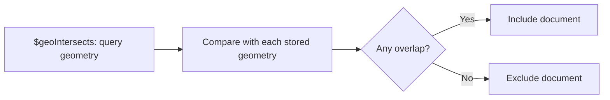

# How to Use $geoIntersects in MongoDB

Author: [nawazdhandala](https://www.github.com/nawazdhandala)

Tags: MongoDB, Geospatial, $geoIntersects, GeoJSON, Location Query

Description: Learn how to use MongoDB's $geoIntersects operator to find documents whose geometries intersect with a specified GeoJSON shape, for overlap and intersection queries.

---

## How $geoIntersects Works

The `$geoIntersects` operator selects documents where the stored geometry intersects with the specified GeoJSON shape. Two geometries intersect if any part of one overlaps with any part of the other - including when one is completely contained within the other.

Use cases:
- Find delivery zones that overlap with a region.
- Find all routes that pass through an area.
- Check if a location falls inside any known region.
- Find properties whose boundaries cross a flood zone.



## Requirements

- A `2dsphere` index on the geometry field is required for optimal performance.
- The stored geometry and the query geometry must be GeoJSON.

## Syntax

```javascript
db.collection.find({
  field: {
    $geoIntersects: {
      $geometry: <GeoJSON geometry object>
    }
  }
})
```

## Examples

### Setup

```javascript
db.regions.createIndex({ boundary: "2dsphere" })

db.regions.insertMany([
  {
    name: "Manhattan",
    boundary: {
      type: "Polygon",
      coordinates: [[
        [-74.0200, 40.7000],
        [-73.9500, 40.7000],
        [-73.9500, 40.8200],
        [-74.0200, 40.8200],
        [-74.0200, 40.7000]
      ]]
    }
  },
  {
    name: "Brooklyn",
    boundary: {
      type: "Polygon",
      coordinates: [[
        [-74.0400, 40.5700],
        [-73.8300, 40.5700],
        [-73.8300, 40.7000],
        [-74.0400, 40.7000],
        [-74.0400, 40.5700]
      ]]
    }
  },
  {
    name: "Queens",
    boundary: {
      type: "Polygon",
      coordinates: [[
        [-73.9600, 40.5400],
        [-73.7000, 40.5400],
        [-73.7000, 40.8000],
        [-73.9600, 40.8000],
        [-73.9600, 40.5400]
      ]]
    }
  }
])
```

### Find Regions That Intersect a Point

Check which region contains a given point (a point intersects a polygon if it is inside it):

```javascript
const customerLocation = {
  type: "Point",
  coordinates: [-73.9700, 40.6600]  // in Brooklyn
};

db.regions.find({
  boundary: {
    $geoIntersects: {
      $geometry: customerLocation
    }
  }
})
// Returns: Brooklyn
```

### Find Regions That Intersect a Polygon

Find all regions that overlap with a given search polygon:

```javascript
const searchArea = {
  type: "Polygon",
  coordinates: [[
    [-74.0000, 40.6900],
    [-73.9000, 40.6900],
    [-73.9000, 40.7500],
    [-74.0000, 40.7500],
    [-74.0000, 40.6900]
  ]]
};

db.regions.find({
  boundary: {
    $geoIntersects: {
      $geometry: searchArea
    }
  }
})
// Returns regions that overlap with the search area
```

### Find Regions a LineString Passes Through

Find all regions that a route (LineString) passes through:

```javascript
const route = {
  type: "LineString",
  coordinates: [
    [-74.0100, 40.7100],   // start
    [-73.9800, 40.7200],   // midpoint
    [-73.9500, 40.7580]    // end
  ]
};

db.regions.find({
  boundary: {
    $geoIntersects: {
      $geometry: route
    }
  }
})
// Returns all regions the route passes through
```

### Reverse Query: Find Containing Region for a Location

```javascript
async function findRegionForLocation(lng, lat) {
  return db.regions.findOne({
    boundary: {
      $geoIntersects: {
        $geometry: {
          type: "Point",
          coordinates: [lng, lat]
        }
      }
    }
  });
}
```

### Node.js Full Example

```javascript
const { MongoClient } = require("mongodb");

async function main() {
  const client = new MongoClient("mongodb://localhost:27017");
  await client.connect();

  const db = client.db("geo");
  const deliveryZones = db.collection("deliveryZones");

  await deliveryZones.createIndex({ boundary: "2dsphere" });

  // Insert delivery zones
  await deliveryZones.insertMany([
    {
      zoneId: "Z1",
      name: "Central Zone",
      boundary: {
        type: "Polygon",
        coordinates: [[
          [-74.01, 40.73], [-73.97, 40.73],
          [-73.97, 40.76], [-74.01, 40.76],
          [-74.01, 40.73]
        ]]
      }
    },
    {
      zoneId: "Z2",
      name: "North Zone",
      boundary: {
        type: "Polygon",
        coordinates: [[
          [-74.01, 40.76], [-73.97, 40.76],
          [-73.97, 40.80], [-74.01, 40.80],
          [-74.01, 40.76]
        ]]
      }
    }
  ]);

  // Check if a customer address is in any delivery zone
  const addresses = [
    { name: "Customer A", coords: [-73.99, 40.74] },  // In Central Zone
    { name: "Customer B", coords: [-73.98, 40.78] },  // In North Zone
    { name: "Customer C", coords: [-73.95, 40.65] }   // No zone
  ];

  for (const addr of addresses) {
    const zone = await deliveryZones.findOne({
      boundary: {
        $geoIntersects: {
          $geometry: {
            type: "Point",
            coordinates: addr.coords
          }
        }
      }
    });

    if (zone) {
      console.log(`${addr.name}: Eligible for delivery via ${zone.name}`);
    } else {
      console.log(`${addr.name}: Outside delivery area`);
    }
  }

  // Find all zones overlapping with a large search polygon
  const searchPoly = {
    type: "Polygon",
    coordinates: [[
      [-74.02, 40.72], [-73.96, 40.72],
      [-73.96, 40.79], [-74.02, 40.79],
      [-74.02, 40.72]
    ]]
  };

  const overlappingZones = await deliveryZones.find({
    boundary: {
      $geoIntersects: { $geometry: searchPoly }
    }
  }).toArray();

  console.log(`Zones overlapping with search area: ${overlappingZones.map(z => z.name).join(", ")}`);

  await client.close();
}

main().catch(console.error);
```

## $geoIntersects vs $geoWithin

```text
Operator          What it finds
----------------------------------------------
$geoIntersects    Geometries that overlap (any intersection)
$geoWithin        Geometries entirely contained within the query shape
```

Example with a point and polygon:

```javascript
// A point that is inside a polygon:
// $geoIntersects -> matches (point intersects polygon)
// $geoWithin     -> matches (point is inside polygon)

// A polygon that partially overlaps another polygon:
// $geoIntersects -> matches (overlapping areas intersect)
// $geoWithin     -> does NOT match (not fully contained)
```

## Supported Geometry Combinations

```text
Query geometry       Stored geometry    Intersection result
-----------------------------------------------------------------
Point                Polygon            Point inside polygon
LineString           Polygon            Line crosses polygon
Polygon              Polygon            Polygons overlap
Point                LineString         Point on line
LineString           LineString         Lines cross
```

## Best Practices

- **Create a `2dsphere` index** on the geometry field before running `$geoIntersects` at scale.
- **Use `$geoIntersects` for point-in-polygon checks** by querying stored polygons with a point geometry.
- **Store region boundaries in a separate collection** and use `$geoIntersects` to dynamically assign regions to locations.
- **Close polygon rings** by repeating the first coordinate as the last.
- **Use `findOne`** for point-in-polygon lookup when you expect exactly one containing region.

## Summary

`$geoIntersects` finds documents whose stored geometries overlap in any way with the specified GeoJSON geometry. It supports combinations of points, lines, and polygons. It is ideal for point-in-polygon lookups, finding routes that cross regions, and checking if two areas overlap. Unlike `$geoWithin`, it matches partial overlaps, not just containment.
