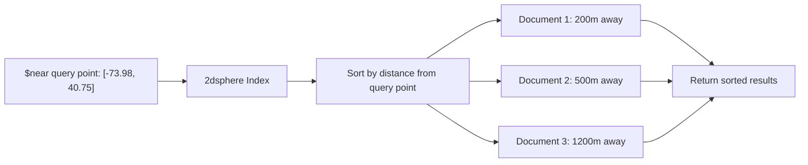

# How to Use Geospatial Queries in MongoDB with $near

Author: [nawazdhandala](https://www.github.com/nawazdhandala)

Tags: MongoDB, Geospatial, $near, 2dsphere, Location Query

Description: Learn how to use MongoDB's $near operator to find documents sorted by proximity to a given point, with optional minimum and maximum distance bounds.

---

## How $near Works

The `$near` operator returns documents sorted by distance from a specified point, closest first. It requires a geospatial index (`2dsphere` or `2d`) on the queried field.

Unlike `$geoWithin` which returns all documents within a boundary in any order, `$near` always returns results sorted by distance ascending.



## Prerequisites

A `2dsphere` index must exist on the GeoJSON field before using `$near` with GeoJSON geometry:

```javascript
db.places.createIndex({ location: "2dsphere" })
```

For legacy coordinate pairs (arrays), a `2d` index is also supported.

## Syntax

Using `$near` with GeoJSON (recommended):

```javascript
db.collection.find({
  field: {
    $near: {
      $geometry: {
        type: "Point",
        coordinates: [longitude, latitude]
      },
      $maxDistance: <meters>,   // optional upper bound
      $minDistance: <meters>    // optional lower bound
    }
  }
})
```

Using `$near` with legacy coordinates (2d index):

```javascript
db.collection.find({
  field: {
    $near: [longitude, latitude],
    $maxDistance: <distance>    // distance in coordinate units, not meters
  }
})
```

## Examples

### Setup

```javascript
db.restaurants.createIndex({ location: "2dsphere" })

db.restaurants.insertMany([
  {
    name: "Pasta Palace",
    cuisine: "Italian",
    location: { type: "Point", coordinates: [-73.9851, 40.7484] }
  },
  {
    name: "Sushi World",
    cuisine: "Japanese",
    location: { type: "Point", coordinates: [-73.9900, 40.7560] }
  },
  {
    name: "Taco Town",
    cuisine: "Mexican",
    location: { type: "Point", coordinates: [-74.0100, 40.7128] }
  },
  {
    name: "Burger Barn",
    cuisine: "American",
    location: { type: "Point", coordinates: [-73.9860, 40.7490] }
  }
])
```

### Find Nearest Places

Find restaurants nearest to Times Square (`[-73.9857, 40.7580]`), sorted by distance:

```javascript
db.restaurants.find({
  location: {
    $near: {
      $geometry: {
        type: "Point",
        coordinates: [-73.9857, 40.7580]
      }
    }
  }
})
```

### Find Within Maximum Distance

Find restaurants within 1 km:

```javascript
db.restaurants.find({
  location: {
    $near: {
      $geometry: {
        type: "Point",
        coordinates: [-73.9857, 40.7580]
      },
      $maxDistance: 1000  // 1000 meters = 1 km
    }
  }
})
```

### Find Within a Distance Range

Find restaurants between 500m and 2000m away (a "donut" search area):

```javascript
db.restaurants.find({
  location: {
    $near: {
      $geometry: {
        type: "Point",
        coordinates: [-73.9857, 40.7580]
      },
      $minDistance: 500,   // at least 500m away
      $maxDistance: 2000   // no more than 2km away
    }
  }
})
```

### Combine $near with Other Filters

Find Italian restaurants within 1 km:

```javascript
db.restaurants.find({
  cuisine: "Italian",
  location: {
    $near: {
      $geometry: {
        type: "Point",
        coordinates: [-73.9857, 40.7580]
      },
      $maxDistance: 1000
    }
  }
})
```

### Get Distance with $geoNear Aggregation

`$near` returns results sorted by distance but does not include the distance in the output. Use `$geoNear` in an aggregation pipeline to get the calculated distance as a field:

```javascript
db.restaurants.aggregate([
  {
    $geoNear: {
      near: {
        type: "Point",
        coordinates: [-73.9857, 40.7580]
      },
      distanceField: "distanceMeters",
      maxDistance: 1000,
      spherical: true
    }
  },
  {
    $project: {
      name: 1,
      cuisine: 1,
      distanceMeters: { $round: ["$distanceMeters", 0] }
    }
  }
])
```

Sample output:

```javascript
[
  { name: "Burger Barn", cuisine: "American", distanceMeters: 104 },
  { name: "Pasta Palace", cuisine: "Italian", distanceMeters: 107 },
  { name: "Sushi World", cuisine: "Japanese", distanceMeters: 847 }
]
```

### Node.js Example

```javascript
const { MongoClient } = require("mongodb");

async function findNearbyRestaurants(lng, lat, maxDistanceMeters) {
  const client = new MongoClient("mongodb://localhost:27017");
  await client.connect();

  const restaurants = client.db("cityguide").collection("restaurants");

  // Ensure index exists
  await restaurants.createIndex({ location: "2dsphere" });

  // Find nearby restaurants with distance
  const results = await restaurants.aggregate([
    {
      $geoNear: {
        near: { type: "Point", coordinates: [lng, lat] },
        distanceField: "distance",
        maxDistance: maxDistanceMeters,
        spherical: true
      }
    },
    {
      $project: {
        name: 1,
        cuisine: 1,
        distanceMeters: { $round: ["$distance", 0] }
      }
    }
  ]).toArray();

  console.log(`Restaurants within ${maxDistanceMeters}m of [${lng}, ${lat}]:`);
  results.forEach(r => {
    console.log(`  ${r.name} (${r.cuisine}) - ${r.distanceMeters}m away`);
  });

  await client.close();
  return results;
}

// Find restaurants within 1km of Times Square
findNearbyRestaurants(-73.9857, 40.7580, 1000).catch(console.error);
```

## $near vs $nearSphere

Both operators find documents near a point, but:

- `$near` with a `2dsphere` index performs spherical distance calculations (accurate for Earth).
- `$near` with a `2d` index uses flat-plane Euclidean distance.
- `$nearSphere` always uses spherical calculations, even with a `2d` index.

For modern applications, use `$near` with a `2dsphere` index to get spherical distance automatically.

## Limitations

- `$near` requires a geospatial index.
- `$near` cannot be used inside `$or`, `$and`, `$not`, or `$nor` expressions.
- `$near` always sorts by distance - you cannot change the sort order.
- For additional sorting criteria, use the `$geoNear` aggregation stage instead.

## Best Practices

- **Always set `$maxDistance`** to prevent returning results from across the globe and to ensure efficient index usage.
- **Use `$geoNear` aggregation** when you need the calculated distance in the result documents.
- **Combine `$near` with field filters** (like `cuisine: "Italian"`) to reduce result sets and improve performance.
- **Store coordinates in GeoJSON format** (`{ type: "Point", coordinates: [lng, lat] }`) for full operator compatibility.
- **Remember longitude before latitude** in GeoJSON - a common mistake is reversing the order.

## Summary

The `$near` operator returns documents sorted by proximity to a given point, closest first. It requires a `2dsphere` or `2d` index on the location field. Use `$maxDistance` and `$minDistance` to bound the search area. For getting calculated distances in the output, use the `$geoNear` aggregation stage with `distanceField`. Always store location data in GeoJSON format with longitude before latitude.
