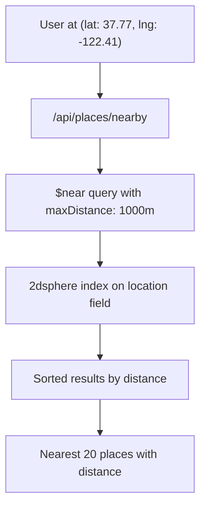

# How to Implement a Geospatial Search Feature with MongoDB

Author: [nawazdhandala](https://www.github.com/nawazdhandala)

Tags: MongoDB, Geospatial, Search, Index, Location

Description: Learn how to build a location-based search feature in MongoDB using 2dsphere indexes, $near, $geoWithin, and $geoIntersects operators.

---

## Overview

MongoDB has first-class geospatial support. Documents store coordinates in GeoJSON format, a `2dsphere` index enables spherical earth calculations, and operators like `$near`, `$geoWithin`, and `$geoIntersects` power proximity search, radius search, and polygon containment queries.



## Step 1: Store Location as GeoJSON

MongoDB supports the `Point`, `Polygon`, `LineString`, and other GeoJSON types. The coordinates array is `[longitude, latitude]` (note: longitude first).

```javascript
// Store a place with a GeoJSON point
db.places.insertMany([
  {
    name: "Golden Gate Park",
    category: "park",
    location: {
      type: "Point",
      coordinates: [-122.4862, 37.7694]  // [lng, lat]
    },
    rating: 4.8
  },
  {
    name: "Fisherman's Wharf",
    category: "attraction",
    location: {
      type: "Point",
      coordinates: [-122.4177, 37.8080]
    },
    rating: 4.2
  },
  {
    name: "Coit Tower",
    category: "landmark",
    location: {
      type: "Point",
      coordinates: [-122.4058, 37.8024]
    },
    rating: 4.5
  }
]);
```

## Step 2: Create a 2dsphere Index

```javascript
// 2dsphere index required for GeoJSON / spherical queries
db.places.createIndex({ location: "2dsphere" });

// Optional: compound index to support filtered proximity queries
db.places.createIndex({ category: 1, location: "2dsphere" });
```

## Step 3: Find Nearest Places with $near

`$near` returns documents sorted by distance from nearest to farthest.

```javascript
const { MongoClient } = require("mongodb");

const client = new MongoClient(process.env.MONGO_URI);
const db = client.db("maps");

async function findNearby({ lng, lat, maxDistanceMeters = 2000, limit = 20, category }) {
  const geoFilter = {
    location: {
      $near: {
        $geometry: {
          type: "Point",
          coordinates: [lng, lat]
        },
        $maxDistance: maxDistanceMeters,  // metres
        $minDistance: 0
      }
    }
  };

  const filter = category ? { ...geoFilter, category } : geoFilter;

  return db.collection("places")
    .find(filter)
    .limit(limit)
    .project({ name: 1, category: 1, location: 1, rating: 1 })
    .toArray();
}

// Find parks within 3 km of the user
const parks = await findNearby({
  lng: -122.4194,
  lat: 37.7749,
  maxDistanceMeters: 3000,
  category: "park"
});
```

## Step 4: Search Within a Radius with $geoWithin $centerSphere

`$geoWithin` does not sort by distance but can use the index without requiring a sort.

```javascript
async function findWithinRadius({ lng, lat, radiusKm, category }) {
  const radiusInRadians = radiusKm / 6378.1;  // Earth radius in km

  const filter = {
    location: {
      $geoWithin: {
        $centerSphere: [[lng, lat], radiusInRadians]
      }
    }
  };

  if (category) filter.category = category;

  return db.collection("places")
    .find(filter)
    .project({ name: 1, category: 1, rating: 1 })
    .toArray();
}
```

## Step 5: Search Within a Polygon (Neighbourhood / Delivery Zone)

```javascript
async function findWithinPolygon(polygonCoordinates) {
  // polygonCoordinates must be a closed ring: first and last point identical
  return db.collection("places").find({
    location: {
      $geoWithin: {
        $geometry: {
          type: "Polygon",
          coordinates: [polygonCoordinates]
        }
      }
    }
  }).toArray();
}

// Example: rectangular bounding box around San Francisco downtown
const sfBounds = [
  [-122.5155, 37.7079],  // SW
  [-122.3573, 37.7079],  // SE
  [-122.3573, 37.8121],  // NE
  [-122.5155, 37.8121],  // NW
  [-122.5155, 37.7079]   // close the ring
];

const places = await findWithinPolygon(sfBounds);
```

## Step 6: Compute Distance in the Aggregation Pipeline

Use `$geoNear` as the first aggregation stage to attach the calculated distance to each document.

```javascript
async function nearbyWithDistance({ lng, lat, maxMeters = 5000, limit = 20 }) {
  return db.collection("places").aggregate([
    {
      $geoNear: {
        near: { type: "Point", coordinates: [lng, lat] },
        distanceField: "distanceMeters",
        maxDistance: maxMeters,
        spherical: true,
        query: { rating: { $gte: 4 } }  // optional pre-filter
      }
    },
    { $limit: limit },
    {
      $project: {
        name: 1,
        category: 1,
        rating: 1,
        distanceMeters: { $round: ["$distanceMeters", 0] }
      }
    }
  ]).toArray();
}

const results = await nearbyWithDistance({ lng: -122.4194, lat: 37.7749 });
results.forEach((r) => console.log(`${r.name}: ${r.distanceMeters}m away`));
```

## Step 7: Build a REST API Endpoint

```javascript
const express = require("express");
const app = express();

app.get("/api/places/nearby", async (req, res) => {
  const { lat, lng, radius = "2000", category, limit = "20" } = req.query;

  if (!lat || !lng) {
    return res.status(400).json({ error: "lat and lng are required" });
  }

  try {
    const places = await nearbyWithDistance({
      lat: parseFloat(lat),
      lng: parseFloat(lng),
      maxMeters: parseInt(radius),
      limit: parseInt(limit)
    });
    res.json({ places, count: places.length });
  } catch (err) {
    console.error(err);
    res.status(500).json({ error: "Search failed" });
  }
});

app.listen(3000);
```

## Step 8: Store and Query Polygon Zones

Delivery zones, geofences, and service areas are stored as Polygon documents.

```javascript
// Insert a delivery zone
db.zones.insertOne({
  name: "Downtown SF",
  area: {
    type: "Polygon",
    coordinates: [[
      [-122.42, 37.77],
      [-122.39, 37.77],
      [-122.39, 37.80],
      [-122.42, 37.80],
      [-122.42, 37.77]
    ]]
  }
});

db.zones.createIndex({ area: "2dsphere" });

// Check which zones contain a user's location
async function getZonesContaining(lng, lat) {
  return db.collection("zones").find({
    area: {
      $geoIntersects: {
        $geometry: { type: "Point", coordinates: [lng, lat] }
      }
    }
  }).toArray();
}
```

## Geospatial Operator Reference

| Operator | Use case | Sorts by distance |
|---|---|---|
| `$near` / `$nearSphere` | Proximity search | Yes |
| `$geoWithin` | Containment in circle/polygon | No |
| `$geoIntersects` | Point-in-polygon check | No |
| `$geoNear` (aggregation) | Distance + rich pipeline | Yes |

## Summary

Implementing geospatial search in MongoDB requires storing coordinates as GeoJSON `Point` documents, creating a `2dsphere` index, and querying with `$near` or `$geoNear` for proximity results sorted by distance. Use `$geoWithin` for unordered containment queries, `$geoIntersects` for point-in-polygon checks, and the `$geoNear` aggregation stage when you need distance as a computed field inside a larger pipeline.
