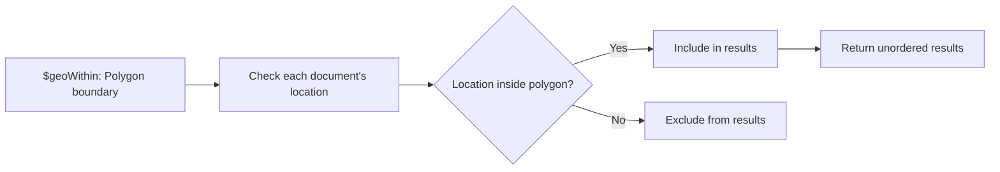

# How to Use $geoWithin in MongoDB for Area-Based Queries

Author: [nawazdhandala](https://www.github.com/nawazdhandala)

Tags: MongoDB, Geospatial, $geoWithin, Polygon, Location Query

Description: Learn how to use MongoDB's $geoWithin operator to find documents whose locations fall within a polygon, circle, or bounding box, without sorting by distance.

---

## How $geoWithin Works

The `$geoWithin` operator returns documents whose location values fall entirely within a specified geometry. Unlike `$near`, it does not sort results by distance and does not require a geospatial index (though using one greatly improves performance).

Use `$geoWithin` for:
- Finding all points inside a polygon (city boundary, delivery zone, geofence)
- Finding all points inside a circle or rectangle
- Geofencing: checking if a location is within a defined region



## Supported Geometry Types

`$geoWithin` supports:

- `$geometry` with GeoJSON Polygon or MultiPolygon (requires `2dsphere` index for accurate spherical queries)
- `$box` - rectangular bounding box (2d index, flat plane)
- `$center` - circle on flat plane (2d index)
- `$centerSphere` - circle on sphere (2dsphere index, more accurate)
- `$polygon` - polygon on flat plane (2d index)

## Examples

### Setup

```javascript
db.stores.createIndex({ location: "2dsphere" })

db.stores.insertMany([
  { name: "Store A - Manhattan", location: { type: "Point", coordinates: [-73.9857, 40.7580] } },
  { name: "Store B - Brooklyn", location: { type: "Point", coordinates: [-73.9442, 40.6501] } },
  { name: "Store C - Queens", location: { type: "Point", coordinates: [-73.7949, 40.7282] } },
  { name: "Store D - Bronx", location: { type: "Point", coordinates: [-73.8648, 40.8448] } },
  { name: "Store E - Newark", location: { type: "Point", coordinates: [-74.1745, 40.7357] } }
])
```

### Find Within a Polygon (GeoJSON)

Find stores within a rough bounding polygon around Manhattan:

```javascript
db.stores.find({
  location: {
    $geoWithin: {
      $geometry: {
        type: "Polygon",
        coordinates: [[
          [-74.0200, 40.7000],
          [-73.9500, 40.7000],
          [-73.9500, 40.8000],
          [-74.0200, 40.8000],
          [-74.0200, 40.7000]  // close the ring
        ]]
      }
    }
  }
})
// Returns stores within the polygon
```

### Find Within a $centerSphere (Radius on Sphere)

Find stores within a 10 km radius of a central point. `$centerSphere` uses radians, so divide kilometers by 6371 (Earth's radius in km):

```javascript
db.stores.find({
  location: {
    $geoWithin: {
      $centerSphere: [
        [-73.9857, 40.7580],   // center point [lng, lat]
        10 / 6371              // 10 km in radians
      ]
    }
  }
})
```

### Find Within a Bounding Box ($box)

Use `$box` for a flat-plane rectangle with a `2d` index:

```javascript
// Requires a 2d index (not 2dsphere)
db.places.createIndex({ coords: "2d" })

db.places.find({
  coords: {
    $geoWithin: {
      $box: [
        [-74.05, 40.70],  // bottom-left corner [lng, lat]
        [-73.95, 40.85]   // top-right corner [lng, lat]
      ]
    }
  }
})
```

### Find Within a Circle ($center, flat plane)

```javascript
// Requires a 2d index
db.places.find({
  coords: {
    $geoWithin: {
      $center: [
        [-73.9857, 40.7580],  // center point
        0.1                   // radius in coordinate degrees (approx 11km at equator)
      ]
    }
  }
})
```

### Geofencing: Check if a Location is in a Delivery Zone

```javascript
const deliveryZone = {
  type: "Polygon",
  coordinates: [[
    [-74.0200, 40.7000],
    [-73.9500, 40.7000],
    [-73.9500, 40.8000],
    [-74.0200, 40.8000],
    [-74.0200, 40.7000]
  ]]
};

// Check if a customer is in the delivery zone
const customerLocation = { type: "Point", coordinates: [-73.9800, 40.7400] };

// Find any delivery zone that contains the customer's location
db.deliveryZones.find({
  boundary: {
    $geoIntersects: {
      $geometry: customerLocation
    }
  }
})

// Or query from the customer's perspective
db.customers.find({
  location: {
    $geoWithin: {
      $geometry: deliveryZone
    }
  }
})
```

### $geoWithin vs $near Comparison

```javascript
// $near: sorted by distance, requires index, has distance limit
db.stores.find({
  location: {
    $near: {
      $geometry: { type: "Point", coordinates: [-73.9857, 40.7580] },
      $maxDistance: 5000
    }
  }
})
// Returns sorted by distance

// $geoWithin: unordered, no index required (but faster with one), no limit
db.stores.find({
  location: {
    $geoWithin: {
      $centerSphere: [[-73.9857, 40.7580], 5 / 6371]
    }
  }
})
// Returns in any order
```

### Node.js Example: Delivery Zone Check

```javascript
const { MongoClient } = require("mongodb");

async function checkDeliveryEligibility(customerLng, customerLat) {
  const client = new MongoClient("mongodb://localhost:27017");
  await client.connect();

  const zones = client.db("delivery").collection("zones");
  const customers = client.db("delivery").collection("customers");

  // Create index on delivery zone boundaries
  await zones.createIndex({ boundary: "2dsphere" });

  // Define a delivery zone
  await zones.insertOne({
    name: "Downtown Zone",
    boundary: {
      type: "Polygon",
      coordinates: [[
        [-74.0200, 40.7000],
        [-73.9500, 40.7000],
        [-73.9500, 40.8000],
        [-74.0200, 40.8000],
        [-74.0200, 40.7000]
      ]]
    }
  });

  // Check if customer is in any delivery zone
  const eligibleZones = await zones.find({
    boundary: {
      $geoIntersects: {
        $geometry: {
          type: "Point",
          coordinates: [customerLng, customerLat]
        }
      }
    }
  }).toArray();

  if (eligibleZones.length > 0) {
    console.log(`Delivery available in zone: ${eligibleZones[0].name}`);
  } else {
    console.log("No delivery to this location.");
  }

  await client.close();
  return eligibleZones.length > 0;
}

checkDeliveryEligibility(-73.9800, 40.7400).catch(console.error);
```

### Polygon with Holes

GeoJSON Polygon can include interior rings (holes) to exclude areas:

```javascript
// Polygon with a hole: outer ring minus inner ring
db.zones.insertOne({
  name: "Outer Zone (excluding center)",
  boundary: {
    type: "Polygon",
    coordinates: [
      // Outer ring (counterclockwise)
      [[-74.05, 40.70], [-73.90, 40.70], [-73.90, 40.85], [-74.05, 40.85], [-74.05, 40.70]],
      // Inner ring / hole (clockwise)
      [[-74.00, 40.74], [-74.00, 40.78], [-73.97, 40.78], [-73.97, 40.74], [-74.00, 40.74]]
    ]
  }
})
```

## Best Practices

- **Use a `2dsphere` index** with `$geometry` (GeoJSON) for accurate spherical calculations.
- **Close polygon rings** by repeating the first coordinate as the last coordinate.
- **Use `$centerSphere` with radians** for radius-based queries when you do not need sorted results.
- **Prefer `$geoWithin` over `$near`** when you only need membership (is this location inside the zone?) rather than sorted proximity.
- **Pre-define delivery/geofence polygons** in a separate collection and use `$geoIntersects` to check membership.

## Summary

`$geoWithin` returns all documents whose location falls inside a specified geometry - polygon, bounding box, or circle. It does not sort results by distance and does not require a geospatial index (though indexes are strongly recommended for performance). Use `$geometry` with a GeoJSON Polygon for spherical accuracy, or `$box`/`$center`/`$centerSphere` for simpler shapes. It is ideal for geofencing, delivery zone checks, and regional filtering.
