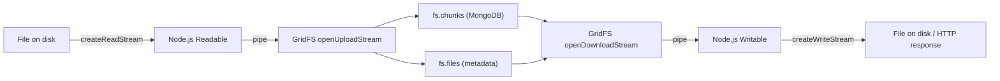

# How to Stream Files to and from GridFS in MongoDB

Author: [nawazdhandala](https://www.github.com/nawazdhandala)

Tags: MongoDB, GridFS, Streaming, File Storage, Node.js

Description: Learn how to stream large files to and from MongoDB GridFS without buffering entire files in memory, using Node.js readable and writable streams.

---

## Why Streaming Matters for GridFS

GridFS splits files into 255 KB chunks and stores them in two collections: `fs.files` (metadata) and `fs.chunks` (binary data). For large files (video, archives, datasets) loading the entire file into memory before writing or after reading is impractical. Node.js streams let you pipe data directly from disk or HTTP to GridFS and back.



## Setup

```javascript
const { MongoClient, GridFSBucket, ObjectId } = require("mongodb");
const fs   = require("fs");
const path = require("path");

const client = new MongoClient(process.env.MONGO_URI);
await client.connect();
const db = client.db("file_store");

// Create a GridFS bucket (uses fs.files and fs.chunks by default)
const bucket = new GridFSBucket(db, {
  bucketName: "uploads",   // custom prefix: uploads.files, uploads.chunks
  chunkSizeBytes: 261120   // 255 KB default; set higher for large sequential files
});
```

## Uploading a File from Disk via Stream

```javascript
async function uploadFile(localPath, remoteFilename, metadata = {}) {
  return new Promise((resolve, reject) => {
    const readStream  = fs.createReadStream(localPath);
    const uploadStream = bucket.openUploadStream(remoteFilename, {
      metadata: {
        originalName: path.basename(localPath),
        uploadedAt:   new Date(),
        ...metadata
      }
    });

    readStream.pipe(uploadStream);

    uploadStream.on("finish", () => {
      console.log(`Uploaded: ${remoteFilename} -> fileId: ${uploadStream.id}`);
      resolve(uploadStream.id);
    });

    uploadStream.on("error", reject);
    readStream.on("error", reject);
  });
}

const fileId = await uploadFile("/tmp/video.mp4", "video.mp4", { userId: "u-1" });
```

## Uploading from an HTTP Request (Multipart / Raw Body)

```javascript
const express = require("express");
const multer  = require("multer");

const app     = express();
const storage = multer.memoryStorage();
const upload  = multer({ storage });

// Upload via multipart form
app.post("/upload", upload.single("file"), async (req, res) => {
  const { originalname, buffer, mimetype } = req.file;

  const uploadStream = bucket.openUploadStream(originalname, {
    metadata: { contentType: mimetype, uploadedBy: req.user?.id }
  });

  uploadStream.end(buffer);

  uploadStream.on("finish", () => {
    res.json({ fileId: uploadStream.id.toString(), name: originalname });
  });

  uploadStream.on("error", (err) => {
    console.error(err);
    res.status(500).json({ error: "Upload failed" });
  });
});

// Stream raw body directly (no buffering in multer)
app.post("/upload-stream", async (req, res) => {
  const filename     = req.headers["x-filename"] || "unnamed";
  const uploadStream = bucket.openUploadStream(filename, {
    metadata: { contentType: req.headers["content-type"] }
  });

  req.pipe(uploadStream);

  uploadStream.on("finish", () => {
    res.json({ fileId: uploadStream.id.toString() });
  });

  uploadStream.on("error", (err) => {
    console.error(err);
    res.status(500).json({ error: "Upload failed" });
  });
});
```

## Downloading a File to Disk via Stream

```javascript
async function downloadFile(fileId, destPath) {
  return new Promise((resolve, reject) => {
    const writeStream    = fs.createWriteStream(destPath);
    const downloadStream = bucket.openDownloadStream(new ObjectId(fileId));

    downloadStream.pipe(writeStream);

    writeStream.on("finish", () => {
      console.log(`Downloaded fileId ${fileId} to ${destPath}`);
      resolve(destPath);
    });

    downloadStream.on("error", reject);
    writeStream.on("error", reject);
  });
}

await downloadFile(fileId.toString(), "/tmp/output_video.mp4");
```

## Streaming a File to an HTTP Response

```javascript
app.get("/files/:id", async (req, res) => {
  const { id } = req.params;
  let fileId;

  try {
    fileId = new ObjectId(id);
  } catch {
    return res.status(400).json({ error: "Invalid file ID" });
  }

  // Fetch metadata first to set Content-Type and Content-Length
  const cursor = bucket.find({ _id: fileId });
  const [fileMeta] = await cursor.toArray();

  if (!fileMeta) {
    return res.status(404).json({ error: "File not found" });
  }

  res.setHeader("Content-Type", fileMeta.metadata?.contentType || "application/octet-stream");
  res.setHeader("Content-Length", fileMeta.length);
  res.setHeader("Content-Disposition", `attachment; filename="${fileMeta.filename}"`);

  const downloadStream = bucket.openDownloadStream(fileId);

  downloadStream.pipe(res);

  downloadStream.on("error", (err) => {
    console.error("Download stream error:", err);
    if (!res.headersSent) {
      res.status(500).json({ error: "Download failed" });
    }
  });
});
```

## Range Requests (Partial Content for Video Streaming)

```javascript
app.get("/video/:id", async (req, res) => {
  const fileId = new ObjectId(req.params.id);

  const [fileMeta] = await bucket.find({ _id: fileId }).toArray();
  if (!fileMeta) return res.status(404).send("Not found");

  const fileSize = fileMeta.length;
  const rangeHeader = req.headers.range;

  if (!rangeHeader) {
    res.setHeader("Content-Length", fileSize);
    res.setHeader("Content-Type", "video/mp4");
    bucket.openDownloadStream(fileId).pipe(res);
    return;
  }

  const [startStr, endStr] = rangeHeader.replace(/bytes=/, "").split("-");
  const start = parseInt(startStr, 10);
  const end   = endStr ? parseInt(endStr, 10) : fileSize - 1;

  res.writeHead(206, {
    "Content-Range":  `bytes ${start}-${end}/${fileSize}`,
    "Accept-Ranges":  "bytes",
    "Content-Length": end - start + 1,
    "Content-Type":   "video/mp4"
  });

  bucket.openDownloadStream(fileId, { start, end: end + 1 }).pipe(res);
});
```

## Deleting a File

```javascript
async function deleteFile(fileId) {
  await bucket.delete(new ObjectId(fileId));
  console.log(`Deleted fileId: ${fileId}`);
}
```

## Listing Files

```javascript
async function listFiles(filter = {}, limit = 50) {
  return bucket.find(filter)
    .sort({ uploadDate: -1 })
    .limit(limit)
    .toArray();
}

const recentFiles = await listFiles({ "metadata.userId": "u-1" });
```

## Summary

Streaming files to and from MongoDB GridFS avoids loading entire files into memory. Use `bucket.openUploadStream()` and pipe a Node.js Readable into it to upload; use `bucket.openDownloadStream()` and pipe it to a Writable or HTTP response to download. For video and large binary content, use the `start`/`end` options on `openDownloadStream` to serve HTTP range requests. Always handle `error` events on both the GridFS stream and the destination stream to prevent silent failures.
