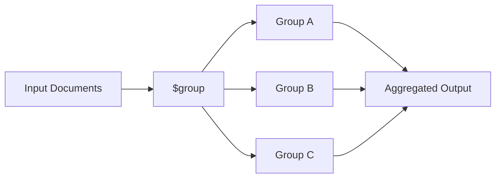

# How to Use $group Stage in MongoDB Aggregation

Author: [nawazdhandala](https://www.github.com/nawazdhandala)

Tags: MongoDB, Aggregation, $group, Pipeline, Stage, Accumulator

Description: Learn how to use the $group stage in MongoDB aggregation to group documents by a key and compute aggregated values using accumulators.

---

## How $group Works

The `$group` stage groups input documents by a specified expression (the `_id` field) and applies accumulator expressions to each group. It is the MongoDB equivalent of SQL's `GROUP BY` clause. Each unique value of the grouping expression produces one output document.



## Syntax

```javascript
{
  $group: {
    _id: <expression>,         // grouping key; null to group all documents
    <field1>: { <accumulator1>: <expression1> },
    <field2>: { <accumulator2>: <expression2> },
    ...
  }
}
```

Common accumulators: `$sum`, `$avg`, `$min`, `$max`, `$push`, `$addToSet`, `$first`, `$last`, `$count`.

## Examples

### Example 1 - Group by a Single Field

Consider a `sales` collection:

```javascript
[
  { _id: 1, product: "laptop", region: "US", amount: 1200 },
  { _id: 2, product: "phone",  region: "EU", amount: 800  },
  { _id: 3, product: "laptop", region: "EU", amount: 1100 },
  { _id: 4, product: "phone",  region: "US", amount: 750  },
  { _id: 5, product: "laptop", region: "US", amount: 1300 }
]
```

Group by `product` and calculate the total sales:

```javascript
db.sales.aggregate([
  {
    $group: {
      _id: "$product",
      totalSales: { $sum: "$amount" },
      count: { $sum: 1 }
    }
  }
])
```

Output:

```javascript
[
  { _id: "laptop", totalSales: 3600, count: 3 },
  { _id: "phone",  totalSales: 1550, count: 2 }
]
```

### Example 2 - Group by Multiple Fields

Group by both `product` and `region`:

```javascript
db.sales.aggregate([
  {
    $group: {
      _id: { product: "$product", region: "$region" },
      totalSales: { $sum: "$amount" },
      avgSale: { $avg: "$amount" }
    }
  }
])
```

Output:

```javascript
[
  { _id: { product: "laptop", region: "US" }, totalSales: 2500, avgSale: 1250 },
  { _id: { product: "phone",  region: "EU" }, totalSales: 800,  avgSale: 800  },
  { _id: { product: "laptop", region: "EU" }, totalSales: 1100, avgSale: 1100 },
  { _id: { product: "phone",  region: "US" }, totalSales: 750,  avgSale: 750  }
]
```

### Example 3 - Group All Documents (Grand Total)

Use `null` as the `_id` to aggregate across all documents:

```javascript
db.sales.aggregate([
  {
    $group: {
      _id: null,
      grandTotal: { $sum: "$amount" },
      averageAmount: { $avg: "$amount" },
      minAmount: { $min: "$amount" },
      maxAmount: { $max: "$amount" }
    }
  }
])
```

Output:

```javascript
[
  { _id: null, grandTotal: 5150, averageAmount: 1030, minAmount: 750, maxAmount: 1300 }
]
```

### Example 4 - Collect Values with $push

Group by `region` and collect all product names into an array:

```javascript
db.sales.aggregate([
  {
    $group: {
      _id: "$region",
      products: { $push: "$product" }
    }
  }
])
```

Output:

```javascript
[
  { _id: "US", products: ["laptop", "phone", "laptop"] },
  { _id: "EU", products: ["phone", "laptop"] }
]
```

### Example 5 - Counting Documents per Group

Use `$sum: 1` to count documents, or use `$count` (MongoDB 5.0+):

```javascript
db.sales.aggregate([
  {
    $group: {
      _id: "$product",
      count: { $sum: 1 }
    }
  }
])
```

### Example 6 - Group with $match and $sort

A common pattern is to filter first, group, then sort results:

```javascript
db.sales.aggregate([
  { $match: { amount: { $gte: 1000 } } },
  {
    $group: {
      _id: "$product",
      totalSales: { $sum: "$amount" }
    }
  },
  { $sort: { totalSales: -1 } }
])
```

Output:

```javascript
[
  { _id: "laptop", totalSales: 3600 }
]
```

## Use Cases

- Generating sales reports by category, region, or time period
- Computing statistics (min, max, avg) across document groups
- Building leaderboards by grouping and sorting aggregated scores
- Counting occurrences of values (similar to SQL `COUNT(*)`)
- Collecting related values into arrays per group

## Summary

The `$group` stage is one of the most powerful stages in the MongoDB aggregation pipeline. It groups documents by an expression and applies accumulator operators to produce per-group statistics. By combining `$group` with `$match`, `$sort`, and `$project`, you can build complex analytical queries that replace multiple application-side loops. Always pair `$group` with `$match` earlier in the pipeline to limit the input document set and improve performance.
