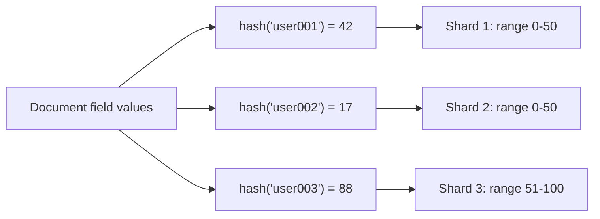

# How to Create a Hashed Index in MongoDB for Sharding

Author: [nawazdhandala](https://www.github.com/nawazdhandala)

Tags: MongoDB, Index, Hashed Index, Sharding, Scalability

Description: Learn how to create a hashed index in MongoDB to enable hash-based sharding, ensure even data distribution, and support equality queries on sharded collections.

---

## How Hashed Indexes Work

A hashed index computes a hash of the indexed field's value and stores that hash in the index. The hash function maps values to integer buckets, producing a near-uniform distribution even if the original values are sequential or clustered.

Hashed indexes are primarily used as shard keys to distribute data evenly across shards. They also support equality queries (`$eq`, `$in`) but do not support range queries.



Key characteristics:
- Values are hashed before being stored in the index.
- Provides even distribution for sequential or monotonically increasing values (like timestamps or auto-incremented IDs).
- Does not support range queries (the hash of adjacent values is not adjacent).
- Only supported on single fields (not compound).

## Syntax

```javascript
db.collection.createIndex({ field: "hashed" })
```

## Examples

### Create a Hashed Index

```javascript
db.users.createIndex({ userId: "hashed" })
```

### Equality Query Using a Hashed Index

Hashed indexes support exact-match queries:

```javascript
db.users.find({ userId: "user_12345" })
```

Verify the index is used:

```javascript
db.users.find({ userId: "user_12345" }).explain("executionStats")
```

The winning plan should show `"stage": "IXSCAN"` with the hashed index.

### Hashed Index Does Not Support Range Queries

Range queries cannot use a hashed index because the hash function scrambles the natural ordering:

```javascript
// This will NOT use the hashed index
db.users.find({ userId: { $gt: "user_100", $lt: "user_200" } })
```

For range queries, use a regular ascending (`1`) or descending (`-1`) index instead.

### Using a Hashed Index as a Shard Key

When setting up sharding for a collection, specify a hashed shard key:

```bash
# Enable sharding on the database
mongosh> sh.enableSharding("myapp")

# Shard the users collection with a hashed shard key
mongosh> sh.shardCollection("myapp.users", { userId: "hashed" })
```

This creates the hashed index automatically if it does not already exist, and distributes chunks evenly across shards based on the hash of `userId`.

### Pre-creating the Index Before Sharding

Best practice is to create the index before enabling sharding:

```javascript
// 1. Create the hashed index first
db.events.createIndex({ eventId: "hashed" }, { name: "idx_eventId_hashed" })

// 2. Then shard the collection
sh.shardCollection("analytics.events", { eventId: "hashed" })
```

### Node.js Example

```javascript
const { MongoClient } = require("mongodb");

async function main() {
  const client = new MongoClient("mongodb://localhost:27017");
  await client.connect();

  const users = client.db("myapp").collection("users");

  // Create a hashed index on userId
  const result = await users.createIndex(
    { userId: "hashed" },
    { name: "idx_userId_hashed" }
  );
  console.log("Index created:", result);

  // Insert sample documents
  await users.insertMany([
    { userId: "user_001", name: "Alice", email: "alice@example.com" },
    { userId: "user_002", name: "Bob", email: "bob@example.com" },
    { userId: "user_003", name: "Carol", email: "carol@example.com" }
  ]);

  // Equality query using the hashed index
  const user = await users.findOne({ userId: "user_002" });
  console.log("Found user:", user.name);

  // Check index stats
  const indexes = await users.indexes();
  console.log("Indexes:", indexes.map(i => ({ name: i.name, key: i.key })));

  await client.close();
}

main().catch(console.error);
```

## Hashed vs Range Shard Keys

Choosing between a hashed and a range shard key depends on your access patterns:

```text
Concern                   Hashed Shard Key    Range Shard Key
--------------------------------------------------------------
Data distribution         Even                Depends on values
Range query efficiency    Poor (scatter)      Good (targeted)
Insert pattern            Distributed         May hot-spot
Monotonic key (timestamps)  Good choice       Hot-spot risk
Targeted reads            Yes (equality only) Yes (equality + range)
```

## Best Practices

- **Use hashed indexes for monotonically increasing shard keys** such as timestamps, ObjectIDs, or auto-incremented numbers to prevent write hot-spots.
- **Pre-create the hashed index** before sharding a collection to avoid a blocking index build on an already-populated collection.
- **Do not use hashed indexes for range query workloads.** Hashed shard keys cause scatter-gather for range queries, hitting every shard.
- **Only one hashed field per index.** MongoDB does not support compound hashed indexes.
- **Monitor chunk distribution** with `sh.status()` after sharding to confirm even distribution.

## Summary

A hashed index in MongoDB stores the hash of indexed field values rather than the values themselves, ensuring even distribution across shards for monotonically increasing keys. Create it with `createIndex({ field: "hashed" })`. It is the foundation of hash-based sharding and supports equality queries, but not range queries. Pre-create it before sharding a collection, and verify with `sh.status()` that data is distributed evenly across shards.
