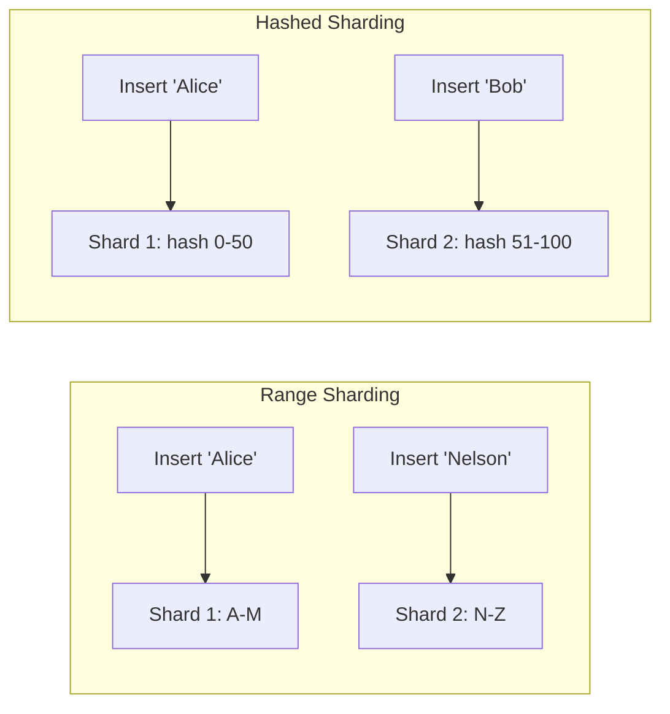

# How to Use Hashed Sharding vs Range Sharding in MongoDB

Author: [nawazdhandala](https://www.github.com/nawazdhandala)

Tags: MongoDB, Sharding, Hashed Sharding, Range Sharding, Shard Key

Description: Learn the differences between hashed and range sharding in MongoDB, when to use each approach, and how to configure both for optimal data distribution and query performance.

---

## Hashed vs Range Sharding Overview

MongoDB supports two primary sharding strategies:

- **Range sharding** - Documents are distributed based on contiguous ranges of shard key values. Documents with similar keys land on the same shard.
- **Hashed sharding** - The shard key value is hashed before distribution. Documents are spread uniformly regardless of the original key values.



## Range Sharding

In range sharding, MongoDB divides the shard key space into non-overlapping ranges (chunks) and assigns each range to a shard. The chunks are contiguous, so documents with nearby shard key values are stored together.

### Setting Up Range Sharding

```javascript
// Connect to mongos
mongosh "mongodb://mongos:27017"

// Enable sharding on the database
sh.enableSharding("myapp")

// Create an index on the shard key
db.events.createIndex({ timestamp: 1 })

// Shard with range strategy (default when not using "hashed")
sh.shardCollection("myapp.events", { timestamp: 1 })
```

### Range Sharding: Querying

Range queries are efficient with range sharding because matching documents are co-located on the same shard or a small number of adjacent shards:

```javascript
// Targeted range query - hits a minimal number of shards
db.events.find({
  timestamp: {
    $gte: ISODate("2026-03-01"),
    $lt: ISODate("2026-04-01")
  }
})
```

### Range Sharding: Insert Pattern

With monotonically increasing keys (timestamps, ObjectIDs), all new inserts go to the shard holding the highest range - creating a write hot-spot:

```javascript
// All new events get the current timestamp, so they all go to the same shard
db.events.insertOne({ timestamp: new Date(), type: "click" })
// Problem: every new insert hits the same "hot" shard
```

### Pre-splitting Chunks for Range Sharding

To avoid the initial hot-spot during data loading, pre-split chunks before inserting data:

```javascript
// Pre-split chunks at month boundaries
sh.splitAt("myapp.events", { timestamp: ISODate("2026-01-01") })
sh.splitAt("myapp.events", { timestamp: ISODate("2026-02-01") })
sh.splitAt("myapp.events", { timestamp: ISODate("2026-03-01") })

// Move chunks to specific shards
sh.moveChunk("myapp.events", { timestamp: ISODate("2026-01-01") }, "rs-shard2")
sh.moveChunk("myapp.events", { timestamp: ISODate("2026-02-01") }, "rs-shard3")
```

## Hashed Sharding

Hashed sharding applies a hash function to the shard key before distributing documents. This produces near-uniform distribution, even for monotonically increasing keys.

### Setting Up Hashed Sharding

```javascript
// Create a hashed index
db.orders.createIndex({ orderId: "hashed" })

// Shard with hashed strategy
sh.shardCollection("myapp.orders", { orderId: "hashed" })
```

### Hashed Sharding: Insert Pattern

Inserts are distributed uniformly across all shards:

```javascript
// These sequential IDs are hashed, so they go to different shards
db.orders.insertOne({ orderId: "ORD-001", amount: 100 })  // -> shard A
db.orders.insertOne({ orderId: "ORD-002", amount: 200 })  // -> shard C
db.orders.insertOne({ orderId: "ORD-003", amount: 150 })  // -> shard B
```

### Hashed Sharding: Query Pattern

Equality queries on the hashed field are targeted (single shard):

```javascript
// Targeted - hashes the orderId and goes to one shard
db.orders.find({ orderId: "ORD-001" })
```

Range queries become scatter-gather because hashing destroys value ordering:

```javascript
// Scatter-gather - must check all shards (hash of adjacent values is not adjacent)
db.orders.find({ orderId: { $gt: "ORD-100", $lt: "ORD-200" } })
```

## Side-by-Side Comparison

```text
Concern                    Range Sharding        Hashed Sharding
----------------------------------------------------------------------
Distribution (sequential)  Hot-spot risk         Even distribution
Distribution (random)      Even                  Even
Range queries              Efficient (targeted)  Scatter-gather
Equality queries           Targeted              Targeted
Pre-splitting needed       Yes (for monotonic)   No (built-in)
Good for time-series       Only with pre-split   Yes
Good for random IDs        Yes                   Yes
Good for ordered reads     Yes                   No
Zone sharding support      Yes                   No
```

## Compound Shard Keys: Combining Both Strategies

A compound shard key can use one field for distribution and another for range querying within that distribution:

```javascript
// customerId (hashed for distribution) + createdAt (range within customer)
db.orders.createIndex({ customerId: 1, createdAt: 1 })
sh.shardCollection("myapp.orders", { customerId: 1, createdAt: 1 })
```

This allows targeted queries per customer with efficient range queries on dates:

```javascript
// Targeted: all data for a customer is on one shard
db.orders.find({
  customerId: "cust_001",
  createdAt: { $gte: ISODate("2026-01-01") }
})
```

## Node.js: Checking Shard Targeting

```javascript
const { MongoClient } = require("mongodb");

async function analyzeSharding() {
  const client = new MongoClient("mongodb://mongos:27017");
  await client.connect();

  const db = client.db("myapp");

  // Check if a query is targeted or scatter-gather
  const explainResult = await db.collection("orders").find(
    { orderId: "ORD-001" }
  ).explain("executionStats");

  const shards = explainResult.executionStats.executionStages.shards;
  if (shards) {
    console.log(`Shards queried: ${shards.length}`);
    shards.forEach(s => {
      console.log(`  Shard: ${s.shardName}, Docs examined: ${s.executionStats.totalDocsExamined}`);
    });
  }

  // Check chunk distribution
  const chunks = await db.getSiblingDB("config")
    .collection("chunks")
    .aggregate([
      { $match: { ns: "myapp.orders" } },
      { $group: { _id: "$shard", count: { $sum: 1 } } },
      { $sort: { count: -1 } }
    ]).toArray();

  console.log("\nChunk distribution:");
  chunks.forEach(c => console.log(`  ${c._id}: ${c.count} chunks`));

  await client.close();
}

analyzeSharding().catch(console.error);
```

## When to Use Each Strategy

**Use range sharding when:**
- Your primary query pattern is range-based (time-series, alphabetical, numerical ranges).
- You can pre-split chunks to avoid hot-spots.
- You need zone sharding for data locality.
- Data naturally distributes across a wide range.

**Use hashed sharding when:**
- Your shard key is monotonically increasing (timestamps, ObjectIDs, sequential IDs).
- Write throughput is critical and you need even write distribution.
- Primary query pattern is equality (find by ID).
- You want zero configuration - hashed sharding distributes data evenly without pre-splitting.

## Best Practices

- **Default to hashed sharding** for new collections with sequential or UUID-style shard keys.
- **Use range sharding** when your applications do range scans and can pre-split chunks.
- **Pre-split chunks before bulk loading** into a range-sharded collection to avoid hot-spots.
- **Monitor distribution** with `sh.status()` and the config.chunks collection.
- **Avoid mixing hashed and range** - a compound hashed+range index is not supported. Hashed shard keys must be single-field.

## Summary

Range sharding distributes documents by contiguous key value ranges, making range queries efficient but risking hot-spots with monotonic keys. Hashed sharding applies a hash function to distribute documents uniformly, making it ideal for sequential keys but inefficient for range queries. Choose based on your write pattern (hashed for monotonic keys) and query pattern (range for range scans, hashed for equality lookups). Use compound shard keys to balance distribution with targeted query access.
