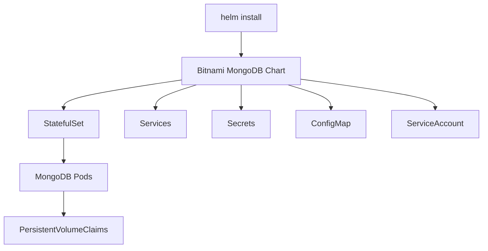

# How to Use MongoDB Helm Chart for Kubernetes Deployment

Author: [nawazdhandala](https://www.github.com/nawazdhandala)

Tags: MongoDB, Helm, Kubernetes, Operations, Infrastructure

Description: Learn how to deploy MongoDB on Kubernetes using the Bitnami Helm chart, configure values, enable authentication, set up persistence, and manage upgrades.

---

## Why Use a Helm Chart for MongoDB

Writing raw Kubernetes YAML for MongoDB requires managing StatefulSets, Services, ConfigMaps, Secrets, PVCs, RBAC, and more. The Bitnami MongoDB Helm chart packages all of this into a single, configurable unit that you can deploy with one command and customize with a `values.yaml` file.



## Adding the Bitnami Repository

```bash
helm repo add bitnami https://charts.bitnami.com/bitnami
helm repo update
```

Verify the chart is available:

```bash
helm search repo bitnami/mongodb
```

## Quick Install

Deploy a standalone MongoDB instance in the `mongodb` namespace:

```bash
kubectl create namespace mongodb

helm install mongodb bitnami/mongodb \
  --namespace mongodb \
  --set auth.rootPassword=SuperSecretPassword123
```

Check the deployment:

```bash
kubectl get pods -n mongodb -w
```

Get the connection string printed by the chart notes:

```bash
helm status mongodb -n mongodb
```

## Customizing with values.yaml

Create a `values.yaml` file for a production-ready configuration:

```yaml
# values.yaml

# Architecture: standalone or replicaset
architecture: replicaset
replicaCount: 3

auth:
  enabled: true
  rootUser: admin
  rootPassword: ""           # set via --set or a secret
  replicaSetKey: ""          # auto-generated if empty

replicaSetName: rs0
replicaSetHostnames: true

persistence:
  enabled: true
  storageClass: "standard"
  accessModes:
    - ReadWriteOnce
  size: 20Gi

resources:
  requests:
    cpu: 500m
    memory: 1Gi
  limits:
    cpu: 2000m
    memory: 4Gi

livenessProbe:
  enabled: true
  initialDelaySeconds: 30
  periodSeconds: 20
  timeoutSeconds: 10

readinessProbe:
  enabled: true
  initialDelaySeconds: 15
  periodSeconds: 10
  timeoutSeconds: 5

metrics:
  enabled: true             # deploy mongodb-exporter sidecar
  serviceMonitor:
    enabled: false          # set true if you have Prometheus Operator

extraFlags:
  - "--wiredTigerCacheSizeGB=2"

podAntiAffinityPreset: hard  # spread pods across nodes

service:
  type: ClusterIP
  port: 27017
```

Install with the values file:

```bash
helm install mongodb bitnami/mongodb \
  --namespace mongodb \
  --values values.yaml \
  --set auth.rootPassword=SuperSecretPassword123 \
  --set auth.replicaSetKey=myreplicasetkey
```

## Using an Existing Secret for Credentials

Create a secret before installing the chart:

```bash
kubectl create secret generic mongodb-credentials \
  --namespace mongodb \
  --from-literal=mongodb-root-password=SuperSecretPassword123 \
  --from-literal=mongodb-replica-set-key=myreplicasetkey
```

Reference the existing secret in `values.yaml`:

```yaml
auth:
  enabled: true
  existingSecret: mongodb-credentials
```

## Upgrading the Chart

Update the Helm repository and apply a new values file:

```bash
helm repo update

helm upgrade mongodb bitnami/mongodb \
  --namespace mongodb \
  --values values.yaml \
  --set auth.rootPassword=SuperSecretPassword123
```

Check the upgrade history:

```bash
helm history mongodb -n mongodb
```

Roll back to a previous revision if needed:

```bash
helm rollback mongodb 1 -n mongodb
```

## Connecting to MongoDB

Get the root password from the secret created by the chart:

```bash
kubectl get secret mongodb -n mongodb \
  -o jsonpath="{.data.mongodb-root-password}" | base64 -d
```

Connect via a temporary pod:

```bash
kubectl run mongodb-client --rm --tty -i \
  --restart=Never \
  --namespace mongodb \
  --image bitnami/mongodb:7.0 \
  --command -- mongosh \
  "mongodb://admin:$(kubectl get secret mongodb -n mongodb -o jsonpath='{.data.mongodb-root-password}' | base64 -d)@mongodb-0.mongodb-headless.mongodb.svc.cluster.local:27017/?authSource=admin&replicaSet=rs0"
```

## Enabling Metrics with Prometheus

If you have Prometheus Operator installed, enable the ServiceMonitor:

```yaml
metrics:
  enabled: true
  serviceMonitor:
    enabled: true
    namespace: monitoring
    interval: 30s
    scrapeTimeout: 10s
```

This deploys a `mongodb-exporter` sidecar and creates a `ServiceMonitor` resource that Prometheus Operator uses to configure scraping.

## Uninstalling

```bash
helm uninstall mongodb -n mongodb
```

Note: PVCs are not deleted automatically. Delete them manually if you want to remove all data:

```bash
kubectl delete pvc -l app.kubernetes.io/name=mongodb -n mongodb
```

## Common Configuration Overrides

Enable TLS:

```yaml
tls:
  enabled: true
  autoGenerated: true   # auto-generate self-signed certs for testing
```

Set resource limits to prevent OOM kills:

```yaml
resources:
  limits:
    memory: 4Gi
```

Configure WiredTiger cache:

```yaml
extraFlags:
  - "--wiredTigerCacheSizeGB=2"
```

## Best Practices

- Never put passwords in `values.yaml`; pass them via `--set` or reference an existing secret.
- Use `architecture: replicaset` with at least 3 replicas for production high availability.
- Set `podAntiAffinityPreset: hard` to spread MongoDB pods across different Kubernetes nodes.
- Enable the metrics sidecar and alert on replication lag, connections, and oplog size.
- Pin the chart version in production with `--version <chart-version>` to avoid unexpected upgrades.
- Back up your `values.yaml` and keep it in version control alongside your infrastructure code.

## Summary

The Bitnami MongoDB Helm chart abstracts the complexity of deploying MongoDB on Kubernetes. Use a `values.yaml` file to configure architecture (standalone or replica set), persistence, resources, and metrics. Pass passwords via `--set` or an existing Kubernetes Secret rather than hardcoding them. For production, use `architecture: replicaset` with anti-affinity rules to ensure high availability across Kubernetes nodes.
