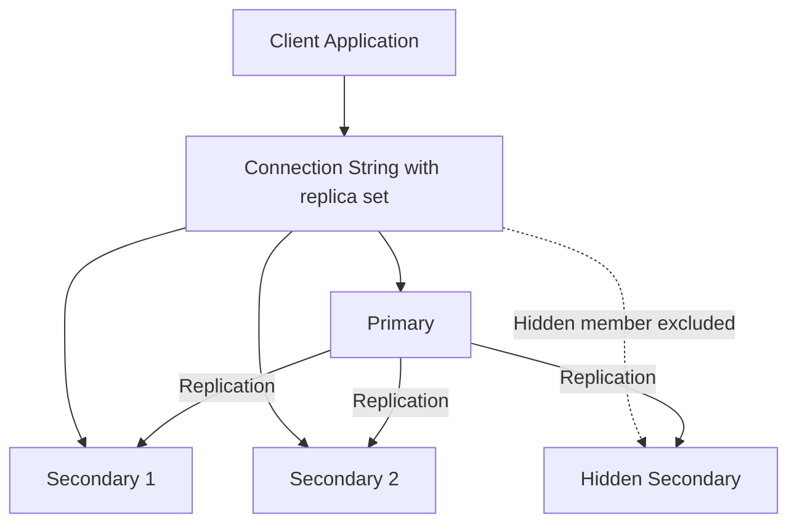

# How to Set Up Hidden Members in MongoDB Replica Set

Author: [nawazdhandala](https://www.github.com/nawazdhandala)

Tags: MongoDB, Replica Set, Hidden Member, Replication, Configuration

Description: Learn how to configure hidden members in a MongoDB replica set for backup and analytics workloads, with rules for priority, votes, and verifying hidden member behavior.

---

## What are Hidden Members

A hidden member is a replica set secondary that replicates all data from the primary but is invisible to client connection strings. Clients using the `mongodb+srv://` URI or `rs.isMaster()` do not see hidden members, so they never receive application traffic.

Hidden members are useful for:
- Running backups without impacting primary or application-facing secondaries
- Running resource-intensive analytics queries in isolation
- Maintaining a full copy of data for reporting without serving production reads



## Rules for Hidden Members

1. `hidden: true` requires `priority: 0` (hidden members cannot become primary)
2. Hidden members can have `votes: 1` (they participate in elections)
3. Hidden members replicate all data including indexes
4. Hidden members are excluded from `db.isMaster()` and `hello` responses
5. Clients can connect directly to a hidden member by specifying the host explicitly

## Configuring a Hidden Member at rs.initiate()

```javascript
rs.initiate({
  _id: "rs0",
  members: [
    { _id: 0, host: "primary.example.com:27017",   priority: 2 },
    { _id: 1, host: "secondary.example.com:27018", priority: 1 },
    { _id: 2, host: "hidden.example.com:27019",
      priority: 0,     // required
      hidden: true,    // not visible to clients
      votes: 1         // still participates in elections
    }
  ]
});
```

## Converting an Existing Member to Hidden

```javascript
const cfg = rs.conf();

// Find the member by host
const hiddenMember = cfg.members.find(m => m.host === "hidden.example.com:27019");

// Apply hidden configuration
hiddenMember.hidden = true;
hiddenMember.priority = 0;

rs.reconfig(cfg);
```

## Verifying a Member is Hidden

```javascript
// rs.status() shows hidden members with their state
rs.status().members.forEach(m => {
  print(m.name, "state:", m.stateStr, "hidden:", m.hidden || false);
});

// rs.conf() shows hidden: true in the member config
rs.conf().members.forEach(m => {
  print(m.host, "priority:", m.priority, "hidden:", m.hidden || false);
});

// isMaster on a client should NOT list the hidden member
db.isMaster().hosts;
// Returns: ["primary.example.com:27017", "secondary.example.com:27018"]
// Does NOT include hidden.example.com:27019
```

## Connecting Directly to a Hidden Member

Even though hidden from connection strings, you can connect directly for admin tasks:

```javascript
// Direct connection bypasses replica set discovery
mongosh --host hidden.example.com:27019 --directConnection true

// Allow reads on the secondary connection
db.getMongo().setReadPref("primaryPreferred");

// Run a heavy analytics query without impacting application traffic
db.events.aggregate([
  { $match: { ts: { $gte: new Date("2024-01-01") } } },
  { $group: { _id: "$type", count: { $sum: 1 } } },
  { $sort: { count: -1 } }
]);
```

## Running Backups from a Hidden Member

Because the hidden member is not in the application's read path, you can run `mongodump` or file system snapshots without affecting performance:

```bash
# Run mongodump directly against the hidden member
mongodump \
  --host hidden.example.com \
  --port 27019 \
  --out /backups/$(date +%Y%m%d) \
  --username backupUser \
  --password "secretpass" \
  --authenticationDatabase admin
```

Or take a WiredTiger file system snapshot:

```bash
# Freeze writes momentarily if using filesystem snapshot
mongosh --host hidden.example.com:27019 --eval 'db.fsyncLock()'
# ... take LVM or cloud snapshot ...
mongosh --host hidden.example.com:27019 --eval 'db.fsyncUnlock()'
```

## Hidden Member with Voting vs. Non-Voting

A hidden member can either vote or not vote in elections:

```javascript
// Hidden + voting (counts toward quorum)
{ _id: 2, host: "hidden1:27019", priority: 0, hidden: true, votes: 1 }

// Hidden + non-voting (does not count toward quorum - useful when you have many members)
{ _id: 3, host: "hidden2:27020", priority: 0, hidden: true, votes: 0 }
```

Non-voting hidden members are useful when you want more than 7 voting members' worth of redundancy without hitting the voting member limit.

## Checking Replication Lag on a Hidden Member

Hidden members replicate with the same priority as other secondaries. Monitor their lag:

```javascript
rs.printSecondaryReplicationInfo();
// Shows lag for ALL secondaries, including hidden ones
```

Or extract specifically:

```javascript
const status = rs.status();
const primary = status.members.find(m => m.stateStr === "PRIMARY");
const hidden = rs.conf().members.filter(m => m.hidden);

hidden.forEach(h => {
  const memberStatus = status.members.find(s => s.name === h.host);
  if (memberStatus) {
    const lagSec = (primary.optimeDate - memberStatus.optimeDate) / 1000;
    print(`Hidden ${h.host}: lag = ${lagSec}s`);
  }
});
```

## Common Configuration Mistakes

```javascript
// ERROR: hidden member with priority > 0
// MongoDB will reject this configuration
{ _id: 2, host: "hidden:27019", priority: 1, hidden: true }
// Fix:
{ _id: 2, host: "hidden:27019", priority: 0, hidden: true }

// ERROR: buildIndexes: false without hidden
// buildIndexes: false requires both hidden: true and priority: 0
{ _id: 3, host: "noidx:27020", buildIndexes: false }
// Fix:
{ _id: 3, host: "noidx:27020", buildIndexes: false, hidden: true, priority: 0 }
```

## Removing Hidden Status

To make a hidden member visible to clients again:

```javascript
const cfg = rs.conf();
const m = cfg.members.find(m => m.host === "hidden.example.com:27019");
m.hidden = false;
m.priority = 1;  // restore voting eligibility
rs.reconfig(cfg);
```

## Summary

Hidden replica set members replicate all data from the primary but are excluded from client connection string discovery, making them ideal for backups, analytics, and reporting without impacting application traffic. Configure a member as hidden by setting `hidden: true` and `priority: 0` in `rs.initiate()` or via `rs.reconfig()`. Hidden members can still vote in elections (`votes: 1`) and should be monitored for replication lag using `rs.printSecondaryReplicationInfo()`. Connect directly to a hidden member with `--directConnection true` for maintenance operations.
