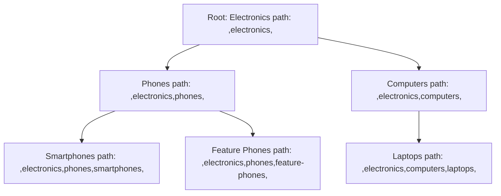

# How to Model Hierarchical Data in MongoDB with Materialized Paths

Author: OneUptime Team

Tags: MongoDB, Data modeling, Hierarchical data, Materialized path, Tree structure

Description: Learn how to model tree structures in MongoDB using the materialized path pattern, enabling efficient ancestor, descendant, and subtree queries with simple string operations.

---

The materialized path pattern stores the full path from the root to each node as a string inside the node itself. This trades a small amount of extra storage and write overhead for dramatically faster subtree and ancestor queries compared to the parent reference pattern.

## How the Pattern Works



Each node stores its full path as a comma-delimited string. Commas at both ends enable prefix queries to find all descendants.

## Document Structure

```javascript
// categories collection
{ _id: "electronics",    name: "Electronics",     path: ",electronics,",                           depth: 0 }
{ _id: "phones",         name: "Phones",           path: ",electronics,phones,",                    depth: 1 }
{ _id: "computers",      name: "Computers",        path: ",electronics,computers,",                 depth: 1 }
{ _id: "smartphones",    name: "Smartphones",      path: ",electronics,phones,smartphones,",        depth: 2 }
{ _id: "feature-phones", name: "Feature Phones",   path: ",electronics,phones,feature-phones,",     depth: 2 }
{ _id: "laptops",        name: "Laptops",           path: ",electronics,computers,laptops,",         depth: 2 }
{ _id: "desktops",       name: "Desktops",          path: ",electronics,computers,desktops,",        depth: 2 }
```

## Indexes

```javascript
// Regex prefix queries use this index
db.categories.createIndex({ path: 1 });
db.categories.createIndex({ depth: 1 });
```

## Core Operations

### Insert a New Node

```javascript
async function insertNode(id, name, parentId) {
  let path;
  let depth;

  if (!parentId) {
    // Root node
    path = `,${id},`;
    depth = 0;
  } else {
    const parent = await db.collection("categories").findOne({ _id: parentId });
    if (!parent) throw new Error(`Parent ${parentId} not found`);
    path = `${parent.path}${id},`;
    depth = parent.depth + 1;
  }

  return db.collection("categories").insertOne({ _id: id, name, path, depth });
}

await insertNode("electronics", "Electronics", null);
await insertNode("phones", "Phones", "electronics");
await insertNode("smartphones", "Smartphones", "phones");
```

### Find All Descendants (Subtree)

A simple regex prefix query finds every node whose path starts with the target node's path:

```javascript
async function getDescendants(nodeId) {
  const node = await db.collection("categories").findOne({ _id: nodeId });
  if (!node) return [];

  // All nodes whose path starts with this node's path
  return db.collection("categories")
    .find({
      path: { $regex: `^${escapeRegex(node.path)}` },
      _id: { $ne: nodeId }
    })
    .sort({ depth: 1, name: 1 })
    .toArray();
}

function escapeRegex(str) {
  return str.replace(/[.*+?^${}()|[\]\\]/g, "\\$&");
}
```

### Find Direct Children

```javascript
async function getChildren(nodeId) {
  const node = await db.collection("categories").findOne({ _id: nodeId });
  if (!node) return [];

  return db.collection("categories")
    .find({
      path: { $regex: `^${escapeRegex(node.path)}[^,]+,$` }
    })
    .toArray();
}
```

### Find All Ancestors (Breadcrumb)

Parse the path string to extract ancestor IDs, then fetch them:

```javascript
async function getAncestors(nodeId) {
  const node = await db.collection("categories").findOne({ _id: nodeId });
  if (!node) return [];

  // Parse path: ",electronics,phones,smartphones," -> ["electronics", "phones"]
  const parts = node.path.split(",").filter(Boolean);
  const ancestorIds = parts.slice(0, -1);  // exclude self (last part)

  if (ancestorIds.length === 0) return [];

  const ancestors = await db.collection("categories")
    .find({ _id: { $in: ancestorIds } })
    .toArray();

  // Restore order according to path
  return ancestorIds.map(id => ancestors.find(a => a._id === id)).filter(Boolean);
}
```

### Check If Node A Is an Ancestor of Node B

```javascript
async function isAncestor(ancestorId, descendantId) {
  const descendant = await db.collection("categories").findOne({ _id: descendantId });
  if (!descendant) return false;
  return descendant.path.includes(`,${ancestorId},`);
}
```

### Find Nodes at a Specific Depth

```javascript
async function getNodesByDepth(depth) {
  return db.collection("categories").find({ depth }).sort({ name: 1 }).toArray();
}
```

## Moving a Node (Subtree Relocation)

Moving a node requires updating the path of the node and all its descendants:

```javascript
async function moveNode(nodeId, newParentId) {
  const node = await db.collection("categories").findOne({ _id: nodeId });
  const newParent = await db.collection("categories").findOne({ _id: newParentId });

  if (!node || !newParent) throw new Error("Node or parent not found");

  const oldPath = node.path;
  const newPath = `${newParent.path}${nodeId},`;
  const newDepth = newParent.depth + 1;
  const depthDiff = newDepth - node.depth;

  // Get all descendants
  const descendants = await db.collection("categories")
    .find({ path: { $regex: `^${escapeRegex(oldPath)}` } })
    .toArray();

  // Build bulk writes
  const bulkOps = descendants.map(d => ({
    updateOne: {
      filter: { _id: d._id },
      update: {
        $set: {
          path: d.path.replace(oldPath, newPath),
          depth: d.depth + depthDiff
        }
      }
    }
  }));

  // Update the node itself
  bulkOps.push({
    updateOne: {
      filter: { _id: nodeId },
      update: { $set: { path: newPath, depth: newDepth } }
    }
  });

  await db.collection("categories").bulkWrite(bulkOps);
}
```

## Deleting a Subtree

```javascript
async function deleteSubtree(nodeId) {
  const node = await db.collection("categories").findOne({ _id: nodeId });
  if (!node) return;

  return db.collection("categories").deleteMany({
    path: { $regex: `^${escapeRegex(node.path)}` }
  });
}
```

## Building a Nested Tree for UI Rendering

```javascript
async function buildTree(rootId) {
  const root = await db.collection("categories").findOne({ _id: rootId });
  if (!root) return null;

  const all = await db.collection("categories")
    .find({ path: { $regex: `^${escapeRegex(root.path)}` } })
    .sort({ depth: 1 })
    .toArray();

  const nodeMap = {};
  all.forEach(n => { nodeMap[n._id] = { ...n, children: [] }; });

  const tree = nodeMap[rootId];

  all.forEach(n => {
    if (n._id === rootId) return;
    const parentId = n.path.replace(`${nodeMap[rootId].path}`, "").split(",")[0];
    // Find the direct parent by removing the last segment from the path
    const pathParts = n.path.split(",").filter(Boolean);
    const parentNodeId = pathParts[pathParts.length - 2];
    if (parentNodeId && nodeMap[parentNodeId]) {
      nodeMap[parentNodeId].children.push(nodeMap[n._id]);
    }
  });

  return tree;
}
```

## File System Example

```javascript
db.files.insertMany([
  { _id: "root",        name: "/",         path: ",root,",                     type: "dir"  },
  { _id: "home",        name: "home",      path: ",root,home,",                type: "dir"  },
  { _id: "alice",       name: "alice",     path: ",root,home,alice,",          type: "dir"  },
  { _id: "docs",        name: "Documents", path: ",root,home,alice,docs,",     type: "dir"  },
  { _id: "resume",      name: "resume.pdf",path: ",root,home,alice,docs,resume,", type: "file", size: 204800 }
]);

// Find all files under /home/alice
db.files.find({
  path: { $regex: "^,root,home,alice," },
  type: "file"
});
```

## Pattern Comparison

| Operation | Parent Reference | Materialized Path |
|---|---|---|
| Insert | Fast | Fast (compute path from parent) |
| Find direct children | Fast | Fast (regex) |
| Find all descendants | $graphLookup or BFS | Single regex query |
| Find all ancestors | $graphLookup | Parse path string |
| Move a subtree | Update one node | Update all nodes in subtree |
| Delete subtree | Multi-step | Single regex delete |
| Storage | Minimal | Small path string per node |

## Summary

The materialized path pattern stores each node's complete ancestor path as a delimited string, enabling fast subtree and ancestor queries with a simple regex prefix match. It excels when reads dominate and deep tree traversals are frequent. The tradeoff is that moving a node requires updating the path of every descendant in bulk. Use this pattern for category trees, file systems, and organizational hierarchies where structure changes are infrequent but subtree queries are common.
