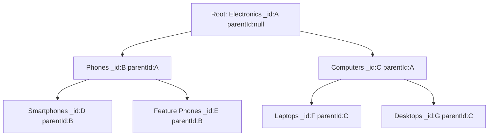

# How to Model Hierarchical Data in MongoDB with Parent Reference

Author: OneUptime Team

Tags: MongoDB, Data modeling, Hierarchical data, Tree structure, Schema design

Description: Learn how to model tree structures in MongoDB using the parent reference pattern, with queries for finding ancestors, descendants, and siblings efficiently.

---

The parent reference pattern is the simplest way to represent a hierarchy in MongoDB. Each node stores only the `_id` of its direct parent. It is analogous to an adjacency list in relational databases.

## The Pattern



Each node knows only its direct parent, not the full path.

## Document Structure

```javascript
// categories collection
{ _id: "electronics",   name: "Electronics",      parentId: null       }
{ _id: "phones",        name: "Phones",            parentId: "electronics" }
{ _id: "computers",     name: "Computers",         parentId: "electronics" }
{ _id: "smartphones",   name: "Smartphones",       parentId: "phones"   }
{ _id: "feature-phones",name: "Feature Phones",    parentId: "phones"   }
{ _id: "laptops",       name: "Laptops",           parentId: "computers"}
{ _id: "desktops",      name: "Desktops",          parentId: "computers"}
```

## Indexes

```javascript
db.categories.createIndex({ parentId: 1 });     // essential for children lookups
db.categories.createIndex({ _id: 1 });          // default, already exists
```

## Basic Operations

### Get Direct Children

```javascript
async function getChildren(parentId) {
  return db.collection("categories")
    .find({ parentId })
    .sort({ name: 1 })
    .toArray();
}

// Get direct children of "phones"
const children = await getChildren("phones");
// [{ _id: "smartphones", ... }, { _id: "feature-phones", ... }]
```

### Get Parent

```javascript
async function getParent(nodeId) {
  const node = await db.collection("categories").findOne({ _id: nodeId });
  if (!node?.parentId) return null;
  return db.collection("categories").findOne({ _id: node.parentId });
}
```

### Get Siblings

```javascript
async function getSiblings(nodeId) {
  const node = await db.collection("categories").findOne({ _id: nodeId });
  if (!node) return [];

  return db.collection("categories")
    .find({ parentId: node.parentId, _id: { $ne: nodeId } })
    .toArray();
}
```

## Traversing Up: Finding All Ancestors

Because each node only stores its direct parent, finding all ancestors requires multiple queries or a recursive `$graphLookup`:

### Application-Level Traversal

```javascript
async function getAncestors(nodeId) {
  const ancestors = [];
  let current = await db.collection("categories").findOne({ _id: nodeId });

  while (current?.parentId) {
    const parent = await db.collection("categories").findOne({ _id: current.parentId });
    if (!parent) break;
    ancestors.unshift(parent);
    current = parent;
  }

  return ancestors;
}

// Returns: [electronics, phones] for nodeId: "smartphones"
```

### Using $graphLookup for Ancestors in One Query

```javascript
db.categories.aggregate([
  { $match: { _id: "smartphones" } },
  {
    $graphLookup: {
      from: "categories",
      startWith: "$parentId",
      connectFromField: "parentId",
      connectToField: "_id",
      as: "ancestors",
      depthField: "depth"
    }
  },
  {
    $project: {
      name: 1,
      ancestors: {
        $sortArray: { input: "$ancestors", sortBy: { depth: -1 } }
      }
    }
  }
]);
// ancestors: [{ _id: "electronics", name: "Electronics" }, { _id: "phones", name: "Phones" }]
```

## Traversing Down: Finding All Descendants

### Using $graphLookup for the Full Subtree

```javascript
db.categories.aggregate([
  { $match: { _id: "phones" } },
  {
    $graphLookup: {
      from: "categories",
      startWith: "$_id",
      connectFromField: "_id",
      connectToField: "parentId",
      as: "descendants",
      depthField: "level"
    }
  },
  {
    $project: {
      name: 1,
      descendants: { $sortArray: { input: "$descendants", sortBy: { level: 1, name: 1 } } }
    }
  }
]);
```

### Recursive Application-Level BFS

```javascript
async function getDescendants(nodeId) {
  const result = [];
  const queue = [nodeId];

  while (queue.length > 0) {
    const current = queue.shift();
    const children = await db.collection("categories")
      .find({ parentId: current })
      .toArray();
    result.push(...children);
    queue.push(...children.map(c => c._id));
  }

  return result;
}
```

## Moving a Node

Changing a node's parent is a single field update:

```javascript
async function moveNode(nodeId, newParentId) {
  return db.collection("categories").updateOne(
    { _id: nodeId },
    { $set: { parentId: newParentId, updatedAt: new Date() } }
  );
}
```

## Deleting a Subtree

```javascript
async function deleteSubtree(nodeId) {
  // Get all descendants first
  const descendants = await getDescendants(nodeId);
  const idsToDelete = [nodeId, ...descendants.map(d => d._id)];

  return db.collection("categories").deleteMany({ _id: { $in: idsToDelete } });
}
```

## Rendering a Navigation Tree

```javascript
async function buildTree(parentId = null) {
  const children = await db.collection("categories")
    .find({ parentId })
    .sort({ name: 1 })
    .toArray();

  return Promise.all(
    children.map(async (child) => ({
      ...child,
      children: await buildTree(child._id)
    }))
  );
}
```

## Employee Hierarchy Example

```javascript
// employees collection
db.employees.insertMany([
  { _id: 1, name: "CEO",        title: "Chief Executive",  managerId: null },
  { _id: 2, name: "CTO",        title: "Chief Technology", managerId: 1    },
  { _id: 3, name: "CFO",        title: "Chief Financial",  managerId: 1    },
  { _id: 4, name: "VP Eng",     title: "VP Engineering",   managerId: 2    },
  { _id: 5, name: "VP Product", title: "VP Product",       managerId: 2    },
  { _id: 6, name: "Sr Dev",     title: "Senior Developer", managerId: 4    },
  { _id: 7, name: "Jr Dev",     title: "Junior Developer", managerId: 4    }
]);

db.employees.createIndex({ managerId: 1 });

// Find everyone who reports to VP Eng (directly or indirectly)
db.employees.aggregate([
  { $match: { _id: 4 } },
  {
    $graphLookup: {
      from: "employees",
      startWith: "$_id",
      connectFromField: "_id",
      connectToField: "managerId",
      as: "reports",
      depthField: "level"
    }
  },
  { $project: { name: 1, "reports.name": 1, "reports.title": 1, "reports.level": 1 } }
]);
```

## Strengths and Limitations

| Aspect | Parent Reference |
|---|---|
| Direct children | Fast (indexed parentId) |
| Direct parent | Fast (single lookup) |
| Move node | Fast (update one field) |
| Find all ancestors | Requires $graphLookup or N queries |
| Find all descendants | Requires $graphLookup or BFS |
| Depth-limited subtree | $graphLookup with `maxDepth` |
| Storage cost | Very low |

## When to Use Parent Reference

Use the parent reference pattern when:
- Trees are frequently modified (nodes are moved, added, or deleted).
- You primarily need parent and children queries, not full path traversals.
- You want the simplest possible schema.

Consider materialized paths or nested sets when you need frequent full-path or subtree queries without `$graphLookup`.

## Summary

The parent reference pattern stores one field (`parentId`) per node and indexes it for fast direct-children queries. Moving nodes is a single field update. For ancestor and descendant traversal, use MongoDB's `$graphLookup` stage to walk the tree in a single aggregation query. Use the `maxDepth` option in `$graphLookup` to limit traversal depth for performance. This pattern is the best starting point for most hierarchical data models in MongoDB.
