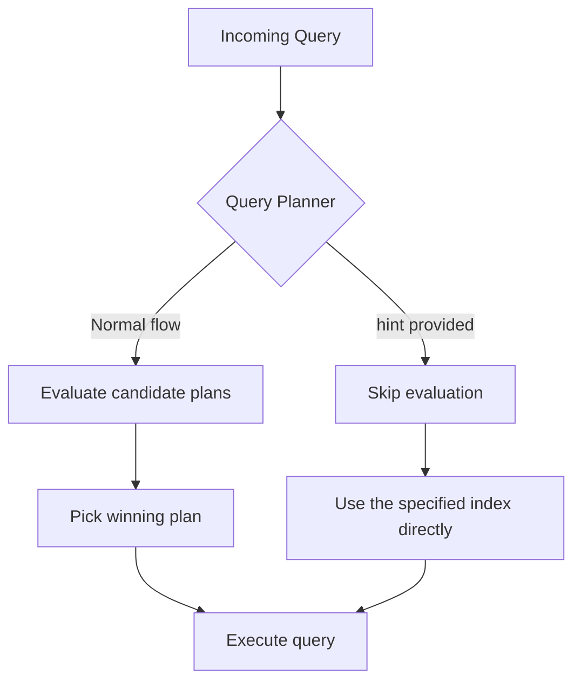
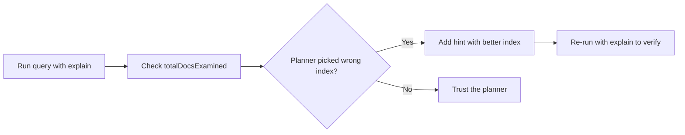

# How to Use hint() to Force an Index in MongoDB

Author: [nawazdhandala](https://www.github.com/nawazdhandala)

Tags: MongoDB, Index, Performance, Query Optimization, hint

Description: Learn how to use MongoDB's hint() method to force the query planner to use a specific index, override poor plan cache decisions, and validate index effectiveness.

---

## What is hint()

MongoDB's query planner evaluates candidate query plans and caches the winning plan for future similar queries. Occasionally the planner picks a suboptimal plan, especially after data distribution changes or when statistics are stale. The `hint()` method forces MongoDB to use a specific index, bypassing the planner's automatic selection.



## Syntax

```javascript
// Hint by index key pattern
db.collection.find(filter).hint({ field: 1 });

// Hint by index name
db.collection.find(filter).hint("index_name");

// Force a collection scan (no index)
db.collection.find(filter).hint({ $natural: 1 });
```

## Setting Up Example Indexes

```javascript
db.orders.createIndex({ customerId: 1 }, { name: "idx_customer" });
db.orders.createIndex({ status: 1, createdAt: -1 }, { name: "idx_status_date" });
db.orders.createIndex({ totalAmount: 1 }, { name: "idx_amount" });
```

## Forcing an Index by Key Pattern

```javascript
// Without hint - planner chooses automatically
db.orders.find({ customerId: "c123", status: "shipped" });

// With hint - force the customerId index
db.orders.find(
  { customerId: "c123", status: "shipped" }
).hint({ customerId: 1 });
```

## Forcing an Index by Name

```javascript
db.orders.find(
  { status: "pending", createdAt: { $gte: new Date("2024-01-01") } }
).hint("idx_status_date");
```

## Forcing a Collection Scan

Sometimes you want to confirm what performance looks like without any index:

```javascript
db.orders.find({ customerId: "c123" }).hint({ $natural: 1 });
```

## Using hint() with sort() and limit()

```javascript
// Ensure the compound index serves both the filter and the sort
db.orders.find({ status: "shipped" })
  .sort({ createdAt: -1 })
  .limit(20)
  .hint("idx_status_date");
```

## Using hint() in update() and delete()

```javascript
// Force an index on updateMany
db.orders.updateMany(
  { status: "pending" },
  { $set: { flagged: true } },
  { hint: { status: 1 } }
);

// Force an index on deleteMany
db.orders.deleteMany(
  { createdAt: { $lt: new Date("2023-01-01") } },
  { hint: { createdAt: 1 } }
);
```

## Using hint() in Aggregation

```javascript
db.orders.aggregate(
  [
    { $match: { status: "shipped", customerId: "c123" } },
    { $sort: { createdAt: -1 } },
    { $limit: 10 }
  ],
  { hint: { customerId: 1 } }
);
```

Note: the `hint` option in `aggregate()` is passed as the options object, not chained.

## Validating hint() Effectiveness with explain()

Always compare plans before and without hint to confirm your choice is better:

```javascript
// Auto-chosen plan
const autoPlan = db.orders.find(
  { status: "shipped", totalAmount: { $gte: 200 } }
).explain("executionStats");

// Forced plan
const hintedPlan = db.orders.find(
  { status: "shipped", totalAmount: { $gte: 200 } }
).hint({ totalAmount: 1 }).explain("executionStats");

// Compare:
// autoPlan.executionStats.totalDocsExamined
// hintedPlan.executionStats.totalDocsExamined
```

A lower `totalDocsExamined` with fewer milliseconds (`executionTimeMillis`) indicates the hinted plan is better.



## When the Query Planner Picks a Suboptimal Plan

Common scenarios where `hint()` helps:

1. **Stale plan cache**: The planner cached a plan based on old data distribution.
2. **Low-selectivity filter with a high-selectivity filter**: The planner favors the wrong index.
3. **Index intersection gone wrong**: The planner tries to combine indexes inefficiently.
4. **Testing**: You want to benchmark multiple indexes against the same query.

```javascript
// Clear the plan cache for a collection
db.orders.getPlanCache().clear();

// Or clear plans for a specific query shape
db.orders.getPlanCache().clearPlansByQuery({ status: "shipped" });
```

## Practical Example: E-Commerce Order Lookup

```javascript
db.orders.insertMany([
  { customerId: "c1", status: "shipped",  totalAmount: 150, createdAt: new Date("2024-03-01") },
  { customerId: "c1", status: "pending",  totalAmount: 200, createdAt: new Date("2024-03-10") },
  { customerId: "c2", status: "shipped",  totalAmount: 300, createdAt: new Date("2024-03-15") }
]);

// The planner may choose status index because "shipped" appears to be selective,
// but if most orders are "shipped", the customerId index is better
db.orders.find({ customerId: "c1", status: "shipped" })
  .hint({ customerId: 1 })
  .explain("executionStats");
```

## Risks and Cautions

- A forced index can be worse than the auto-chosen plan if data changes. Re-evaluate `hint()` usage periodically.
- If you hint an index that does not exist, MongoDB throws an error.
- Do not use `hint()` as a permanent fix without understanding why the planner chose differently. The root cause may be a missing or poorly designed index.

```javascript
// Verify the index name exists before using it
db.orders.getIndexes().map(i => i.name);
// [ "_id_", "idx_customer", "idx_status_date", "idx_amount" ]
```

## Summary

`hint()` overrides MongoDB's query planner and forces use of a specific index. Use it when the auto-chosen plan is suboptimal, when benchmarking indexes, or when debugging query performance. Always verify the improvement with `explain("executionStats")` and compare `totalDocsExamined` and `executionTimeMillis` between the hinted and un-hinted plans. Avoid treating `hint()` as a permanent workaround without investigating the underlying cause of the planner's poor choice.
