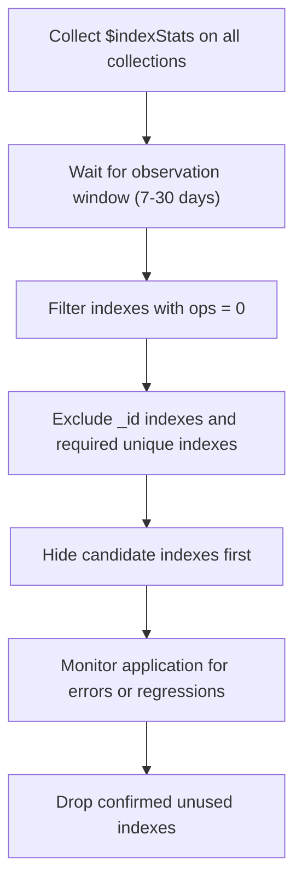

# How to Identify Unused Indexes in MongoDB

Every index in MongoDB consumes RAM, disk space, and CPU on every write operation. Indexes that are never (or rarely) used are pure overhead. The `$indexStats` aggregation stage provides per-index usage counters that make it easy to identify and safely remove unused indexes.

## How $indexStats Works

`$indexStats` returns one document per index for the collection, showing how many times each index has been used since the mongod process last started.

```javascript
// Get usage statistics for all indexes on the orders collection
const stats = await db.collection("orders").aggregate([
  { $indexStats: {} }
]).toArray();

stats.forEach((s) => {
  console.log(`${s.name}: ${s.accesses.ops} ops since ${s.accesses.since}`);
});
```

Example output:
```yaml
_id_: 45231 ops since 2025-01-01T00:00:00Z
status_1_createdAt_-1: 12045 ops since 2025-01-01T00:00:00Z
customerId_1: 0 ops since 2025-01-01T00:00:00Z
legacyField_1: 0 ops since 2025-01-01T00:00:00Z
```

## Important Caveats

- **Counters reset on restart**: `accesses.since` shows when the counter started. After a mongod restart, all counts reset to zero. Measure over a long observation window (days or weeks) to be sure.
- **Replica set members**: Each replica set member tracks its own index usage independently. Query from each member if you route reads to secondaries.
- **Hidden indexes**: Hidden indexes receive zero usage stats by design (they are invisible to the query planner) but can be made visible again without being rebuilt.

## Finding Zero-Use Indexes

```javascript
// Find indexes with zero accesses
const unusedIndexes = await db.collection("orders").aggregate([
  { $indexStats: {} },
  {
    $match: {
      "accesses.ops": 0,
      name: { $ne: "_id_" }  // _id index is always required
    }
  },
  {
    $project: {
      name: 1,
      key: 1,
      "accesses.ops": 1,
      "accesses.since": 1
    }
  }
]).toArray();

console.log("Unused indexes:", unusedIndexes);
```

## Scanning All Collections for Unused Indexes

Run this script to audit all collections in the database at once.

```javascript
async function findUnusedIndexes(db) {
  const collections = await db.listCollections().toArray();
  const results = [];

  for (const col of collections) {
    const name = col.name;
    const stats = await db.collection(name).aggregate([
      { $indexStats: {} }
    ]).toArray();

    for (const stat of stats) {
      if (stat.name === "_id_") continue;
      results.push({
        collection: name,
        index: stat.name,
        key: stat.key,
        ops: stat.accesses.ops,
        since: stat.accesses.since
      });
    }
  }

  return results
    .filter((r) => r.ops === 0)
    .sort((a, b) => a.collection.localeCompare(b.collection));
}

const unused = await findUnusedIndexes(db);
unused.forEach((r) => {
  console.log(`db.${r.collection}.dropIndex("${r.index}");`);
});
```

This script prints ready-to-run `dropIndex` commands for every unused index.

## Recommended Workflow



## Using Hidden Indexes as a Safety Net

Instead of dropping an index immediately, hide it first. A hidden index is maintained by MongoDB but is invisible to the query planner. If performance degrades after hiding, you can unhide the index without rebuilding it.

```javascript
// Hide the index to test impact before dropping
db.orders.hideIndex("customerId_1");

// Monitor query performance for a few days...

// If no issues, drop permanently
db.orders.dropIndex("customerId_1");

// If issues arise, unhide immediately
db.orders.unhideIndex("customerId_1");
```

## Detecting Redundant Indexes

An index is redundant if another index is a superset of it with the same leading fields. For example, an index on `{ status: 1 }` is redundant when `{ status: 1, createdAt: -1 }` already exists, because the compound index satisfies all queries the single-field index would handle.

```javascript
// Find all indexes and check for prefix redundancy
const indexes = await db.collection("orders").indexes();
indexes.forEach((idx) => {
  console.log(idx.name, JSON.stringify(idx.key));
});
// If both of these appear, the first is redundant:
// status_1: { status: 1 }
// status_1_createdAt_-1: { status: 1, createdAt: -1 }
```

## Low-Use vs. Zero-Use Indexes

Some indexes may have very few uses but are still valuable (for example, a unique constraint that rarely fires, or a query that runs once a day). Distinguish low-use indexes by context before dropping them.

```javascript
// Find indexes with fewer than 100 ops (adjust threshold as needed)
const lowUse = await db.collection("orders").aggregate([
  { $indexStats: {} },
  {
    $match: {
      "accesses.ops": { $lt: 100 },
      name: { $ne: "_id_" }
    }
  }
]).toArray();
```

Review low-use indexes manually to check whether they enforce constraints (unique, TTL) rather than serving queries.

## Dropping an Unused Index

```javascript
// Drop by index name
await db.collection("orders").dropIndex("legacyField_1");

// Drop by key specification
await db.collection("orders").dropIndex({ legacyField: 1 });
```

Always drop indexes during a low-traffic window and monitor closely afterward.

## Summary

Use `$indexStats` aggregation to measure how often each index is accessed. Collect data over at least a week (ideally a month) to account for infrequent but important queries. Before dropping, use `hideIndex()` to make the index invisible to the query planner without removing it, giving you a safe rollback path. Drop confirmed unused indexes to reclaim RAM, reduce write overhead, and simplify the index set. Also look for redundant indexes where a compound index already covers what a single-field index provides.
