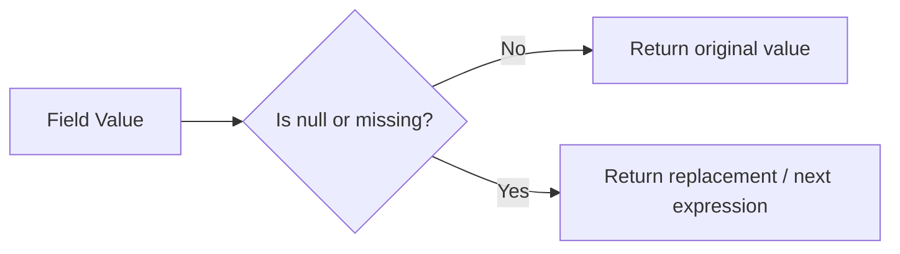

# How to Use $ifNull and $coalesce in MongoDB Aggregation

Author: [nawazdhandala](https://www.github.com/nawazdhandala)

Tags: MongoDB, Aggregation, $ifNull, $coalesce, Pipeline, Conditional

Description: Learn how to use $ifNull and $coalesce in MongoDB aggregation to handle null and missing field values with fallback defaults.

---

## How $ifNull and $coalesce Work

`$ifNull` returns a replacement value when an expression evaluates to `null` or is a missing field. `$coalesce` (MongoDB 5.0+) is the multi-argument generalization that returns the first non-null value from a list of expressions.

Both are essential for defensive pipelines that need to handle incomplete or inconsistent document schemas.



## Syntax

### $ifNull

```javascript
// Two-argument form: if null, use replacement
{ $ifNull: [ <expression>, <replacementIfNull> ] }

// Multi-argument form (MongoDB 4.4+): return first non-null
{ $ifNull: [ <expr1>, <expr2>, ..., <lastDefault> ] }
```

### $coalesce (MongoDB 5.0+)

```javascript
{ $coalesce: [ <expr1>, <expr2>, ..., <lastDefault> ] }
```

`$coalesce` is equivalent to the multi-argument form of `$ifNull`. Both return the first expression that is not `null` or missing.

## Examples

### Input Documents

```javascript
[
  { _id: 1, name: "Alice", nickname: "Ali",  phone: "555-1234", email: "alice@example.com" },
  { _id: 2, name: "Bob",   nickname: null,   phone: null,       email: "bob@example.com"   },
  { _id: 3, name: "Carol"  /* nickname, phone, email missing */ }
]
```

### Example 1 - $ifNull with a String Default

Return `nickname`, or fall back to `"No Nickname"` if null or missing:

```javascript
db.users.aggregate([
  {
    $project: {
      name: 1,
      displayName: { $ifNull: ["$nickname", "No Nickname"] }
    }
  }
])
```

Output:

```javascript
[
  { _id: 1, name: "Alice", displayName: "Ali"         },
  { _id: 2, name: "Bob",   displayName: "No Nickname" },
  { _id: 3, name: "Carol", displayName: "No Nickname" }
]
```

### Example 2 - $ifNull Fallback to Another Field

Fall back to the `name` field when `nickname` is null or missing:

```javascript
db.users.aggregate([
  {
    $project: {
      preferredName: { $ifNull: ["$nickname", "$name"] }
    }
  }
])
```

Output:

```javascript
[
  { _id: 1, preferredName: "Ali"   },
  { _id: 2, preferredName: "Bob"   },
  { _id: 3, preferredName: "Carol" }
]
```

### Example 3 - Multi-Argument $ifNull (Fallback Chain)

Try `phone`, then `email`, then `"No Contact"`:

```javascript
db.users.aggregate([
  {
    $project: {
      name: 1,
      contact: { $ifNull: ["$phone", "$email", "No Contact"] }
    }
  }
])
```

Output:

```javascript
[
  { _id: 1, name: "Alice", contact: "555-1234"         },
  { _id: 2, name: "Bob",   contact: "bob@example.com"  },
  { _id: 3, name: "Carol", contact: "No Contact"       }
]
```

### Example 4 - $coalesce (MongoDB 5.0+)

`$coalesce` is the semantic equivalent:

```javascript
db.users.aggregate([
  {
    $project: {
      name: 1,
      contact: { $coalesce: ["$phone", "$email", "No Contact"] }
    }
  }
])
```

Produces the same output as Example 3.

### Example 5 - $ifNull with Default Array

When an array field might be missing, default to an empty array to prevent errors in subsequent array operations:

```javascript
// Input: { _id: 1, tags: ["mongodb"] }
// Input: { _id: 2 }  -- tags missing

db.posts.aggregate([
  {
    $project: {
      tagCount: {
        $size: { $ifNull: ["$tags", []] }
      }
    }
  }
])
```

Output:

```javascript
[
  { _id: 1, tagCount: 1 },
  { _id: 2, tagCount: 0 }
]
```

Without `$ifNull`, `$size` on a missing field throws an error.

### Example 6 - $ifNull with Default Numeric Value

Default a missing numeric field to `0` for arithmetic:

```javascript
// Input: { _id: 1, base: 100, bonus: 50 }
// Input: { _id: 2, base: 80 }  -- bonus missing

db.payroll.aggregate([
  {
    $project: {
      total: {
        $add: ["$base", { $ifNull: ["$bonus", 0] }]
      }
    }
  }
])
```

Output:

```javascript
[
  { _id: 1, total: 150 },
  { _id: 2, total: 80  }
]
```

### Example 7 - Guarding $concatArrays

Guard against null arrays before concatenating:

```javascript
db.data.aggregate([
  {
    $project: {
      combined: {
        $concatArrays: [
          { $ifNull: ["$arrayA", []] },
          { $ifNull: ["$arrayB", []] }
        ]
      }
    }
  }
])
```

## $ifNull vs $cond

Both handle null values, but differ in approach:

```javascript
// $ifNull - concise for null check
{ $ifNull: ["$field", "default"] }

// $cond - more explicit, handles any condition
{
  $cond: {
    if: { $eq: ["$field", null] },
    then: "default",
    else: "$field"
  }
}
```

Note: `$ifNull` also handles missing fields, while `$cond` with `$eq: null` only matches explicitly `null` values.

## Use Cases

- Providing fallback values for optional document fields
- Defaulting numeric fields to `0` for safe arithmetic
- Defaulting array fields to `[]` for safe array operations
- Building contact chains (try phone, then email, then "N/A")
- Handling schema variations in heterogeneous collections

## Summary

`$ifNull` returns a replacement value when an expression is `null` or the field is missing. With multiple arguments (MongoDB 4.4+), it returns the first non-null value in the chain. `$coalesce` (MongoDB 5.0+) is the explicit multi-argument equivalent. Use these operators defensively to prevent pipeline errors and provide meaningful defaults for incomplete documents.
