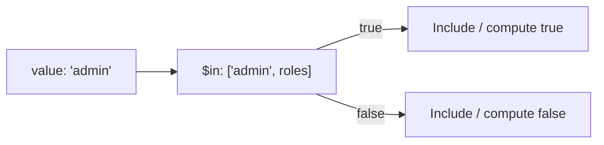

# How to Use $in Aggregation Operator to Check Array Membership in MongoDB

Author: [nawazdhandala](https://www.github.com/nawazdhandala)

Tags: MongoDB, Aggregation, Pipeline, Array, Expression

Description: Learn how to use the $in aggregation expression operator in MongoDB to test whether a value exists in an array, distinct from the $in query operator.

---

## Overview

MongoDB has two different `$in` operators:

1. The **query operator** `$in` - used in `find()` and `$match` to match documents where a field equals any value in a given list
2. The **aggregation expression operator** `$in` - used inside pipeline expressions to return a boolean indicating whether a value exists in an array

This guide covers the **aggregation expression** form.



## Syntax

```javascript
{ $in: [ <search value>, <array expression> ] }
```

Returns `true` if the search value is found in the array expression, `false` otherwise.

Note: The argument order is `[value, array]`, not `[array, value]`.

## Examples

### Example 1 - Check if a Value is in an Embedded Array

Test whether a user has a specific role:

```javascript
// Input: { _id: 1, name: "Alice", roles: ["user", "editor"] }
db.users.aggregate([
  {
    $project: {
      name: 1,
      isAdmin: {
        $in: ["admin", "$roles"]
      }
    }
  }
])
```

Output:

```javascript
[
  { _id: 1, name: "Alice", isAdmin: false }
]
```

### Example 2 - Filter Documents Using $in Inside $match

Use `$in` with `$expr` to match documents where a computed or field value appears in an array field:

```javascript
db.orders.aggregate([
  {
    $match: {
      $expr: {
        $in: ["$status", ["shipped", "delivered"]]
      }
    }
  }
])
```

Note: For static value lists in `$match`, the query-level `$in` is more efficient. Use the expression form when the array itself comes from a document field.

### Example 3 - Check if a Field Value Exists in Another Document Field's Array

Cross-reference a value against an array stored in the same document:

```javascript
// Input: { _id: 1, selectedTag: "mongodb", allTags: ["redis", "mongodb", "postgres"] }
db.articles.aggregate([
  {
    $project: {
      isTagPresent: {
        $in: ["$selectedTag", "$allTags"]
      }
    }
  }
])
```

Output:

```javascript
[
  { _id: 1, isTagPresent: true }
]
```

### Example 4 - Use $in in a $cond Expression

Assign a label based on array membership:

```javascript
db.products.aggregate([
  {
    $project: {
      name: 1,
      category: {
        $cond: {
          if: { $in: ["$productType", ["laptop", "tablet", "phone"]] },
          then: "electronics",
          else: "other"
        }
      }
    }
  }
])
```

### Example 5 - $in vs. $setIntersection

When checking if any element from one array appears in another, use `$setIntersection`:

```javascript
// $in: check if a single value is in an array
{ $in: ["admin", "$roles"] }

// $setIntersection + $gt: check if any element of array A is in array B
{
  $gt: [
    { $size: { $setIntersection: ["$userPermissions", "$requiredPermissions"] } },
    0
  ]
}
```

### Example 6 - Combine with $filter to Keep Matching Elements

Keep only items in a cart array that belong to a featured categories list:

```javascript
// Input: { _id: 1, cart: [{name:"A", cat:"books"},{name:"B", cat:"toys"}], featured: ["books","electronics"] }
db.carts.aggregate([
  {
    $project: {
      featuredItems: {
        $filter: {
          input: "$cart",
          as: "item",
          cond: { $in: ["$$item.cat", "$featured"] }
        }
      }
    }
  }
])
```

Output:

```javascript
[
  { _id: 1, featuredItems: [{name:"A", cat:"books"}] }
]
```

## Differences: Aggregation $in vs. Query $in

| Aspect | Query `$in` | Aggregation `$in` |
|---|---|---|
| Used in | `find()`, `$match` | `$project`, `$addFields`, `$cond`, `$expr` |
| Syntax | `{ field: { $in: [v1, v2] } }` | `{ $in: [value, arrayExpr] }` |
| Returns | Matching documents | Boolean (`true`/`false`) |
| Array source | Literal list only | Any array expression (field, literal, computed) |

## Summary

The aggregation `$in` expression operator tests whether a single value is present in an array and returns a boolean. It is the right tool for conditional branching inside `$project` and `$addFields` when membership depends on a field-sourced array. Pair it with `$filter`, `$cond`, and `$map` to build sophisticated per-document transformations that depend on array membership checks.
