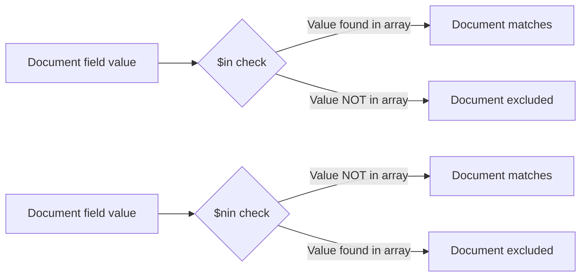

# How to Use $in and $nin Operators in MongoDB

Author: [nawazdhandala](https://www.github.com/nawazdhandala)

Tags: MongoDB, $in, $nin, Query, Operator, Comparison

Description: Learn how to use MongoDB's $in and $nin operators to match documents where a field value exists or does not exist within a specified list of values.

---

## How $in and $nin Work

The `$in` operator matches documents where the value of a field equals any value in a specified array. Think of it as a shorthand for multiple `$eq` conditions joined with OR. The `$nin` (not-in) operator is the inverse - it matches documents where the field value is not in the array.



## Syntax

```javascript
{ field: { $in: [value1, value2, ...] } }
{ field: { $nin: [value1, value2, ...] } }
```

## Using $in with String Values

Match documents where a field equals one of several string values:

```javascript
// Find users with role admin or editor
db.users.find({ role: { $in: ["admin", "editor"] } })

// Find orders with specific statuses
db.orders.find({ status: { $in: ["pending", "processing", "shipped"] } })
```

## Using $in with ObjectIds

A common pattern is looking up multiple documents by their IDs in a single query:

```javascript
const userIds = [
  ObjectId("64a1b2c3d4e5f6789012345a"),
  ObjectId("64a1b2c3d4e5f6789012345b"),
  ObjectId("64a1b2c3d4e5f6789012345c")
]

db.users.find({ _id: { $in: userIds } })
```

## Using $in with Numbers

```javascript
// Find products with specific priority levels
db.tasks.find({ priority: { $in: [1, 2, 3] } })

// Find products in specific categories by ID
db.products.find({ categoryId: { $in: [10, 20, 30] } })
```

## $in with Array Fields

When the document field is itself an array, `$in` matches documents where the array contains at least one of the specified values:

```javascript
// Documents: [{ tags: ["mongodb", "nosql"] }, { tags: ["sql", "postgres"] }]
// Find documents tagged with mongodb or sql
db.articles.find({ tags: { $in: ["mongodb", "sql"] } })
```

## Using $nin - Not In

Match documents where a field does not contain any of the specified values:

```javascript
// Find users who are not admin or superadmin
db.users.find({ role: { $nin: ["admin", "superadmin"] } })

// Find active orders (not completed or cancelled)
db.orders.find({ status: { $nin: ["completed", "cancelled", "refunded"] } })
```

## $nin Also Matches Missing Fields

An important behavior: `$nin` matches documents where the field does not exist at all:

```javascript
// Matches documents where deletedAt is not in the list AND where deletedAt doesn't exist
db.users.find({ deletedAt: { $nin: [null] } })
```

## Combining $in with Other Operators

```javascript
// Active users with admin or editor role
db.users.find({
  status: "active",
  role: { $in: ["admin", "editor"] }
})

// Products in a category with a price range
db.products.find({
  category: { $in: ["Electronics", "Computers"] },
  price: { $gte: 100, $lte: 1000 }
})
```

## Performance Consideration

For large arrays in `$in`, MongoDB may prefer a collection scan over an index scan. Keep the array values concise and ensure the field is indexed:

```javascript
// Ensure an index exists for frequently queried fields
db.orders.createIndex({ status: 1 })

// Then the $in query will use the index
db.orders.find({ status: { $in: ["pending", "processing"] } })
```

## $in vs Multiple $or Conditions

These two queries are equivalent, but `$in` is cleaner and often more efficient:

```javascript
// Verbose - avoid this style
db.users.find({
  $or: [
    { role: "admin" },
    { role: "editor" },
    { role: "viewer" }
  ]
})

// Preferred - use $in
db.users.find({ role: { $in: ["admin", "editor", "viewer"] } })
```

## Use Cases

- Fetching multiple records by a list of IDs
- Filtering orders by a set of allowed statuses
- Finding users with any of several roles
- Excluding deprecated or invalid categories
- Checking membership in a predefined set of values

## Summary

`$in` and `$nin` are essential MongoDB operators for set-based filtering. Use `$in` when you want to match documents where a field's value belongs to a list, and `$nin` when you want to exclude those values. Both work on scalar fields and array fields. For scalar fields, ensure the target field is indexed for optimal query performance, especially when the value list is small and selective.
