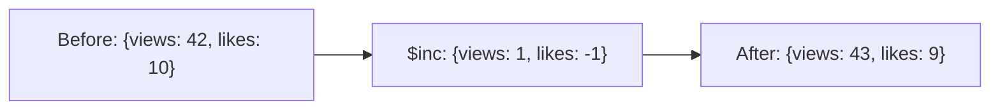

# How to Use $inc Operator in MongoDB to Increment Values

Author: [nawazdhandala](https://www.github.com/nawazdhandala)

Tags: MongoDB, $inc, Update, Operator, Numeric

Description: Learn how to use MongoDB's $inc operator to increment or decrement numeric field values atomically, with practical examples for counters and scoring systems.

---

## How $inc Works

The `$inc` operator increments the value of a field by the specified amount. If the field does not exist, `$inc` creates the field and sets it to the increment value. Use a negative number to decrement. The operation is atomic - no race conditions when multiple clients increment the same counter.



## Syntax

```javascript
{ $inc: { field1: amount1, field2: amount2, ... } }
```

- Positive `amount` increments the field
- Negative `amount` decrements the field

## Incrementing a Counter

The most common use case - a view counter:

```javascript
// Before: { _id: 1, title: "My Post", views: 100 }

db.posts.updateOne(
  { _id: 1 },
  { $inc: { views: 1 } }
)

// After: { _id: 1, title: "My Post", views: 101 }
```

## Decrementing a Value

Use a negative amount to decrease a value:

```javascript
// Before: { _id: 2, item: "Widget", stock: 50 }

db.inventory.updateOne(
  { _id: 2 },
  { $inc: { stock: -3 } }
)

// After: { _id: 2, item: "Widget", stock: 47 }
```

## Incrementing by More Than 1

```javascript
// Add 100 bonus points to a user's score
db.users.updateOne(
  { username: "alice" },
  { $inc: { score: 100 } }
)
```

## Auto-Creating Fields with $inc

If the field does not exist, `$inc` creates it with the increment value as its initial value:

```javascript
// Before: { _id: 3, name: "New Post" }  (no views field)

db.posts.updateOne(
  { _id: 3 },
  { $inc: { views: 1 } }
)

// After: { _id: 3, name: "New Post", views: 1 }
```

## Incrementing Multiple Fields

```javascript
// After a purchase: decrease stock, increase soldCount
db.products.updateOne(
  { sku: "ELEC-001" },
  {
    $inc: {
      stock: -1,
      soldCount: 1,
      revenue: 49.99
    }
  }
)
```

## Using $inc with Upsert

Combine with upsert to create a counter document if it does not exist:

```javascript
// Create or increment a page view counter
db.analytics.updateOne(
  { page: "/home", date: "2024-01-15" },
  { $inc: { views: 1 } },
  { upsert: true }
)
```

## Using $inc with Decimal Values

`$inc` works with floating-point numbers:

```javascript
// Before: { _id: 5, balance: 1000.00 }

db.accounts.updateOne(
  { _id: 5 },
  { $inc: { balance: -49.99 } }
)

// After: { _id: 5, balance: 950.01 }
```

## Atomicity Guarantee

Because `$inc` is a server-side atomic operation, it is safe for concurrent updates from multiple clients:

```javascript
// Multiple application instances can safely call this simultaneously
// without race conditions - MongoDB handles the atomic increment
db.counters.updateOne(
  { _id: "requestCount" },
  { $inc: { count: 1 } },
  { upsert: true }
)
```

## Combining $inc with Other Operators

```javascript
// Increment login count, update last login timestamp, and clear failed attempts
db.users.updateOne(
  { email: "alice@example.com" },
  {
    $inc: { loginCount: 1 },
    $set: {
      lastLoginAt: new Date(),
      failedAttempts: 0
    }
  }
)
```

## Use Cases

- Tracking page views, article reads, or video plays
- Managing inventory stock levels
- Accumulating user points or scores
- Counting login attempts or API calls
- Maintaining sequence numbers or auto-increment IDs

## Summary

`$inc` provides a safe, atomic way to increment or decrement numeric field values in MongoDB. It automatically creates the field with the increment value if it does not exist, making it ideal for counters and accumulators. Use negative amounts for decrement. Because it is processed server-side as a single atomic operation, `$inc` eliminates race conditions in high-concurrency scenarios - making it far superior to the read-modify-write pattern for numeric updates.
