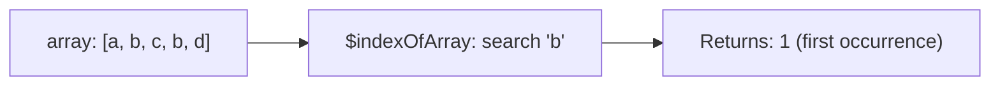

# How to Use $indexOfArray in MongoDB Aggregation

Author: [nawazdhandala](https://www.github.com/nawazdhandala)

Tags: MongoDB, Aggregation, Pipeline, Array, Expression

Description: Learn how to use $indexOfArray in MongoDB aggregation to find the index position of a value within an array, with optional start and end bounds for scoped searches.

---

## Overview

`$indexOfArray` searches an array for a specified value and returns the zero-based index of the first match. If the value is not found it returns `-1`. An optional start and end bound limit the search range.



## Syntax

```javascript
{
  $indexOfArray: [
    <array expression>,
    <search expression>,
    <start index>,    // optional, default 0
    <end index>       // optional, default array length - 1
  ]
}
```

- Returns the index of the first occurrence of the search value within `[start, end)`.
- Returns `-1` if not found.
- Returns `null` if the array is `null` or missing.
- Throws an error if the first argument is not an array.

## Examples

### Example 1 - Find Index of a Value

```javascript
// Input: { _id: 1, fruits: ["apple", "banana", "cherry", "banana"] }
db.inventory.aggregate([
  {
    $project: {
      bananaIndex: {
        $indexOfArray: ["$fruits", "banana"]
      }
    }
  }
])
```

Output:

```javascript
[
  { _id: 1, bananaIndex: 1 }
]
```

### Example 2 - Value Not Found Returns -1

```javascript
// Input: { _id: 1, tags: ["nodejs", "javascript"] }
db.posts.aggregate([
  {
    $project: {
      pythonIdx: {
        $indexOfArray: ["$tags", "python"]
      }
    }
  }
])
```

Output:

```javascript
[
  { _id: 1, pythonIdx: -1 }
]
```

### Example 3 - Search with a Start Bound

Start searching from index 2, skipping earlier elements:

```javascript
// Input: { _id: 1, vals: [10, 20, 10, 30, 10] }
db.data.aggregate([
  {
    $project: {
      secondTen: {
        $indexOfArray: ["$vals", 10, 1]
      }
    }
  }
])
```

Output:

```javascript
[
  { _id: 1, secondTen: 2 }
]
```

### Example 4 - Search with Start and End Bounds

Search only between index 1 and 3 (exclusive end):

```javascript
// Input: { _id: 1, vals: [10, 20, 10, 30, 10] }
db.data.aggregate([
  {
    $project: {
      inRange: {
        $indexOfArray: ["$vals", 10, 1, 3]
      }
    }
  }
])
```

Output:

```javascript
[
  { _id: 1, inRange: 2 }
]
```

### Example 5 - Check if a Value Exists Using the Index

Use the result of `$indexOfArray` as an existence check:

```javascript
db.users.aggregate([
  {
    $project: {
      hasEditorRole: {
        $gt: [{ $indexOfArray: ["$roles", "editor"] }, -1]
      }
    }
  }
])
```

This is equivalent to `{ $in: ["editor", "$roles"] }` but makes the position available for further use.

### Example 6 - Find Position of a Matched Element for Later Use

Find the position of the first failed step in a workflow and then extract it:

```javascript
// Input: { _id: 1, steps: ["init", "validate", "FAILED", "cleanup"] }
db.workflows.aggregate([
  {
    $project: {
      failPos: {
        $indexOfArray: ["$steps", "FAILED"]
      }
    }
  },
  {
    $project: {
      failPos: 1,
      failedStep: {
        $cond: {
          if: { $gt: ["$failPos", -1] },
          then: { $arrayElemAt: ["$steps", "$failPos"] },
          else: null
        }
      }
    }
  }
])
```

### Example 7 - Use in a Filter to Keep Unmatched Elements

Keep all elements before the first occurrence of a sentinel value:

```javascript
db.streams.aggregate([
  {
    $project: {
      beforeStop: {
        $let: {
          vars: {
            stopIdx: { $indexOfArray: ["$events", "STOP"] }
          },
          in: {
            $cond: {
              if: { $gt: ["$$stopIdx", -1] },
              then: { $slice: ["$events", "$$stopIdx"] },
              else: "$events"
            }
          }
        }
      }
    }
  }
])
```

## Comparison with String Equivalent

| Operator | Input | Searches |
|---|---|---|
| `$indexOfArray` | Array | Array elements (equality) |
| `$indexOfCP` | String | Unicode code point positions |
| `$indexOfBytes` | String | Byte positions |

## Summary

`$indexOfArray` returns the zero-based index of the first occurrence of a value in an array, or `-1` if not found. It is useful for locating elements, checking existence, extracting elements by position, and slicing arrays at dynamic boundaries. Optional start and end bounds allow scoped searches within a sub-range of the array without needing `$slice` before the search.
