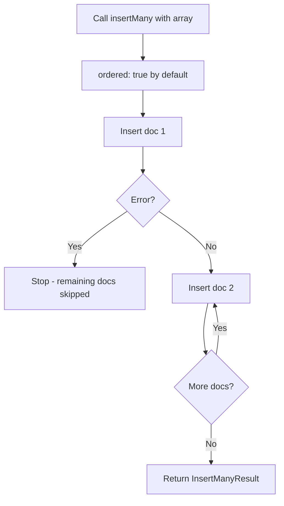

# How to Insert Multiple Documents in MongoDB with insertMany()

Author: [nawazdhandala](https://www.github.com/nawazdhandala)

Tags: MongoDB, insertMany, CRUD, Document, Insert, Bulk

Description: Learn how to insert multiple documents at once in MongoDB using insertMany(), with examples covering ordered inserts, error handling, and performance tips.

---

## How insertMany() Works

`insertMany()` allows you to insert an array of documents into a MongoDB collection in a single operation. This is far more efficient than calling `insertOne()` in a loop because it reduces the number of round trips to the database.

By default, MongoDB inserts documents in the order they appear in the array (ordered mode). If an error occurs during an ordered insert, MongoDB stops processing the remaining documents. In unordered mode, MongoDB continues inserting other documents even if one fails.



## Syntax

```javascript
db.collection.insertMany(documents, options)
```

- `documents` - An array of document objects to insert
- `options` - Optional settings object

Available options:

```text
ordered       - Boolean, default true. If true, stops on first error
writeConcern  - Specifies write acknowledgment requirements
comment       - Arbitrary comment for tracing
```

## Basic Example

Insert an array of documents into a collection:

```javascript
db.products.insertMany([
  { name: "Laptop", price: 999.99, category: "Electronics" },
  { name: "Desk Chair", price: 299.99, category: "Furniture" },
  { name: "Coffee Mug", price: 12.99, category: "Kitchen" }
])
```

The returned result includes all inserted IDs:

```javascript
{
  acknowledged: true,
  insertedIds: {
    '0': ObjectId("64a1b2c3d4e5f6789012345a"),
    '1': ObjectId("64a1b2c3d4e5f6789012345b"),
    '2': ObjectId("64a1b2c3d4e5f6789012345c")
  }
}
```

## Inserting Documents with Custom _id Values

```javascript
db.categories.insertMany([
  { _id: "electronics", label: "Electronics", sortOrder: 1 },
  { _id: "furniture", label: "Furniture", sortOrder: 2 },
  { _id: "kitchen", label: "Kitchen & Dining", sortOrder: 3 }
])
```

## Capturing Inserted IDs

```javascript
const result = db.users.insertMany([
  { name: "Alice", email: "alice@example.com", role: "admin" },
  { name: "Bob", email: "bob@example.com", role: "editor" },
  { name: "Carol", email: "carol@example.com", role: "viewer" }
])

Object.entries(result.insertedIds).forEach(([index, id]) => {
  print(`User ${index}: ${id}`)
})
```

## Ordered vs Unordered Insert

By default inserts are ordered - an error on one document stops the rest:

```javascript
// Ordered insert (default) - stops at first error
db.items.insertMany([
  { _id: 1, name: "Item A" },
  { _id: 1, name: "Item B" },  // duplicate _id - will cause error
  { _id: 3, name: "Item C" }   // this will NOT be inserted
])
```

Use `ordered: false` to continue inserting despite errors:

```javascript
// Unordered insert - continues past errors
db.items.insertMany(
  [
    { _id: 1, name: "Item A" },
    { _id: 1, name: "Item B" },  // duplicate - skipped
    { _id: 3, name: "Item C" }   // this WILL be inserted
  ],
  { ordered: false }
)
```

## Error Handling for insertMany()

```javascript
try {
  const result = db.orders.insertMany([
    { orderId: "ORD-001", amount: 100 },
    { orderId: "ORD-002", amount: 200 }
  ])
  print(`Inserted ${Object.keys(result.insertedIds).length} documents`)
} catch (err) {
  if (err.code === 11000) {
    print("Duplicate key error on one or more documents")
    print("writeErrors:", JSON.stringify(err.writeErrors))
  } else {
    throw err
  }
}
```

## Performance Tip - Batching Large Inserts

For very large datasets, break them into batches to avoid exceeding MongoDB's 16MB document size limit per batch or the 100,000 operations limit:

```javascript
const allDocuments = [] // assume this has thousands of documents
const batchSize = 1000

for (let i = 0; i < allDocuments.length; i += batchSize) {
  const batch = allDocuments.slice(i, i + batchSize)
  db.largeCollection.insertMany(batch, { ordered: false })
}
```

## Use Cases

- Seeding a database with initial data
- Importing records from a CSV or JSON file
- Bulk-creating test fixtures
- Migrating data from another system
- Loading reference or lookup tables

## Summary

`insertMany()` is the efficient choice when you need to insert multiple documents at once. Use the default ordered mode when document insertion order matters or when you want to stop on error. Switch to `ordered: false` for maximum throughput when individual document failures should not block the rest. Always handle the `BulkWriteError` for partial failure scenarios to understand which documents were inserted and which failed.
