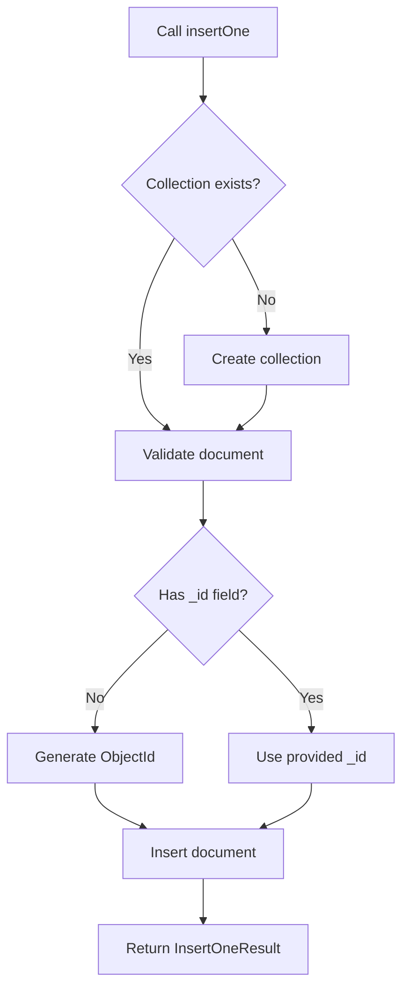

# How to Insert a Single Document in MongoDB with insertOne()

Author: [nawazdhandala](https://www.github.com/nawazdhandala)

Tags: MongoDB, insertOne, CRUD, Document, Insert

Description: Learn how to insert a single document into a MongoDB collection using insertOne(), including options, return values, and practical examples.

---

## How insertOne() Works

`insertOne()` is the primary method for adding a single document to a MongoDB collection. When called, MongoDB assigns a unique `_id` field to the document if one is not provided. The operation is atomic - it either succeeds completely or fails without partially inserting data.

If the collection does not exist, MongoDB creates it automatically when you call `insertOne()`.



## Syntax

The basic syntax for `insertOne()` is:

```javascript
db.collection.insertOne(document, options)
```

- `document` - The document object to insert
- `options` - Optional settings object

Available options:

```text
writeConcern  - Specifies the write concern for the operation
comment       - An arbitrary comment to help trace the operation
```

## Basic Example

The simplest way to insert a document without specifying an `_id`:

```javascript
db.users.insertOne({
  name: "Alice Johnson",
  email: "alice@example.com",
  age: 30,
  createdAt: new Date()
})
```

The result object returned looks like:

```javascript
{
  acknowledged: true,
  insertedId: ObjectId("64a1b2c3d4e5f6789012345a")
}
```

## Inserting a Document with a Custom _id

You can supply your own `_id` value instead of relying on the auto-generated ObjectId:

```javascript
db.products.insertOne({
  _id: "prod-001",
  name: "Mechanical Keyboard",
  price: 149.99,
  inStock: true,
  tags: ["electronics", "peripherals"]
})
```

## Capturing the Inserted ID

Storing the result lets you reference the newly created document:

```javascript
const result = db.orders.insertOne({
  customerId: ObjectId("64a1b2c3d4e5f6789012345a"),
  items: [
    { productId: "prod-001", quantity: 2, price: 149.99 }
  ],
  total: 299.98,
  status: "pending",
  createdAt: new Date()
})

console.log("New order ID:", result.insertedId)
```

## Inserting Nested Documents

MongoDB documents can contain embedded objects and arrays:

```javascript
db.employees.insertOne({
  name: "Bob Smith",
  department: "Engineering",
  address: {
    street: "123 Main St",
    city: "San Francisco",
    state: "CA",
    zip: "94105"
  },
  skills: ["JavaScript", "Python", "MongoDB"],
  startDate: new Date("2023-01-15")
})
```

## Handling Duplicate _id Errors

If a document with the same `_id` already exists, MongoDB throws a `WriteError`. Handle this in your application:

```javascript
try {
  db.users.insertOne({
    _id: "existing-user-id",
    name: "Duplicate User"
  })
} catch (err) {
  if (err.code === 11000) {
    print("Duplicate key error: document with this _id already exists")
  } else {
    throw err
  }
}
```

## Using Write Concern

Write concern controls the acknowledgment level from MongoDB:

```javascript
db.logs.insertOne(
  {
    level: "ERROR",
    message: "Connection timeout",
    timestamp: new Date(),
    service: "auth-service"
  },
  {
    writeConcern: { w: "majority", j: true, wtimeout: 5000 }
  }
)
```

## Use Cases

- Creating new user accounts or profiles
- Recording individual transactions or orders
- Logging a single event or audit entry
- Inserting configuration documents
- Adding a new product or catalog entry

## Summary

`insertOne()` is the straightforward way to add a single document to a MongoDB collection. It automatically generates an `_id` if none is provided, creates the collection if it does not exist, and returns the inserted document's ID upon success. Use it when you need to insert one document at a time with full acknowledgment, and handle `WriteError` with code `11000` for duplicate key violations.
