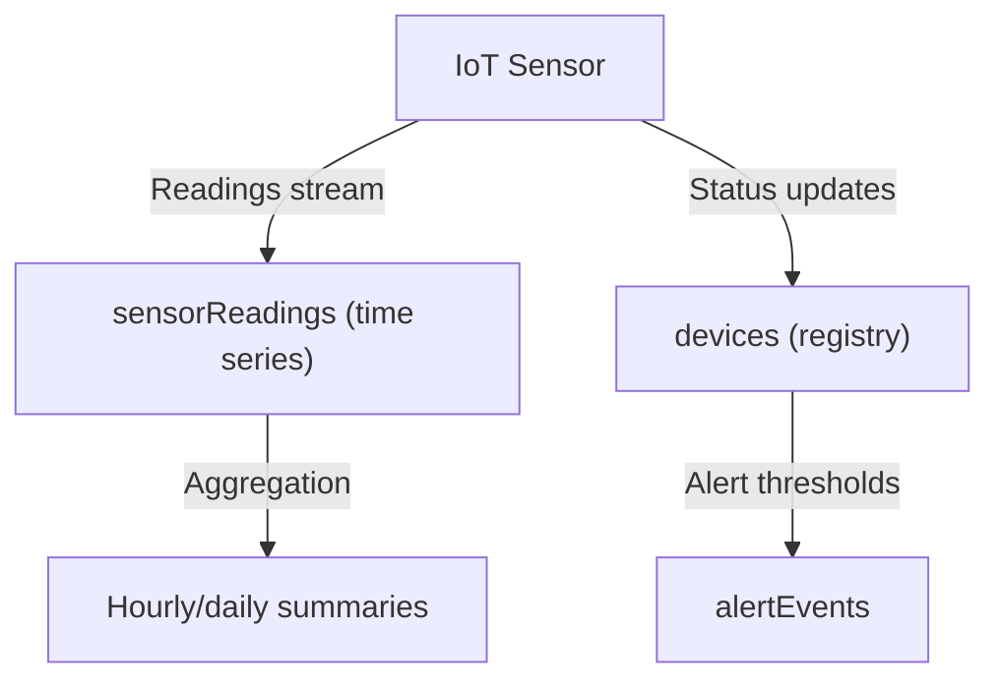

# How to Model an IoT Sensor Data Schema in MongoDB

IoT applications generate continuous streams of sensor readings at high frequency. Storing each reading as its own document (the naive approach) creates billions of small documents, wastes storage, and produces poor query performance. MongoDB provides two excellent solutions: the bucket pattern and native time series collections.

## The Naive Approach (and Its Problems)

```javascript
// One document per reading -- not recommended at high frequency
db.sensorReadings.insertOne({
  _id: ObjectId(),
  deviceId: "sensor-001",
  temperature: 22.5,
  humidity: 45.2,
  pressure: 1013.2,
  timestamp: new Date()
});
```

At 1 reading per second from 1,000 sensors, this creates 86.4 million documents per day. Document overhead (index entries, storage metadata) dominates over actual data.

## Approach 1: The Bucket Pattern

Group multiple readings from the same sensor into a single document that covers a time window (for example, one hour).

```javascript
// One document per sensor per hour
{
  _id: ObjectId("64a1b2c3d4e5f6789abc0001"),
  deviceId: "sensor-001",
  bucketStart: new Date("2024-06-15T10:00:00Z"),
  bucketEnd: new Date("2024-06-15T11:00:00Z"),
  count: 3600,
  readings: [
    { ts: new Date("2024-06-15T10:00:00Z"), temp: 22.5, humidity: 45.2, pressure: 1013.2 },
    { ts: new Date("2024-06-15T10:00:01Z"), temp: 22.6, humidity: 45.1, pressure: 1013.1 },
    // ... up to 3600 readings
  ],
  stats: {
    temp: { min: 21.8, max: 23.1, avg: 22.5, sum: 81000 },
    humidity: { min: 44.0, max: 46.5, avg: 45.2, sum: 162720 }
  }
}
```

Adding a new reading:

```javascript
async function addReading(db, deviceId, reading) {
  const bucketStart = new Date(reading.timestamp);
  bucketStart.setMinutes(0, 0, 0);  // Round to hour

  await db.collection("sensorBuckets").updateOne(
    {
      deviceId,
      bucketStart,
      count: { $lt: 3600 }
    },
    {
      $push: { readings: reading },
      $inc: {
        count: 1,
        "stats.temp.sum": reading.temp,
      },
      $min: { "stats.temp.min": reading.temp },
      $max: { "stats.temp.max": reading.temp },
      $setOnInsert: { deviceId, bucketStart }
    },
    { upsert: true }
  );
}
```

## Approach 2: MongoDB Time Series Collections

MongoDB 5.0 introduced native time series collections that handle bucketing and compression automatically.

```javascript
// Create a time series collection
db.createCollection("sensorReadings", {
  timeseries: {
    timeField: "timestamp",     // The date/time field
    metaField: "metadata",       // Fields that identify the source (sensor ID, etc.)
    granularity: "seconds"       // "seconds", "minutes", or "hours"
  },
  expireAfterSeconds: 2592000   // Optional: auto-delete after 30 days
});
```

Insert readings in the same way you insert into any collection:

```javascript
await db.collection("sensorReadings").insertOne({
  timestamp: new Date(),
  metadata: {
    deviceId: "sensor-001",
    location: "warehouse-a",
    type: "temperature_humidity"
  },
  temperature: 22.5,
  humidity: 45.2,
  pressure: 1013.2
});
```

MongoDB automatically groups documents into internal buckets based on `metaField` and `timeField`, compressing storage significantly.

## Device Registry Collection

Maintain a separate device registry with static metadata about each sensor.

```javascript
db.devices.insertOne({
  _id: "sensor-001",
  name: "Warehouse A - Sensor 1",
  type: "temperature_humidity_pressure",
  location: {
    building: "Warehouse A",
    zone: "Zone 3",
    coordinates: { lat: 37.7749, lon: -122.4194 }
  },
  firmwareVersion: "2.1.4",
  batteryLevel: 85,
  lastSeen: new Date(),
  isOnline: true,
  alertThresholds: {
    temperature: { min: 15, max: 30 },
    humidity: { min: 30, max: 70 }
  }
});

db.devices.createIndex({ "location.building": 1 });
db.devices.createIndex({ isOnline: 1, lastSeen: -1 });
```

## Collection Architecture



## Querying Sensor Data

```javascript
// Get all temperature readings for a sensor in the last 24 hours
const cutoff = new Date(Date.now() - 24 * 60 * 60 * 1000);

const readings = await db.collection("sensorReadings").find({
  "metadata.deviceId": "sensor-001",
  timestamp: { $gte: cutoff }
}).sort({ timestamp: 1 }).toArray();
```

```javascript
// Aggregate hourly averages
const hourlyAverages = await db.collection("sensorReadings").aggregate([
  {
    $match: {
      "metadata.deviceId": "sensor-001",
      timestamp: { $gte: new Date("2024-06-15T00:00:00Z") }
    }
  },
  {
    $group: {
      _id: {
        $dateTrunc: {
          date: "$timestamp",
          unit: "hour"
        }
      },
      avgTemp: { $avg: "$temperature" },
      avgHumidity: { $avg: "$humidity" },
      maxTemp: { $max: "$temperature" },
      minTemp: { $min: "$temperature" },
      count: { $sum: 1 }
    }
  },
  { $sort: { "_id": 1 } }
]).toArray();
```

## Alert Events Collection

```javascript
db.alertEvents.insertOne({
  _id: ObjectId(),
  deviceId: "sensor-001",
  field: "temperature",
  value: 35.2,
  threshold: 30,
  type: "exceeded_max",
  triggeredAt: new Date(),
  resolvedAt: null,
  acknowledgedBy: null
});

db.alertEvents.createIndex({ deviceId: 1, triggeredAt: -1 });
db.alertEvents.createIndex({ resolvedAt: 1 }, { sparse: true });
```

## Choosing Between Bucket Pattern and Time Series Collections

| Factor | Bucket Pattern | Time Series Collection |
|---|---|---|
| MongoDB version required | Any | 5.0+ |
| Compression | Manual | Automatic |
| Custom bucket logic | Flexible | Fixed by granularity |
| Aggregation performance | Good | Optimized natively |
| Schema control | Full | Limited to time+meta+measurements |

## Summary

IoT sensor data should never be stored as one document per reading at high ingestion rates. Use MongoDB native time series collections (MongoDB 5.0+) for automatic bucketing, compression, and optimized aggregation. For older MongoDB versions or more complex bucket requirements, implement the bucket pattern manually with `updateOne + upsert`. Store static device metadata in a separate `devices` collection, stream readings into the time series collection, and maintain alert events in their own collection. Use `$dateTrunc` in aggregation pipelines for efficient time-bucket grouping.
