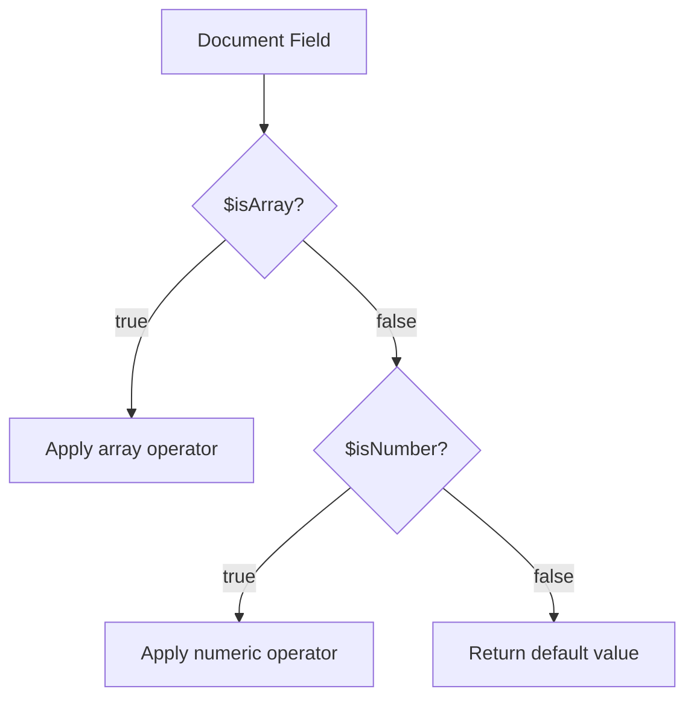

# How to Use $isArray and $isNumber in MongoDB Aggregation

Author: [nawazdhandala](https://www.github.com/nawazdhandala)

Tags: MongoDB, Aggregation, Pipeline, Expression, Type

Description: Learn how to use $isArray and $isNumber in MongoDB aggregation to check field types and build conditional logic that handles mixed-type data safely.

---

## Overview

`$isArray` and `$isNumber` are type-checking expressions that return a boolean. They let you branch logic inside a pipeline without causing errors on documents where a field holds an unexpected type.



## $isArray

### Syntax

```javascript
{ $isArray: <expression> }
```

Returns `true` if the expression resolves to an array, `false` otherwise (including `null` and missing fields).

### Examples

#### Check if a field is an array

```javascript
// Input documents vary: some have "tags" as array, some as string
db.posts.aggregate([
  {
    $project: {
      hasTags: { $isArray: "$tags" }
    }
  }
])
```

Output:

```javascript
[
  { _id: 1, hasTags: true },
  { _id: 2, hasTags: false },
  { _id: 3, hasTags: false }   // null or missing
]
```

#### Conditionally compute array size

```javascript
db.posts.aggregate([
  {
    $project: {
      tagCount: {
        $cond: {
          if: { $isArray: "$tags" },
          then: { $size: "$tags" },
          else: 0
        }
      }
    }
  }
])
```

#### Filter only documents where the field is an array

```javascript
db.posts.aggregate([
  {
    $match: {
      $expr: { $isArray: "$tags" }
    }
  }
])
```

#### Normalize a field that could be a string or an array

```javascript
db.items.aggregate([
  {
    $project: {
      labels: {
        $cond: {
          if: { $isArray: "$labels" },
          then: "$labels",
          else: { $cond: {
            if: { $ne: ["$labels", null] },
            then: ["$labels"],
            else: []
          }}
        }
      }
    }
  }
])
```

## $isNumber

### Syntax

```javascript
{ $isNumber: <expression> }
```

Returns `true` if the expression resolves to a numeric BSON type: `int`, `long`, `double`, or `decimal`. Returns `false` for strings, booleans, null, and all other types.

### Examples

#### Identify numeric fields

```javascript
// Input: { _id: 1, value: 42 }, { _id: 2, value: "N/A" }, { _id: 3, value: null }
db.metrics.aggregate([
  {
    $project: {
      isNum: { $isNumber: "$value" }
    }
  }
])
```

Output:

```javascript
[
  { _id: 1, isNum: true },
  { _id: 2, isNum: false },
  { _id: 3, isNum: false }
]
```

#### Sum only numeric values, default others to 0

```javascript
db.metrics.aggregate([
  {
    $group: {
      _id: null,
      total: {
        $sum: {
          $cond: {
            if: { $isNumber: "$value" },
            then: "$value",
            else: 0
          }
        }
      }
    }
  }
])
```

#### Compute average while skipping non-numeric documents

```javascript
db.readings.aggregate([
  {
    $match: {
      $expr: { $isNumber: "$temperature" }
    }
  },
  {
    $group: {
      _id: "$sensorId",
      avgTemp: { $avg: "$temperature" }
    }
  }
])
```

## Combining $isArray and $isNumber

Handle documents where a field could be a number, an array of numbers, or invalid data:

```javascript
db.records.aggregate([
  {
    $project: {
      computed: {
        $switch: {
          branches: [
            {
              case: { $isNumber: "$data" },
              then: "$data"
            },
            {
              case: { $isArray: "$data" },
              then: { $sum: "$data" }
            }
          ],
          default: null
        }
      }
    }
  }
])
```

## Comparison with $type

| Operator | Returns | Checks |
|---|---|---|
| `$isArray` | boolean | whether value is an array |
| `$isNumber` | boolean | whether value is int, long, double, or decimal |
| `$type` | string | BSON type name of the value |

Use `$isArray` and `$isNumber` when you only need a boolean branch. Use `$type` when you need to distinguish between specific numeric types (e.g., double vs. decimal).

## Summary

`$isArray` and `$isNumber` are defensive type guards for aggregation pipelines that process collections with heterogeneous schemas. Use `$isArray` to avoid errors from `$size` or `$map` on non-array fields, and use `$isNumber` to skip non-numeric values before arithmetic operations. Combining these operators with `$cond` and `$switch` keeps pipelines robust without requiring schema enforcement at the application layer.
