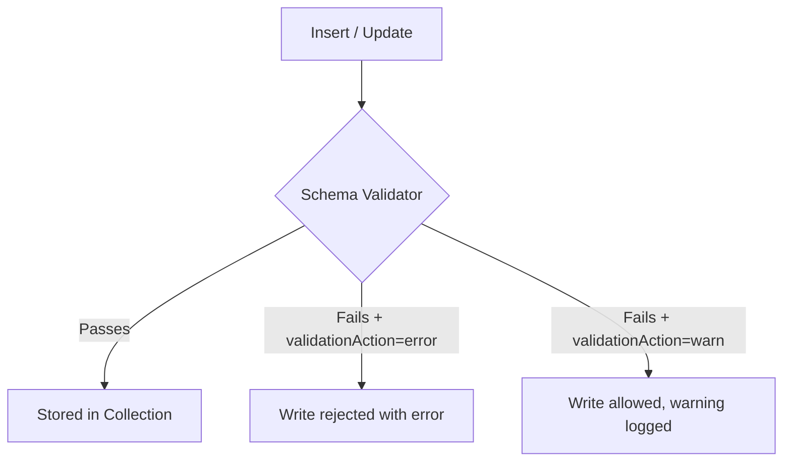

# How to Perform Schema Validation in MongoDB with $jsonSchema

Author: [nawazdhandala](https://www.github.com/nawazdhandala)

Tags: MongoDB, Schema Validation, JSON Schema, Data Quality, Administration

Description: Learn how to use MongoDB's $jsonSchema validator to enforce document structure, required fields, data types, and value constraints at the database level.

---

## How MongoDB Schema Validation Works

MongoDB is schema-flexible by default, but you can enforce schema rules at the collection level using the `validator` option with `$jsonSchema`. When a document fails validation, MongoDB either rejects the write (`error`) or logs a warning but allows the write (`warn`), depending on your `validationAction`.



## Defining a Schema Validator

Create a collection with a `$jsonSchema` validator:

```javascript
db.createCollection("orders", {
  validator: {
    $jsonSchema: {
      bsonType: "object",
      title: "Order Schema",
      required: ["customerId", "items", "status", "total", "createdAt"],
      additionalProperties: false,
      properties: {
        _id: {
          bsonType: "objectId"
        },
        customerId: {
          bsonType: "string",
          minLength: 1,
          maxLength: 100,
          description: "Customer identifier - required string"
        },
        items: {
          bsonType: "array",
          minItems: 1,
          items: {
            bsonType: "object",
            required: ["productId", "qty", "price"],
            properties: {
              productId: { bsonType: "string" },
              qty: { bsonType: "int", minimum: 1 },
              price: { bsonType: "double", minimum: 0 }
            }
          },
          description: "Array of order items - must have at least one item"
        },
        status: {
          bsonType: "string",
          enum: ["pending", "processing", "shipped", "delivered", "cancelled"],
          description: "Order status - must be one of the allowed values"
        },
        total: {
          bsonType: "double",
          minimum: 0,
          description: "Order total in USD - must be non-negative"
        },
        createdAt: {
          bsonType: "date",
          description: "Order creation timestamp"
        },
        notes: {
          bsonType: "string",
          maxLength: 500
        }
      }
    }
  },
  validationAction: "error",   // "error" (default) or "warn"
  validationLevel: "strict"    // "strict" (default) or "moderate"
})
```

## validationLevel and validationAction

**validationLevel:**
- `strict` (default) - applies validation to all inserts and updates
- `moderate` - applies validation to new inserts and updates to existing documents that already pass validation; skips validation for existing invalid documents

**validationAction:**
- `error` (default) - rejects documents that fail validation
- `warn` - allows the write but logs a warning in the MongoDB log

## Testing Validation

Insert a valid order:

```javascript
db.orders.insertOne({
  customerId: "c123",
  items: [{ productId: "p1", qty: 2, price: 49.99 }],
  status: "pending",
  total: 99.98,
  createdAt: new Date()
})
```

Insert an invalid order (missing required field):

```javascript
db.orders.insertOne({
  customerId: "c123",
  status: "pending",
  total: 99.98,
  createdAt: new Date()
  // missing "items" - required field
})
```

Expected error:

```text
MongoServerError: Document failed validation
Additional information: {
  failingDocumentId: ObjectId('...'),
  details: {
    operatorName: '$jsonSchema',
    schemaRulesNotSatisfied: [
      { operatorName: 'required', specifiedAs: { required: ['customerId','items','status','total','createdAt'] }, missingProperties: ['items'] }
    ]
  }
}
```

Insert with invalid enum value:

```javascript
db.orders.insertOne({
  customerId: "c123",
  items: [{ productId: "p1", qty: 2, price: 49.99 }],
  status: "unknown",    // not in enum
  total: 99.98,
  createdAt: new Date()
})
```

## Adding Validation to an Existing Collection

Use `collMod` to add or update validation on an existing collection:

```javascript
db.runCommand({
  collMod: "orders",
  validator: {
    $jsonSchema: {
      bsonType: "object",
      required: ["customerId", "status"],
      properties: {
        customerId: { bsonType: "string" },
        status: {
          bsonType: "string",
          enum: ["pending", "processing", "shipped", "delivered", "cancelled"]
        }
      }
    }
  },
  validationAction: "warn",   // use "warn" when adding to an existing collection with potentially invalid data
  validationLevel: "moderate"
})
```

Use `validationAction: "warn"` initially when adding validation to an existing collection, review the warnings, fix the data, then switch to `"error"`.

## Removing Validation

To remove all validation from a collection:

```javascript
db.runCommand({
  collMod: "orders",
  validator: {}
})
```

## Viewing the Current Schema

```javascript
db.getCollectionInfos({ name: "orders" })[0].options.validator
```

## Common bsonType Values

| bsonType | Description |
|----------|-------------|
| `string` | UTF-8 string |
| `int` | 32-bit integer |
| `long` | 64-bit integer |
| `double` | 64-bit float |
| `decimal` | 128-bit decimal (for financial data) |
| `bool` | Boolean |
| `date` | UTC datetime |
| `objectId` | BSON ObjectId |
| `array` | Array |
| `object` | Embedded document |
| `null` | Null value |
| `binData` | Binary data |

## Using Multiple Types

Allow a field to be either a string or null:

```javascript
{
  notes: {
    bsonType: ["string", "null"],
    maxLength: 500
  }
}
```

## Pattern Matching with pattern

Validate an email field format:

```javascript
{
  email: {
    bsonType: "string",
    pattern: "^[a-zA-Z0-9._%+\\-]+@[a-zA-Z0-9.\\-]+\\.[a-zA-Z]{2,}$",
    description: "Must be a valid email address"
  }
}
```

## Schema Validation in Application Code (Node.js)

Even with database-level validation, handle validation errors in your application:

```javascript
const { MongoServerError } = require("mongodb");

try {
  await db.collection("orders").insertOne(orderDoc);
} catch (error) {
  if (error instanceof MongoServerError && error.code === 121) {
    // Error code 121 = DocumentValidationFailure
    console.error("Document failed schema validation:", error.errInfo);
    throw new ValidationError("Order data is invalid: " + JSON.stringify(error.errInfo?.details));
  }
  throw error;
}
```

## Best Practices

- Start with `validationAction: "warn"` when adding validation to existing collections; switch to `"error"` after fixing all existing violations.
- Use `additionalProperties: false` to reject documents with unexpected fields in strict environments.
- Add meaningful `description` strings to each property for self-documenting schemas.
- Use `bsonType: "decimal"` instead of `"double"` for financial amounts to avoid floating-point precision issues.
- Keep schema validators in version control and apply them as part of your database migration process.
- Test schema changes in staging before applying to production.

## Summary

MongoDB `$jsonSchema` validation enforces document structure at the database level, independent of application logic. Define validators when creating a collection or add them later with `collMod`. Use `required` to mandate fields, `enum` to restrict values, `bsonType` to enforce types, and `minLength`/`maxLength`/`minimum`/`maximum` for value constraints. Start with `validationAction: "warn"` on existing collections, review the warnings, and switch to `"error"` once the data is clean.
