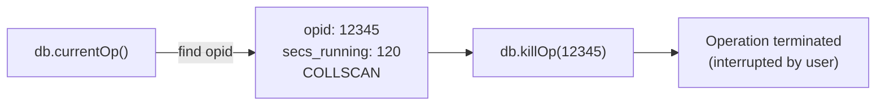

# How to Kill Long-Running MongoDB Operations with db.killOp()

Author: [nawazdhandala](https://www.github.com/nawazdhandala)

Tags: MongoDB, Operations, Performance, Diagnostic, Administration

Description: Learn how to use db.killOp() to terminate long-running or stuck MongoDB operations, and how to safely identify target operations before killing them.

---

## Overview

`db.killOp(opid)` sends a termination signal to a running operation identified by its operation ID (`opid`). The operation ID is obtained from `db.currentOp()`. Use it to stop runaway queries, stuck index builds, or lock-blocking operations that are degrading cluster performance.



## Syntax

```javascript
db.killOp(<opid>)
```

Where `<opid>` is the numeric operation ID from `db.currentOp().inprog[n].opid`.

## Step-by-Step: Find and Kill an Operation

### Step 1: List long-running operations

```javascript
db.currentOp({
  "active": true,
  "secs_running": { "$gt": 10 }
})
```

Sample output:

```javascript
{
  "inprog": [
    {
      "opid": 98765,
      "op": "query",
      "ns": "shop.orders",
      "secs_running": 87,
      "planSummary": "COLLSCAN",
      "client": "10.0.1.20:50123"
    }
  ]
}
```

### Step 2: Kill the target operation

```javascript
db.killOp(98765)
```

Expected response:

```javascript
{ "info": "attempting to kill op", "ok": 1 }
```

### Step 3: Verify the operation is gone

```javascript
db.currentOp({ "opid": 98765 })
// Should return empty inprog array
```

## Kill All Collection Scans Running Longer than 30 Seconds

```javascript
var result = db.currentOp({
  "active": true,
  "secs_running": { "$gt": 30 },
  "planSummary": "COLLSCAN"
});

result.inprog.forEach(function(op) {
  print("Killing opid=" + op.opid + " ns=" + op.ns + " secs=" + op.secs_running);
  db.killOp(op.opid);
});
```

## Kill All Operations from a Specific Client

```javascript
var result = db.currentOp({
  "client": { "$regex": "^192.168.1.50" }
});

result.inprog.forEach(function(op) {
  if (op.opid) {
    db.killOp(op.opid);
  }
});
```

## Kill Operations on a Specific Namespace

```javascript
var result = db.currentOp({
  "ns": "analytics.pageviews",
  "active": true
});

result.inprog.forEach(function(op) {
  db.killOp(op.opid);
});
```

## Kill via $currentOp Aggregation (MongoDB 3.6+)

```javascript
var ops = db.adminCommand({
  aggregate: 1,
  pipeline: [
    { $currentOp: { allUsers: true, idleConnections: false } },
    {
      $match: {
        "ns": "mydb.events",
        "secs_running": { "$gt": 60 }
      }
    }
  ],
  cursor: {}
}).cursor.firstBatch;

ops.forEach(function(op) {
  print("Killing " + op.opid);
  db.adminCommand({ killOp: 1, op: op.opid });
});
```

Note: `db.adminCommand({ killOp: 1, op: opid })` is the underlying command that `db.killOp()` calls.

## Killing Operations on a Sharded Cluster

On a `mongos`, operations run on individual shards. To kill a shard-level operation, connect directly to the shard's `mongod` and run `db.killOp()` there.

```javascript
// Connect to the shard primary directly
var shardConn = new Mongo("shard1-host:27017");
var shardAdmin = shardConn.getDB("admin");

var ops = shardAdmin.currentOp({
  "secs_running": { "$gt": 30 }
});

ops.inprog.forEach(function(op) {
  shardAdmin.killOp(op.opid);
});
```

## What Happens When You Kill an Operation

- The operation receives an interrupt signal
- The operation rolls back any partial writes (for write operations)
- The client receives an error: `"operation was interrupted"`
- The connection is preserved; the client can issue new operations

Killing a write operation that is part of a multi-document transaction causes the entire transaction to be aborted.

## Required Permissions

| Scenario | Required Privilege |
|---|---|
| Kill your own operations | Any authenticated user |
| Kill other users' operations | `killop` privilege or `clusterMonitor` role |
| Kill all operations | `clusterAdmin` or `clusterManager` role |

## Safety Checklist Before Killing Operations

- Confirm the `opid` is the correct operation (check `ns`, `op`, `client`)
- For write operations, verify the rollback is acceptable
- Do not kill index builds unless you intend to restart them
- On replica sets, killing the primary's operation does not affect secondaries
- Communicate with the application team if killing a known business transaction

## Summary

`db.killOp(opid)` terminates a specific running operation on MongoDB by sending an interrupt signal. Always identify the target operation using `db.currentOp()` first, filtering by `secs_running`, `planSummary`, `ns`, or `client` to isolate the correct operation. Write operations are safely rolled back. For cluster-wide cleanup on sharded deployments, connect directly to each affected shard primary. Combine regular `db.currentOp()` monitoring with automated `db.killOp()` scripts to enforce query time budgets in production.
