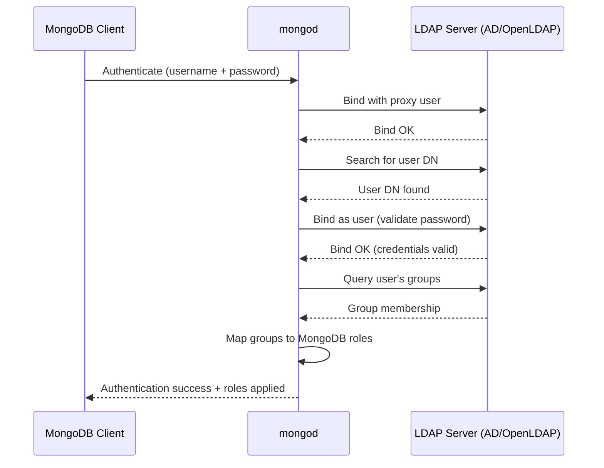

# How to Configure MongoDB LDAP Authentication

Author: [nawazdhandala](https://www.github.com/nawazdhandala)

Tags: MongoDB, LDAP, Authentication, Security, Enterprise

Description: Learn how to configure MongoDB LDAP authentication to integrate with your corporate directory, map LDAP groups to MongoDB roles, and test the connection.

---

## Introduction

MongoDB Enterprise supports LDAP (Lightweight Directory Access Protocol) authentication, allowing users to authenticate with their corporate credentials. MongoDB can validate credentials against an LDAP server and optionally use LDAP groups to authorize access via role mappings. This eliminates the need to manage separate MongoDB user accounts for each employee.

## LDAP Authentication Flow



## Prerequisites

- MongoDB Enterprise 3.4 or later
- An LDAP server (Active Directory or OpenLDAP)
- A service account (proxy user) on the LDAP server to perform searches

## Step 1: Install mongoldap Tool (For Testing)

MongoDB Enterprise includes `mongoldap` for testing LDAP configuration before applying it to mongod:

```bash
# Verify mongoldap is available
mongoldap --version
```

## Step 2: Configure mongod.conf for LDAP

```yaml
security:
  authorization: enabled
  ldap:
    servers: "ldap.example.com:389"
    transportSecurity: tls        # or "none" for unencrypted (not recommended)
    bind:
      method: simple
      queryUser: "cn=mongodb-service,ou=ServiceAccounts,dc=example,dc=com"
      queryPassword: "serviceAccountPassword"
    userToDNMapping: |
      [
        {
          match: "(.+)",
          ldapQuery: "ou=Users,dc=example,dc=com??sub?(uid={0})"
        }
      ]
    authz:
      queryTemplate: |
        {
          LDAP_SERVER: "ldap.example.com",
          LDAP_QUERY: "ou=Groups,dc=example,dc=com??sub?(&(objectClass=groupOfNames)(member={USER}))"
        }

setParameter:
  authenticationMechanisms: PLAIN
```

## Step 3: Configure userToDNMapping

The `userToDNMapping` transforms the username provided by the client into an LDAP Distinguished Name (DN). For Active Directory, users often authenticate with their email:

```yaml
security:
  ldap:
    userToDNMapping: |
      [
        {
          match: "(.+)@example\\.com",
          substitution: "CN={0},CN=Users,DC=example,DC=com"
        }
      ]
```

For OpenLDAP with UID-based search:

```yaml
security:
  ldap:
    userToDNMapping: |
      [
        {
          match: "(.+)",
          ldapQuery: "ou=People,dc=example,dc=com??sub?(uid={0})"
        }
      ]
```

## Step 4: Map LDAP Groups to MongoDB Roles

Create MongoDB roles that correspond to LDAP groups:

```javascript
// Create a role mapping for the LDAP group DN
use admin
db.createRole({
  role: "cn=mongo-admins,ou=Groups,dc=example,dc=com",
  privileges: [],
  roles: [{ role: "dbAdmin", db: "ecommerce" }, { role: "readWrite", db: "ecommerce" }]
})

db.createRole({
  role: "cn=mongo-readers,ou=Groups,dc=example,dc=com",
  privileges: [],
  roles: [{ role: "read", db: "ecommerce" }]
})
```

The role name must exactly match the DN returned by the `authz.queryTemplate`.

## Step 5: Test LDAP Config with mongoldap

Before restarting mongod, verify the configuration:

```bash
mongoldap \
  --config /etc/mongod.conf \
  --user "jsmith@example.com" \
  --password "userPassword"
```

Expected output:

```text
Running MongoDB LDAP authorization validation checks...
   Provided username: jsmith@example.com
   Transformed username: CN=jsmith,CN=Users,DC=example,DC=com
   Authentication with user DN "CN=jsmith,CN=Users,DC=example,DC=com": SUCCESS

   Roles for user "CN=jsmith,CN=Users,DC=example,DC=com":
   cn=mongo-admins,ou=Groups,dc=example,dc=com
```

## Step 6: Restart mongod and Verify

```bash
sudo systemctl restart mongod
```

Test authentication:

```bash
mongosh --host localhost --authenticationMechanism PLAIN \
  --authenticationDatabase '$external' \
  --username "jsmith@example.com" \
  --password
```

## Step 7: Create an Emergency Local Admin User

Always maintain at least one local MongoDB admin user that does not require LDAP, in case the LDAP server is unreachable:

```javascript
use admin
db.createUser({
  user: "emergency-admin",
  pwd: "strongPassword",
  roles: [{ role: "root", db: "admin" }],
  mechanisms: ["SCRAM-SHA-256"]
})
```

## Troubleshooting

```bash
# Enable verbose LDAP diagnostics
mongosh --eval 'db.adminCommand({ setParameter: 1, ldapUserCacheInvalidationInterval: 30 })'

# Check LDAP connectivity
ldapsearch -H ldap://ldap.example.com:389 \
  -D "cn=mongodb-service,ou=ServiceAccounts,dc=example,dc=com" \
  -w "serviceAccountPassword" \
  -b "ou=Users,dc=example,dc=com" "(uid=jsmith)"

# View LDAP errors in mongod log
grep -i ldap /var/log/mongodb/mongod.log | tail -30
```

## Summary

MongoDB LDAP authentication requires MongoDB Enterprise and integrates with your existing directory service. Configure the LDAP server, proxy bind credentials, `userToDNMapping` (to convert usernames to DNs), and an optional `authz.queryTemplate` for group-based authorization. Map LDAP group DNs to MongoDB roles using `db.createRole()`. Always test with `mongoldap` before restarting mongod, and maintain at least one local emergency admin user outside of LDAP dependency.
