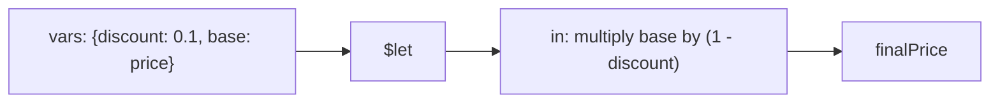

# How to Use $let for Variables in MongoDB Aggregation

Author: [nawazdhandala](https://www.github.com/nawazdhandala)

Tags: MongoDB, Aggregation, Pipeline, Expression, Variable

Description: Learn how to use $let in MongoDB aggregation to define named variables scoped to a sub-expression, making complex pipelines more readable and avoiding repeated computation.

---

## Overview

`$let` defines one or more named variables and evaluates an expression in the context of those variables. It is useful for giving meaningful names to intermediate computed values, and for avoiding repeated sub-expressions in complex projections.



## Syntax

```javascript
{
  $let: {
    vars: {
      <varName1>: <expression1>,
      <varName2>: <expression2>,
      ...
    },
    in: <expression using $$varName1, $$varName2>
  }
}
```

- `vars` - defines variables; values are evaluated once and bound to the names
- `in` - the expression that uses those variables; reference them with `$$varName`

## Examples

### Example 1 - Simplify a Repeated Sub-Expression

Without `$let`, computing a discounted price twice would repeat `$subtract`:

```javascript
db.products.aggregate([
  {
    $project: {
      finalPrice: {
        $let: {
          vars: {
            basePrice: "$price",
            discountRate: 0.15
          },
          in: {
            $subtract: [
              "$$basePrice",
              { $multiply: ["$$basePrice", "$$discountRate"] }
            ]
          }
        }
      }
    }
  }
])
```

### Example 2 - Readable Conditional Logic

Use `$let` to name intermediate booleans for a readable `$cond`:

```javascript
db.users.aggregate([
  {
    $project: {
      accessLevel: {
        $let: {
          vars: {
            isPremium: { $gte: ["$subscriptionTier", 2] },
            isVerified: { $eq: ["$emailVerified", true] }
          },
          in: {
            $cond: {
              if: { $and: ["$$isPremium", "$$isVerified"] },
              then: "full",
              else: {
                $cond: {
                  if: "$$isVerified",
                  then: "basic",
                  else: "restricted"
                }
              }
            }
          }
        }
      }
    }
  }
])
```

### Example 3 - Use Inside $map

`$let` works inside any expression including `$map`:

```javascript
db.orders.aggregate([
  {
    $project: {
      lineItems: {
        $map: {
          input: "$items",
          as: "item",
          in: {
            $let: {
              vars: {
                subtotal: { $multiply: ["$$item.qty", "$$item.unitPrice"] },
                taxRate: 0.08
              },
              in: {
                name: "$$item.name",
                subtotal: "$$subtotal",
                tax: { $multiply: ["$$subtotal", "$$taxRate"] },
                total: { $multiply: ["$$subtotal", { $add: [1, "$$taxRate"] }] }
              }
            }
          }
        }
      }
    }
  }
])
```

### Example 4 - Avoid Deep Nesting with Intermediate Variables

Compute a normalized score across three dimensions:

```javascript
db.athletes.aggregate([
  {
    $project: {
      normalizedScore: {
        $let: {
          vars: {
            speedScore: { $divide: ["$speed", 100] },
            strengthScore: { $divide: ["$strength", 100] },
            enduranceScore: { $divide: ["$endurance", 100] }
          },
          in: {
            $divide: [
              {
                $add: [
                  "$$speedScore",
                  "$$strengthScore",
                  "$$enduranceScore"
                ]
              },
              3
            ]
          }
        }
      }
    }
  }
])
```

### Example 5 - $let in $match with $expr

Use `$let` inside `$expr` to precompute a threshold value:

```javascript
db.orders.aggregate([
  {
    $match: {
      $expr: {
        $let: {
          vars: {
            threshold: { $multiply: ["$baseLimit", 1.2] }
          },
          in: { $gt: ["$amount", "$$threshold"] }
        }
      }
    }
  }
])
```

### Example 6 - Nested $let Scopes

Outer variables remain accessible inside inner `$let` blocks:

```javascript
db.products.aggregate([
  {
    $project: {
      margin: {
        $let: {
          vars: { revenue: "$price" },
          in: {
            $let: {
              vars: { cost: "$costPrice" },
              in: {
                $subtract: ["$$revenue", "$$cost"]
              }
            }
          }
        }
      }
    }
  }
])
```

## Variable Naming Rules

- Variable names must start with a lowercase letter
- Names are case-sensitive
- System variables (`$$ROOT`, `$$CURRENT`, `$$NOW`) are reserved and cannot be redefined

## $let vs. $addFields

| Approach | Scope | Visibility |
|---|---|---|
| `$let` | Within the expression only | Not added to the output document |
| `$addFields` | Adds a new field to the document | Persists in output and downstream stages |

Use `$let` when the intermediate value is only needed within a single expression and you do not want it to appear in the output.

## Summary

`$let` improves the readability and maintainability of complex aggregation expressions by binding sub-expressions to named variables. Instead of repeating the same sub-expression multiple times or deeply nesting operators, define the value once in `vars` and reference it by name with `$$varName` in the `in` expression. It has no runtime cost beyond the evaluation of the bound expressions themselves.
