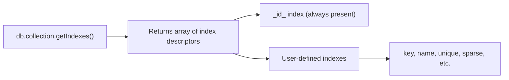

# How to List All Indexes in MongoDB with getIndexes()

Author: [nawazdhandala](https://www.github.com/nawazdhandala)

Tags: MongoDB, Index, getIndexes, Maintenance, Introspection

Description: Learn how to list all indexes in MongoDB using getIndexes(), listIndexes(), and $indexStats to inspect index definitions, usage statistics, and spot redundant indexes.

---

## How getIndexes() Works

`getIndexes()` returns an array of documents describing all indexes on a collection. Each document includes the index key pattern, name, version, and any special properties like `unique`, `sparse`, or `expireAfterSeconds`.

This is the primary command for inspecting what indexes exist on a collection.



## Methods to List Indexes

Three main ways to inspect indexes:

```javascript
// Method 1: getIndexes() - returns full index documents
db.collection.getIndexes()

// Method 2: listIndexes() cursor (useful in drivers)
db.collection.listIndexes()

// Method 3: $indexStats aggregation - includes usage stats
db.collection.aggregate([{ $indexStats: {} }])
```

## Examples

### getIndexes() Basic Usage

```javascript
db.users.getIndexes()
```

Sample output:

```javascript
[
  {
    "v": 2,
    "key": { "_id": 1 },
    "name": "_id_"
  },
  {
    "v": 2,
    "key": { "email": 1 },
    "name": "email_1",
    "unique": true
  },
  {
    "v": 2,
    "key": { "createdAt": 1 },
    "name": "idx_createdAt_ttl",
    "expireAfterSeconds": 86400
  },
  {
    "v": 2,
    "key": { "status": 1, "customerId": 1 },
    "name": "idx_status_customer"
  }
]
```

### Listing Indexes in mongosh

```bash
mongosh> use myapp
mongosh> db.orders.getIndexes()
```

### Using $indexStats for Usage Information

`$indexStats` shows how many times each index has been used since the last mongod restart:

```javascript
db.orders.aggregate([{ $indexStats: {} }])
```

Sample output:

```javascript
[
  {
    "name": "_id_",
    "key": { "_id": 1 },
    "host": "localhost:27017",
    "accesses": { "ops": 524, "since": ISODate("2026-03-01T00:00:00Z") }
  },
  {
    "name": "idx_status",
    "key": { "status": 1 },
    "host": "localhost:27017",
    "accesses": { "ops": 18432, "since": ISODate("2026-03-01T00:00:00Z") }
  },
  {
    "name": "idx_legacy_field",
    "key": { "oldField": 1 },
    "host": "localhost:27017",
    "accesses": { "ops": 0, "since": ISODate("2026-03-01T00:00:00Z") }
  }
]
```

An index with `ops: 0` is a candidate for removal.

### List Indexes Across All Collections in a Database

```javascript
db.getCollectionNames().forEach(collectionName => {
  const indexes = db.getCollection(collectionName).getIndexes();
  print(`\n${collectionName} (${indexes.length} indexes):`);
  indexes.forEach(idx => print(`  - ${idx.name}: ${JSON.stringify(idx.key)}`));
});
```

### Node.js Example

```javascript
const { MongoClient } = require("mongodb");

async function listAllIndexes() {
  const client = new MongoClient("mongodb://localhost:27017");
  await client.connect();

  const db = client.db("myapp");

  // List all collections
  const collections = await db.listCollections().toArray();

  for (const coll of collections) {
    const collection = db.collection(coll.name);
    const indexes = await collection.indexes();

    console.log(`\n${coll.name} - ${indexes.length} index(es):`);
    indexes.forEach(idx => {
      const props = [];
      if (idx.unique) props.push("unique");
      if (idx.sparse) props.push("sparse");
      if (idx.expireAfterSeconds !== undefined) props.push(`ttl=${idx.expireAfterSeconds}s`);
      if (idx.partialFilterExpression) props.push("partial");
      const propStr = props.length > 0 ? ` [${props.join(", ")}]` : "";
      console.log(`  ${idx.name}: ${JSON.stringify(idx.key)}${propStr}`);
    });
  }

  await client.close();
}

listAllIndexes().catch(console.error);
```

### Find Redundant Indexes

A single-field index is redundant if a compound index starts with the same field:

```javascript
// Check for redundant prefix indexes
const indexes = db.orders.getIndexes();
const keyPatterns = indexes.map(i => Object.keys(i.key));

keyPatterns.forEach((pattern, i) => {
  keyPatterns.forEach((otherPattern, j) => {
    if (i !== j && pattern.length < otherPattern.length) {
      // Check if pattern is a prefix of otherPattern
      const isPrefix = pattern.every((field, k) => field === otherPattern[k]);
      if (isPrefix) {
        console.log(
          `Index "${indexes[i].name}" (${JSON.stringify(pattern)}) ` +
          `may be redundant - covered by "${indexes[j].name}" (${JSON.stringify(otherPattern)})`
        );
      }
    }
  });
});
```

### Check Index Properties Programmatically

```javascript
const { MongoClient } = require("mongodb");

async function inspectIndexProperties() {
  const client = new MongoClient("mongodb://localhost:27017");
  await client.connect();

  const collection = client.db("shop").collection("orders");
  const indexes = await collection.indexes();

  // Separate indexes by type
  const ttlIndexes = indexes.filter(i => i.expireAfterSeconds !== undefined);
  const uniqueIndexes = indexes.filter(i => i.unique);
  const sparseIndexes = indexes.filter(i => i.sparse);
  const textIndexes = indexes.filter(i => Object.values(i.key).includes("text"));
  const geoIndexes = indexes.filter(i =>
    Object.values(i.key).some(v => ["2dsphere", "2d", "geoHaystack"].includes(v))
  );

  console.log("TTL indexes:", ttlIndexes.map(i => i.name));
  console.log("Unique indexes:", uniqueIndexes.map(i => i.name));
  console.log("Sparse indexes:", sparseIndexes.map(i => i.name));
  console.log("Text indexes:", textIndexes.map(i => i.name));
  console.log("Geo indexes:", geoIndexes.map(i => i.name));

  await client.close();
}

inspectIndexProperties().catch(console.error);
```

## Index Properties Reference

```text
Property              Description
----------------------------------------------------
v                     Index version (2 = current)
key                   Field(s) and direction(s)
name                  Index name (auto-generated or custom)
unique                true if values must be unique
sparse                true if missing-field docs are skipped
partialFilterExpression  Filter for partial indexes
expireAfterSeconds    TTL duration in seconds
background            (deprecated in 4.2+) build in background
weights               Text index field weights
default_language      Text index language
multiKey              true if indexed field contains arrays
```

## Best Practices

- **Run `getIndexes()` before adding new indexes** to check whether a suitable index already exists.
- **Use `$indexStats` monthly** to identify unused indexes and candidates for removal.
- **Check for prefix redundancy** - a compound index covers queries that any single-field prefix would serve.
- **Script cross-collection audits** using `db.getCollectionNames()` to get a full picture of all indexes in a database.
- **Store index definitions in source control** alongside schema migrations so you always know what indexes should exist.

## Summary

`getIndexes()` lists all indexes on a collection, returning their key patterns, names, and properties like `unique`, `sparse`, and `expireAfterSeconds`. For usage statistics, use `$indexStats` to see how many times each index has been accessed since the last mongod restart. Regularly auditing indexes with these tools helps identify unused, redundant, or missing indexes.
