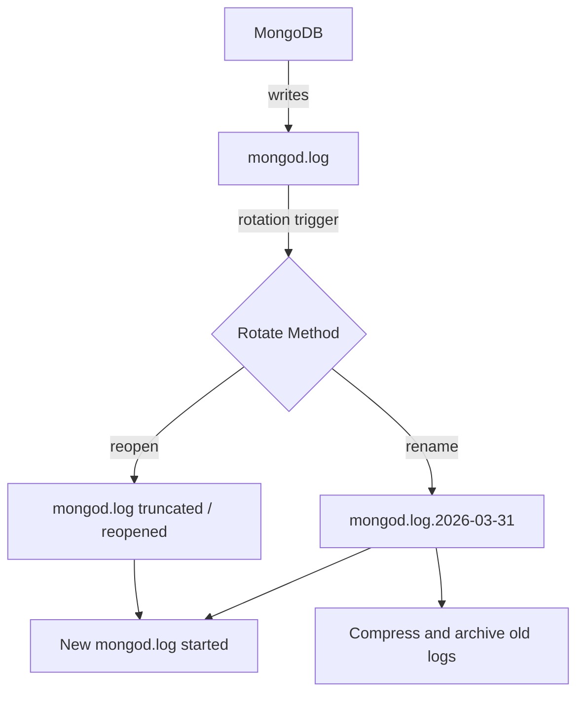

# How to Configure MongoDB Log Rotation

Author: [nawazdhandala](https://www.github.com/nawazdhandala)

Tags: MongoDB, Logging, Operations, Administration, Linux

Description: Learn how to configure MongoDB log rotation using built-in commands, logrotate, and systemd, to prevent log files from consuming all available disk space.

---

## Why Log Rotation Matters

MongoDB writes continuous log output to a single file. Without rotation, this file grows indefinitely and can fill up the disk, causing MongoDB to crash or become unresponsive. Log rotation keeps log files manageable by periodically archiving old logs and starting a fresh one.



## MongoDB Log Rotation Methods

MongoDB supports two log rotation methods configured in `mongod.conf`:

- **rename** (default) - renames the current log file to `mongod.log.YYYY-MM-DDTHH:MM:SS`, then creates a new `mongod.log`
- **reopen** - closes and reopens the current log file without renaming; used with external tools like logrotate that rename the file first

## Configuring logRotate in mongod.conf

```yaml
systemLog:
  destination: file
  path: /var/log/mongodb/mongod.log
  logAppend: true
  logRotate: rename    # "rename" or "reopen"
```

## Triggering Rotation Manually

Send a SIGUSR1 signal to the mongod process:

```bash
sudo kill -SIGUSR1 $(cat /var/run/mongodb/mongod.pid)
```

Or use the `logRotate` admin command from mongosh:

```javascript
db.adminCommand({ logRotate: 1 })
```

Or for mongos in a sharded cluster, specify the process:

```javascript
db.adminCommand({ logRotate: "mongod" })
```

After rotation (with `rename` method), the old log file gets a timestamp suffix:

```text
/var/log/mongodb/mongod.log               <- new, active log
/var/log/mongodb/mongod.log.2026-03-31T10:00:00  <- rotated archive
```

## Configuring logrotate

`logrotate` is the standard Linux tool for log rotation. It reads configuration files from `/etc/logrotate.d/`.

Create `/etc/logrotate.d/mongodb`:

```text
/var/log/mongodb/mongod.log {
    daily
    rotate 14
    compress
    delaycompress
    missingok
    notifempty
    sharedscripts
    postrotate
        /bin/kill -SIGUSR1 $(cat /var/run/mongodb/mongod.pid 2>/dev/null) 2>/dev/null || true
    endscript
}
```

Configuration options explained:

| Option | Meaning |
|--------|---------|
| `daily` | Rotate once per day |
| `rotate 14` | Keep 14 rotated files before deleting |
| `compress` | Compress rotated files with gzip |
| `delaycompress` | Compress the previous rotation cycle, not the just-rotated file |
| `missingok` | Do not error if the log file is missing |
| `notifempty` | Do not rotate if the log file is empty |
| `postrotate` | Script to run after rotation to signal MongoDB to reopen its log |

Test the logrotate configuration:

```bash
sudo logrotate --debug /etc/logrotate.d/mongodb
```

Force an immediate rotation (bypasses the `daily` schedule):

```bash
sudo logrotate --force /etc/logrotate.d/mongodb
```

## Using reopen with logrotate

When using logrotate to rename the file externally, configure MongoDB to reopen (not rename) its log:

```yaml
systemLog:
  destination: file
  path: /var/log/mongodb/mongod.log
  logAppend: true
  logRotate: reopen
```

logrotate configuration with `reopen`:

```text
/var/log/mongodb/mongod.log {
    daily
    rotate 14
    compress
    delaycompress
    missingok
    notifempty
    copytruncate     # copy the log then truncate - no signal needed
}
```

With `copytruncate`, logrotate copies the log file then truncates the original to zero. No signal to MongoDB is needed. However, there is a small window between the copy and truncate where log entries can be missed.

## Setting Log Retention Size

MongoDB 4.4+ supports setting a maximum log file size before automatic rotation. Add to `mongod.conf`:

```yaml
systemLog:
  destination: file
  path: /var/log/mongodb/mongod.log
  logAppend: true
  logRotate: rename
```

Then use logrotate's `size` directive instead of `daily` for size-based rotation:

```text
/var/log/mongodb/mongod.log {
    size 500M
    rotate 10
    compress
    delaycompress
    missingok
    notifempty
    postrotate
        /bin/kill -SIGUSR1 $(cat /var/run/mongodb/mongod.pid 2>/dev/null) 2>/dev/null || true
    endscript
}
```

## Checking Current Log File Location

From mongosh, check where MongoDB is currently writing logs:

```javascript
db.adminCommand({ getCmdLineOpts: 1 }).parsed.systemLog
```

## Verifying Rotation Worked

After triggering a rotation, confirm the new log file was created and the old one was renamed:

```bash
ls -lh /var/log/mongodb/
```

Expected:

```text
-rw-r--r-- 1 mongodb mongodb   1.2K Mar 31 10:00 mongod.log
-rw-r--r-- 1 mongodb mongodb 245.3M Mar 31 09:59 mongod.log.2026-03-31T09:59:00
```

Check that MongoDB is writing to the new file:

```bash
tail -f /var/log/mongodb/mongod.log
```

## Disk Space Monitoring

Alert when the log directory exceeds a threshold. Add to a monitoring script:

```bash
LOG_DIR=/var/log/mongodb
THRESHOLD_GB=5

USED_GB=$(du -s "$LOG_DIR" | awk '{printf "%.0f", $1/1024/1024}')
if [ "$USED_GB" -gt "$THRESHOLD_GB" ]; then
  echo "WARNING: MongoDB log directory using ${USED_GB}GB"
fi
```

## Best Practices

- Always configure logrotate for MongoDB in production; do not rely on manual rotation.
- Keep at least 7-14 days of logs to aid in post-incident analysis.
- Use `compress` and `delaycompress` to reduce disk usage without losing recent logs.
- Monitor the log directory size and alert before it fills the disk.
- Use `logRotate: rename` (the default) rather than `copytruncate` to avoid any log entry loss.
- Consider shipping logs to a centralized log management system (ELK, Splunk) so that retention is not limited by local disk.

## Summary

MongoDB log rotation prevents the mongod.log from filling your disk. Configure logrotate in `/etc/logrotate.d/mongodb` to rotate daily, keep 14 rotations, and compress old files. Use the `postrotate` directive to send `SIGUSR1` to MongoDB so it opens a new log file. For size-based rotation, use logrotate's `size` directive. Always verify rotation is working by checking `ls -lh /var/log/mongodb/` after the first scheduled run.
