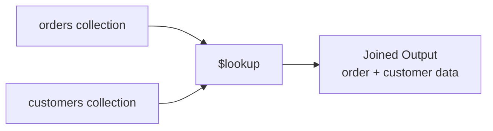

# How to Use $lookup for Joins in MongoDB Aggregation

Author: [nawazdhandala](https://www.github.com/nawazdhandala)

Tags: MongoDB, Aggregation, $lookup, Pipeline, Stage, Join

Description: Learn how to use the $lookup stage in MongoDB aggregation to perform left outer joins between collections and combine related documents.

---

## How $lookup Works

The `$lookup` stage performs a left outer join between the current collection and another collection in the same database. For each input document, `$lookup` queries the foreign collection and attaches the matching documents as an array field. If no match exists, the field is an empty array.



## Syntax

### Simple Equality Join

```javascript
{
  $lookup: {
    from: "<foreignCollection>",
    localField: "<fieldInInputDoc>",
    foreignField: "<fieldInForeignDoc>",
    as: "<outputArrayField>"
  }
}
```

### Pipeline Join (MongoDB 3.6+)

```javascript
{
  $lookup: {
    from: "<foreignCollection>",
    let: { <var>: "<localFieldExpression>", ... },
    pipeline: [ <aggregation pipeline> ],
    as: "<outputArrayField>"
  }
}
```

## Examples

### Input Data

`orders` collection:

```javascript
[
  { _id: 1, customerId: "C1", product: "Laptop",  amount: 1200 },
  { _id: 2, customerId: "C2", product: "Phone",   amount: 800  },
  { _id: 3, customerId: "C1", product: "Monitor", amount: 400  },
  { _id: 4, customerId: "C3", product: "Keyboard", amount: 100 }
]
```

`customers` collection:

```javascript
[
  { _id: "C1", name: "Alice", country: "US" },
  { _id: "C2", name: "Bob",   country: "EU" }
]
```

### Example 1 - Basic $lookup

Join orders with customer data:

```javascript
db.orders.aggregate([
  {
    $lookup: {
      from: "customers",
      localField: "customerId",
      foreignField: "_id",
      as: "customerInfo"
    }
  }
])
```

Output:

```javascript
[
  {
    _id: 1, customerId: "C1", product: "Laptop", amount: 1200,
    customerInfo: [{ _id: "C1", name: "Alice", country: "US" }]
  },
  {
    _id: 2, customerId: "C2", product: "Phone", amount: 800,
    customerInfo: [{ _id: "C2", name: "Bob", country: "EU" }]
  },
  {
    _id: 3, customerId: "C1", product: "Monitor", amount: 400,
    customerInfo: [{ _id: "C1", name: "Alice", country: "US" }]
  },
  {
    _id: 4, customerId: "C3", product: "Keyboard", amount: 100,
    customerInfo: []   // no matching customer - left outer join behavior
  }
]
```

### Example 2 - Unwinding the Joined Array

Use `$unwind` to flatten the `customerInfo` array into a single embedded document:

```javascript
db.orders.aggregate([
  {
    $lookup: {
      from: "customers",
      localField: "customerId",
      foreignField: "_id",
      as: "customerInfo"
    }
  },
  {
    $unwind: {
      path: "$customerInfo",
      preserveNullAndEmptyArrays: false  // drop orders with no matching customer
    }
  }
])
```

Output:

```javascript
[
  { _id: 1, product: "Laptop",  amount: 1200, customerInfo: { _id: "C1", name: "Alice", country: "US" } },
  { _id: 2, product: "Phone",   amount: 800,  customerInfo: { _id: "C2", name: "Bob",   country: "EU" } },
  { _id: 3, product: "Monitor", amount: 400,  customerInfo: { _id: "C1", name: "Alice", country: "US" } }
]
```

### Example 3 - Pipeline Join with Filtering

Use the pipeline form to filter the joined documents before attaching them. Only join customers from the US:

```javascript
db.orders.aggregate([
  {
    $lookup: {
      from: "customers",
      let: { cid: "$customerId" },
      pipeline: [
        {
          $match: {
            $expr: {
              $and: [
                { $eq: ["$$cid", "$_id"] },
                { $eq: ["$country", "US"] }
              ]
            }
          }
        },
        { $project: { name: 1, country: 1 } }
      ],
      as: "usCustomer"
    }
  }
])
```

### Example 4 - $lookup and $project to Flatten

After joining, use `$project` to lift the customer name to the top level:

```javascript
db.orders.aggregate([
  {
    $lookup: {
      from: "customers",
      localField: "customerId",
      foreignField: "_id",
      as: "customer"
    }
  },
  { $unwind: { path: "$customer", preserveNullAndEmptyArrays: true } },
  {
    $project: {
      product: 1,
      amount: 1,
      customerName: "$customer.name",
      country: "$customer.country"
    }
  }
])
```

Output:

```javascript
[
  { _id: 1, product: "Laptop",   amount: 1200, customerName: "Alice", country: "US" },
  { _id: 2, product: "Phone",    amount: 800,  customerName: "Bob",   country: "EU" },
  { _id: 3, product: "Monitor",  amount: 400,  customerName: "Alice", country: "US" },
  { _id: 4, product: "Keyboard", amount: 100,  customerName: null,    country: null }
]
```

## Performance Tips

- Create an index on the `foreignField` in the joined collection for fast lookups.
- Use the pipeline form to filter and project foreign documents early, reducing data transferred between collections.
- Avoid joining very large collections without filtering; consider denormalization if joins are frequent.

```javascript
// Index on the foreignField
db.customers.createIndex({ _id: 1 })
```

## Use Cases

- Enriching order records with customer details
- Building product catalogs that embed category information
- Combining log events with user profile data
- Replacing multiple application-side queries with a single aggregation

## Summary

The `$lookup` stage enables left outer joins in MongoDB aggregation pipelines. The simple equality join form handles the most common use case, while the pipeline form allows filtered and projected foreign documents. Always index the foreign field and use `$unwind` with `preserveNullAndEmptyArrays` to control how unmatched documents are handled.
