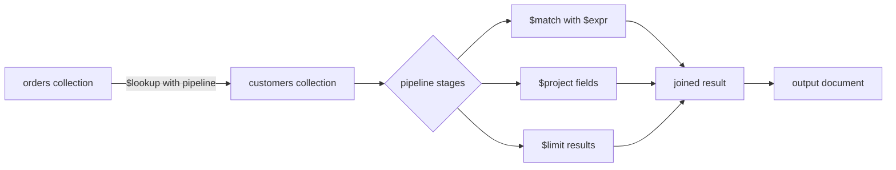

# How to Use $lookup with Pipeline for Complex Joins in MongoDB

Author: OneUptime Team

Tags: MongoDB, Aggregation, Pipeline, Join, Query

Description: Learn how to use $lookup with a sub-pipeline in MongoDB for complex joins, including filtering, projecting, and transforming joined documents inside the lookup stage.

---

The `$lookup` aggregation stage lets you join documents from another collection. When you need more than a simple equality join, the pipeline form of `$lookup` gives you full aggregation power inside the join itself.

## Basic vs. Pipeline $lookup

A standard `$lookup` matches on a single equality condition:

```javascript
// Simple equality join
db.orders.aggregate([
  {
    $lookup: {
      from: "customers",
      localField: "customerId",
      foreignField: "_id",
      as: "customer"
    }
  }
]);
```

The pipeline form replaces `localField`/`foreignField` with a `let` + `pipeline`:

```javascript
// Pipeline join
db.orders.aggregate([
  {
    $lookup: {
      from: "customers",
      let: { custId: "$customerId" },
      pipeline: [
        { $match: { $expr: { $eq: ["$_id", "$$custId"] } } },
        { $project: { name: 1, email: 1, tier: 1 } }
      ],
      as: "customer"
    }
  }
]);
```

## Architecture Overview



## Example Schema

```javascript
// orders collection
{
  _id: ObjectId("..."),
  customerId: ObjectId("..."),
  items: [{ sku: "A1", qty: 2, price: 29.99 }],
  status: "shipped",
  createdAt: ISODate("2026-01-15")
}

// customers collection
{
  _id: ObjectId("..."),
  name: "Alice Smith",
  email: "alice@example.com",
  tier: "gold",
  country: "US",
  active: true
}
```

## Multi-Condition Joins

Join on multiple fields using `$and` inside `$expr`:

```javascript
db.inventory.aggregate([
  {
    $lookup: {
      from: "warehouses",
      let: { sku: "$sku", region: "$region" },
      pipeline: [
        {
          $match: {
            $expr: {
              $and: [
                { $eq: ["$sku", "$$sku"] },
                { $eq: ["$region", "$$region"] },
                { $gt: ["$stock", 0] }
              ]
            }
          }
        },
        { $sort: { stock: -1 } },
        { $limit: 1 }
      ],
      as: "bestWarehouse"
    }
  }
]);
```

## Filtering Joined Documents

Only include joined documents that meet a condition, reducing the size of the result:

```javascript
db.posts.aggregate([
  {
    $lookup: {
      from: "comments",
      let: { postId: "$_id" },
      pipeline: [
        {
          $match: {
            $expr: {
              $and: [
                { $eq: ["$postId", "$$postId"] },
                { $eq: ["$approved", true] }
              ]
            }
          }
        },
        { $sort: { createdAt: -1 } },
        { $limit: 5 },
        { $project: { body: 1, author: 1, createdAt: 1 } }
      ],
      as: "recentComments"
    }
  },
  {
    $project: {
      title: 1,
      recentComments: 1,
      commentCount: { $size: "$recentComments" }
    }
  }
]);
```

## Joining with Computed Values

Use expressions in the `let` block to pass derived values:

```javascript
db.orders.aggregate([
  {
    $addFields: {
      orderYear: { $year: "$createdAt" }
    }
  },
  {
    $lookup: {
      from: "promotions",
      let: { year: "$orderYear", tier: "$customerTier" },
      pipeline: [
        {
          $match: {
            $expr: {
              $and: [
                { $eq: ["$year", "$$year"] },
                { $in: ["$$tier", "$eligibleTiers"] }
              ]
            }
          }
        },
        { $project: { code: 1, discount: 1 } }
      ],
      as: "applicablePromos"
    }
  }
]);
```

## Nested $lookup Inside a Pipeline Join

You can nest a `$lookup` inside the sub-pipeline for a three-way join:

```javascript
db.orders.aggregate([
  {
    $lookup: {
      from: "orderItems",
      let: { orderId: "$_id" },
      pipeline: [
        { $match: { $expr: { $eq: ["$orderId", "$$orderId"] } } },
        {
          $lookup: {
            from: "products",
            localField: "productId",
            foreignField: "_id",
            as: "product"
          }
        },
        { $unwind: "$product" },
        {
          $project: {
            qty: 1,
            "product.name": 1,
            "product.price": 1
          }
        }
      ],
      as: "items"
    }
  }
]);
```

## Joining to the Same Collection (Self-Join)

Find employees and their managers from the same collection:

```javascript
db.employees.aggregate([
  {
    $lookup: {
      from: "employees",
      let: { managerId: "$managerId" },
      pipeline: [
        {
          $match: {
            $expr: { $eq: ["$_id", "$$managerId"] }
          }
        },
        { $project: { name: 1, title: 1, email: 1 } }
      ],
      as: "manager"
    }
  },
  {
    $unwind: { path: "$manager", preserveNullAndEmptyArrays: true }
  }
]);
```

## Performance Considerations

Add indexes on the foreign collection field being joined to:

```javascript
// Index on the "from" collection field used in $match
db.comments.createIndex({ postId: 1, approved: 1, createdAt: -1 });
db.warehouses.createIndex({ sku: 1, region: 1, stock: -1 });
```

Use `$project` inside the pipeline to return only needed fields:

```javascript
db.orders.aggregate([
  {
    $lookup: {
      from: "customers",
      let: { custId: "$customerId" },
      pipeline: [
        { $match: { $expr: { $eq: ["$_id", "$$custId"] } } },
        // Only return what you need
        { $project: { name: 1, email: 1, _id: 0 } }
      ],
      as: "customer"
    }
  }
]);
```

## Unwinding and Reshaping Results

After a pipeline `$lookup`, the result is always an array. Use `$unwind` to flatten one-to-one joins:

```javascript
db.orders.aggregate([
  {
    $lookup: {
      from: "customers",
      let: { custId: "$customerId" },
      pipeline: [
        { $match: { $expr: { $eq: ["$_id", "$$custId"] } } },
        { $project: { name: 1, tier: 1 } }
      ],
      as: "customer"
    }
  },
  { $unwind: "$customer" },
  {
    $project: {
      orderId: "$_id",
      status: 1,
      customerName: "$customer.name",
      customerTier: "$customer.tier"
    }
  }
]);
```

## Full Working Example

```javascript
// Find top 5 orders with full customer and product details
db.orders.aggregate([
  { $match: { status: "completed" } },
  { $sort: { total: -1 } },
  { $limit: 5 },
  {
    $lookup: {
      from: "customers",
      let: { custId: "$customerId" },
      pipeline: [
        { $match: { $expr: { $eq: ["$_id", "$$custId"] } } },
        { $project: { name: 1, email: 1, tier: 1 } }
      ],
      as: "customer"
    }
  },
  { $unwind: "$customer" },
  {
    $lookup: {
      from: "products",
      let: { skus: "$items.sku" },
      pipeline: [
        { $match: { $expr: { $in: ["$sku", "$$skus"] } } },
        { $project: { sku: 1, name: 1, category: 1 } }
      ],
      as: "productDetails"
    }
  },
  {
    $project: {
      total: 1,
      status: 1,
      "customer.name": 1,
      "customer.tier": 1,
      productCount: { $size: "$productDetails" }
    }
  }
]);
```

## Summary

The pipeline form of `$lookup` extends MongoDB joins to support multi-field conditions, filtering, projections, sorting, and even nested lookups inside the joined pipeline. By using `let` to pass parent document fields and `$expr` with `$match` to join on them, you gain SQL-like expressiveness while keeping all data operations within MongoDB. Always index the joined collection on the fields referenced in the sub-pipeline `$match` to ensure efficient join performance.
