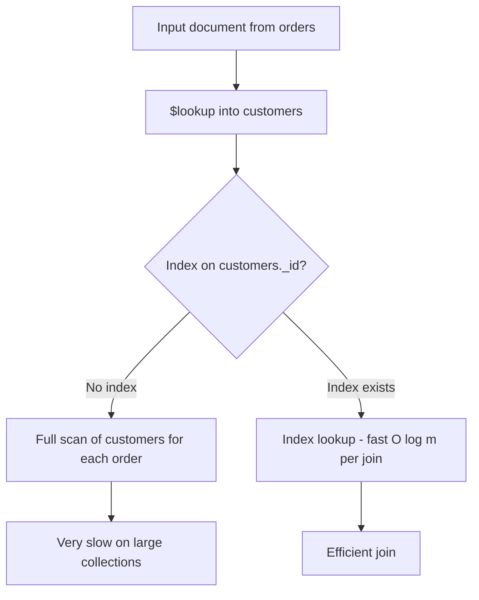
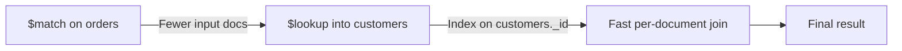

# How to Use $lookup with Indexes in MongoDB Aggregation

Author: [nawazdhandala](https://www.github.com/nawazdhandala)

Tags: MongoDB, Aggregation, Lookup, Index, Performance

Description: Learn how to optimize $lookup in MongoDB aggregation pipelines using indexes on foreign fields, pipeline-based $lookup patterns, and explain() to verify index usage.

---

## What is $lookup and Why Indexes Matter

`$lookup` performs a left outer join between documents in one collection and documents in another. Without an index on the `foreignField` in the joined collection, MongoDB must scan the entire joined collection for every input document. This turns an O(n) join into an O(n x m) full scan.



## Setting Up Example Collections

```javascript
db.orders.insertMany([
  { _id: "o1", customerId: "c1", amount: 250, status: "shipped" },
  { _id: "o2", customerId: "c2", amount: 100, status: "pending" },
  { _id: "o3", customerId: "c1", amount: 500, status: "shipped" }
]);

db.customers.insertMany([
  { _id: "c1", name: "Alice",  email: "alice@example.com", tier: "gold" },
  { _id: "c2", name: "Bob",    email: "bob@example.com",   tier: "silver" },
  { _id: "c3", name: "Carol",  email: "carol@example.com", tier: "bronze" }
]);

// Index on the foreignField (customers._id already has the default _id index)
// For custom foreign fields, create explicit indexes:
db.customers.createIndex({ email: 1 });
```

## Basic $lookup with Index on foreignField

```javascript
// _id is already indexed - this $lookup is efficient
db.orders.aggregate([
  {
    $lookup: {
      from: "customers",
      localField: "customerId",
      foreignField: "_id",
      as: "customer"
    }
  },
  {
    $project: {
      _id: 1,
      amount: 1,
      status: 1,
      "customer.name": 1,
      "customer.tier": 1
    }
  }
]);
```

## Verifying Index Usage with explain()

```javascript
db.orders.explain("executionStats").aggregate([
  {
    $lookup: {
      from: "customers",
      localField: "customerId",
      foreignField: "_id",
      as: "customer"
    }
  }
]);
```

In the explain output, look inside the `$lookup` stage for `IXSCAN` on the foreign collection. If you see `COLLSCAN`, the foreign field is missing an index.

## $lookup on a Non-_id Field

When joining on a field other than `_id`, create an explicit index:

```javascript
// Join orders to customers by email field
db.orders.insertMany([
  { orderId: "o10", customerEmail: "alice@example.com", amount: 300 }
]);

// Index the foreignField in customers
db.customers.createIndex({ email: 1 });

db.orders.aggregate([
  {
    $lookup: {
      from: "customers",
      localField: "customerEmail",
      foreignField: "email",
      as: "customer"
    }
  }
]);
```

## Pipeline-Based $lookup with $match (Correlated Subquery)

The pipeline form of `$lookup` lets you add a `$match` inside the join, which allows the use of indexes more flexibly:

```javascript
db.orders.aggregate([
  {
    $lookup: {
      from: "customers",
      let: { custId: "$customerId" },
      pipeline: [
        {
          $match: {
            $expr: { $eq: ["$_id", "$$custId"] },
            tier: "gold"        // additional filter inside the join
          }
        },
        {
          $project: { name: 1, email: 1, tier: 1 }
        }
      ],
      as: "customer"
    }
  },
  { $unwind: { path: "$customer", preserveNullAndEmptyArrays: false } }
]);
```

The `$match` inside the pipeline can use indexes on the `customers` collection, including compound indexes:

```javascript
db.customers.createIndex({ _id: 1, tier: 1 });
```

## $match Before $lookup to Reduce Input Documents

Always filter the source collection before the join to reduce the number of join lookups performed:

```javascript
// GOOD: filter orders first, then join
db.orders.aggregate([
  { $match: { status: "shipped" } },     // index on orders.status reduces input
  {
    $lookup: {
      from: "customers",
      localField: "customerId",
      foreignField: "_id",
      as: "customer"
    }
  }
]);

// BAD: join first, filter after - joins all orders before filtering
db.orders.aggregate([
  {
    $lookup: {
      from: "customers",
      localField: "customerId",
      foreignField: "_id",
      as: "customer"
    }
  },
  { $match: { status: "shipped" } }
]);
```



## $lookup with Multiple Foreign Fields (MongoDB 5.0+)

The pipeline-based form allows joining on multiple fields:

```javascript
db.orders.createIndex({ customerId: 1, region: 1 });
db.customers.createIndex({ _id: 1, region: 1 });

db.orders.aggregate([
  {
    $lookup: {
      from: "customers",
      let: { custId: "$customerId", orderRegion: "$region" },
      pipeline: [
        {
          $match: {
            $expr: {
              $and: [
                { $eq: ["$_id", "$$custId"] },
                { $eq: ["$region", "$$orderRegion"] }
              ]
            }
          }
        }
      ],
      as: "customer"
    }
  }
]);
```

## Using $unwind to Flatten $lookup Results

```javascript
db.orders.aggregate([
  { $match: { status: "shipped" } },
  {
    $lookup: {
      from: "customers",
      localField: "customerId",
      foreignField: "_id",
      as: "customer"
    }
  },
  // $unwind turns the customer array into a single embedded document
  { $unwind: { path: "$customer", preserveNullAndEmptyArrays: true } },
  {
    $group: {
      _id: "$customer.tier",
      totalRevenue: { $sum: "$amount" },
      orderCount: { $sum: 1 }
    }
  },
  { $sort: { totalRevenue: -1 } }
]);
```

## Practical Example: Order Report with Customer Details

```javascript
// Ensure indexes are in place
db.orders.createIndex({ status: 1, createdAt: -1 });
db.customers.createIndex({ _id: 1 });
db.customers.createIndex({ tier: 1 });

db.orders.aggregate([
  // Step 1: Filter to recent shipped orders (uses index)
  { $match: { status: "shipped", createdAt: { $gte: new Date("2024-01-01") } } },
  // Step 2: Join customer info (uses _id index on customers)
  {
    $lookup: {
      from: "customers",
      localField: "customerId",
      foreignField: "_id",
      as: "customer"
    }
  },
  { $unwind: "$customer" },
  // Step 3: Group by customer tier
  {
    $group: {
      _id: "$customer.tier",
      revenue: { $sum: "$amount" },
      count: { $sum: 1 }
    }
  },
  { $sort: { revenue: -1 } }
]);
```

## Index Checklist for $lookup

```javascript
// Before running $lookup, verify indexes
db.customers.getIndexes();
// Ensure the foreignField appears as a key in one of the listed indexes

// If missing, create it
db.customers.createIndex({ customerId: 1 });
```

## Summary

`$lookup` in MongoDB benefits enormously from an index on the `foreignField` in the joined collection. Without one, MongoDB performs a full collection scan for every input document. Always place a `$match` before `$lookup` to reduce the number of join operations, create an index on the `foreignField`, and use the pipeline form of `$lookup` when you need to filter or project inside the join. Verify index usage with `explain("executionStats")` and look for `IXSCAN` inside the `$lookup` stage output.
