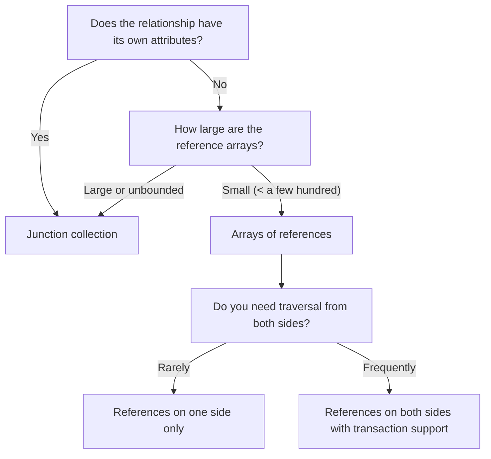

# How to Design Many-to-Many Relationships in MongoDB

A many-to-many relationship exists when multiple instances of entity A can be associated with multiple instances of entity B. Common examples include students and courses, products and categories, users and roles, or tags and articles. MongoDB provides several ways to model this without a traditional junction table.

## Approach 1: Arrays of References

Store an array of ObjectIds on one or both sides of the relationship. This is the most common MongoDB pattern.

```javascript
// products collection with category references
db.products.insertOne({
  _id: ObjectId("64a1b2c3d4e5f6789abc0001"),
  name: "Wireless Headphones",
  price: 79.99,
  categoryIds: [
    ObjectId("64a1b2c3d4e5f6789abc1001"),  // Electronics
    ObjectId("64a1b2c3d4e5f6789abc1002")   // Audio
  ]
});

// categories collection
db.categories.insertMany([
  { _id: ObjectId("64a1b2c3d4e5f6789abc1001"), name: "Electronics" },
  { _id: ObjectId("64a1b2c3d4e5f6789abc1002"), name: "Audio" }
]);
```

Find all products in a category:

```javascript
db.products.createIndex({ categoryIds: 1 });

const electronics = await db.collection("products")
  .find({ categoryIds: ObjectId("64a1b2c3d4e5f6789abc1001") })
  .toArray();
```

MongoDB indexes array fields element-by-element using multikey indexes, so a query against an element of `categoryIds` uses the index efficiently.

## Approach 2: References on Both Sides

Store references in both directions. This allows traversal in either direction without a join, at the cost of maintaining consistency across two documents.

```javascript
// students collection
db.students.insertOne({
  _id: ObjectId("64a1b2c3d4e5f6789abc2001"),
  name: "Alice",
  enrolledCourseIds: [
    ObjectId("64a1b2c3d4e5f6789abc3001"),
    ObjectId("64a1b2c3d4e5f6789abc3002")
  ]
});

// courses collection
db.courses.insertOne({
  _id: ObjectId("64a1b2c3d4e5f6789abc3001"),
  title: "MongoDB Fundamentals",
  enrolledStudentIds: [
    ObjectId("64a1b2c3d4e5f6789abc2001")
  ]
});
```

Adding a student to a course requires updating both documents atomically using a transaction:

```javascript
const session = client.startSession();
await session.withTransaction(async () => {
  await db.collection("students").updateOne(
    { _id: studentId },
    { $addToSet: { enrolledCourseIds: courseId } },
    { session }
  );
  await db.collection("courses").updateOne(
    { _id: courseId },
    { $addToSet: { enrolledStudentIds: studentId } },
    { session }
  );
});
await session.endSession();
```

## Approach 3: Junction Collection

Use a separate collection to represent the relationship when the relationship itself has attributes (such as enrollment date, role, or status).

```javascript
// enrollments collection (junction)
db.enrollments.insertOne({
  _id: ObjectId(),
  studentId: ObjectId("64a1b2c3d4e5f6789abc2001"),
  courseId: ObjectId("64a1b2c3d4e5f6789abc3001"),
  enrolledAt: new Date("2024-09-01"),
  grade: null,
  status: "active"
});

// Index for lookups in both directions
db.enrollments.createIndex({ studentId: 1, courseId: 1 }, { unique: true });
db.enrollments.createIndex({ courseId: 1, studentId: 1 });
```

Find all courses for a student, with enrollment details:

```javascript
const studentCourses = await db.collection("enrollments").aggregate([
  { $match: { studentId: ObjectId("64a1b2c3d4e5f6789abc2001") } },
  {
    $lookup: {
      from: "courses",
      localField: "courseId",
      foreignField: "_id",
      as: "course"
    }
  },
  { $unwind: "$course" },
  {
    $project: {
      "course.title": 1,
      enrolledAt: 1,
      grade: 1,
      status: 1
    }
  }
]).toArray();
```

## Approach Comparison



## Tags Example: Embedded String Arrays

For a simple tagging system where tags are just strings (not first-class entities), embed them directly.

```javascript
db.articles.insertOne({
  _id: ObjectId(),
  title: "MongoDB Schema Design Patterns",
  body: "...",
  tags: ["mongodb", "schema", "database", "nosql"]
});

// Multikey index on tags array
db.articles.createIndex({ tags: 1 });

// Find all articles tagged with "mongodb"
const articles = await db.collection("articles")
  .find({ tags: "mongodb" })
  .toArray();
```

## User Roles Example

```javascript
// users collection
db.users.insertOne({
  _id: ObjectId("64a1b2c3d4e5f6789abc5001"),
  email: "alice@example.com",
  roleIds: [
    ObjectId("64a1b2c3d4e5f6789abc6001"),  // admin
    ObjectId("64a1b2c3d4e5f6789abc6002")   // editor
  ]
});

// roles collection
db.roles.insertMany([
  {
    _id: ObjectId("64a1b2c3d4e5f6789abc6001"),
    name: "admin",
    permissions: ["read", "write", "delete", "manage_users"]
  },
  {
    _id: ObjectId("64a1b2c3d4e5f6789abc6002"),
    name: "editor",
    permissions: ["read", "write"]
  }
]);

// Get user with all permissions resolved
const userWithRoles = await db.collection("users").aggregate([
  { $match: { email: "alice@example.com" } },
  {
    $lookup: {
      from: "roles",
      localField: "roleIds",
      foreignField: "_id",
      as: "roles"
    }
  }
]).toArray();
```

## Summary

MongoDB models many-to-many relationships without a traditional join table by using arrays of ObjectIds, references on both sides, or a dedicated junction collection. Use a simple array of references on one side when the arrays stay bounded and the relationship has no attributes. Use a junction collection when the relationship has attributes (such as enrollment date, status, or roles) or when the reference arrays would grow unboundedly. Always create multikey indexes on array fields containing ObjectIds to make element-level queries efficient, and use transactions when maintaining bidirectional references to ensure consistency.
