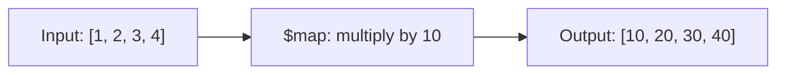

# How to Use $map in MongoDB Aggregation to Transform Arrays

Author: [nawazdhandala](https://www.github.com/nawazdhandala)

Tags: MongoDB, Aggregation, $map, Array, Pipeline

Description: Learn how to use $map in MongoDB aggregation to apply a transformation expression to every element of an array and return the resulting array.

---

## How $map Works

`$map` applies an expression to each element of an array and returns a new array of the same length containing the transformed values. It is the MongoDB equivalent of a functional `map()` operation - it does not filter or reduce, it transforms.



## Syntax

```javascript
{
  $map: {
    input: <array expression>,
    as: <variable name>,       // optional, default "this"
    in: <expression>           // transformation applied to each element
  }
}
```

- `input` - the source array
- `as` - a name for the current element variable (accessed as `$$variableName`)
- `in` - the expression that transforms each element

## Examples

### Input Documents

```javascript
[
  {
    _id: 1,
    name: "Alice",
    scores: [75, 85, 90],
    items: [
      { product: "Laptop",  price: 1000 },
      { product: "Monitor", price: 500  }
    ]
  },
  {
    _id: 2,
    name: "Bob",
    scores: [60, 70, 80],
    items: [
      { product: "Phone", price: 800 },
      { product: "Tablet", price: 600 }
    ]
  }
]
```

### Example 1 - Scale Numeric Values

Multiply every score by 1.1 (apply a 10% curve):

```javascript
db.students.aggregate([
  {
    $project: {
      name: 1,
      curvedScores: {
        $map: {
          input: "$scores",
          as: "score",
          in: { $multiply: ["$$score", 1.1] }
        }
      }
    }
  }
])
```

Output:

```javascript
[
  { _id: 1, name: "Alice", curvedScores: [82.5, 93.5, 99] },
  { _id: 2, name: "Bob",   curvedScores: [66, 77, 88]     }
]
```

### Example 2 - Transform String Elements

Convert an array of strings to uppercase:

```javascript
// Input: { _id: 1, tags: ["javascript", "mongodb", "nosql"] }
db.posts.aggregate([
  {
    $project: {
      upperTags: {
        $map: {
          input: "$tags",
          as: "tag",
          in: { $toUpper: "$$tag" }
        }
      }
    }
  }
])
```

Output:

```javascript
[
  { _id: 1, upperTags: ["JAVASCRIPT", "MONGODB", "NOSQL"] }
]
```

### Example 3 - Extract a Field from an Array of Objects

Extract just the `product` name from each item in the `items` array:

```javascript
db.students.aggregate([
  {
    $project: {
      name: 1,
      productNames: {
        $map: {
          input: "$items",
          as: "item",
          in: "$$item.product"
        }
      }
    }
  }
])
```

Output:

```javascript
[
  { _id: 1, name: "Alice", productNames: ["Laptop", "Monitor"] },
  { _id: 2, name: "Bob",   productNames: ["Phone", "Tablet"]   }
]
```

### Example 4 - Add a New Field to Each Object in an Array

Add a `discountedPrice` field to each item object:

```javascript
db.students.aggregate([
  {
    $project: {
      name: 1,
      itemsWithDiscount: {
        $map: {
          input: "$items",
          as: "item",
          in: {
            product:         "$$item.product",
            price:           "$$item.price",
            discountedPrice: { $multiply: ["$$item.price", 0.9] }
          }
        }
      }
    }
  }
])
```

Output:

```javascript
[
  {
    _id: 1, name: "Alice",
    itemsWithDiscount: [
      { product: "Laptop",  price: 1000, discountedPrice: 900 },
      { product: "Monitor", price: 500,  discountedPrice: 450 }
    ]
  },
  {
    _id: 2, name: "Bob",
    itemsWithDiscount: [
      { product: "Phone",  price: 800, discountedPrice: 720 },
      { product: "Tablet", price: 600, discountedPrice: 540 }
    ]
  }
]
```

### Example 5 - Combining $map with $filter

First filter the array, then map the filtered result:

```javascript
db.students.aggregate([
  {
    $project: {
      name: 1,
      expensiveItemNames: {
        $map: {
          input: {
            $filter: {
              input: "$items",
              as: "item",
              cond: { $gt: ["$$item.price", 600] }
            }
          },
          as: "item",
          in: "$$item.product"
        }
      }
    }
  }
])
```

Output:

```javascript
[
  { _id: 1, name: "Alice", expensiveItemNames: ["Laptop"] },
  { _id: 2, name: "Bob",   expensiveItemNames: ["Phone"]  }
]
```

### Example 6 - $map with Conditional Transformation

Apply a conditional within `$map` to categorize each score:

```javascript
db.students.aggregate([
  {
    $project: {
      name: 1,
      scoreGrades: {
        $map: {
          input: "$scores",
          as: "s",
          in: {
            $switch: {
              branches: [
                { case: { $gte: ["$$s", 90] }, then: "A" },
                { case: { $gte: ["$$s", 80] }, then: "B" },
                { case: { $gte: ["$$s", 70] }, then: "C" }
              ],
              default: "F"
            }
          }
        }
      }
    }
  }
])
```

Output:

```javascript
[
  { _id: 1, name: "Alice", scoreGrades: ["C", "B", "A"] },
  { _id: 2, name: "Bob",   scoreGrades: ["F", "C", "B"] }
]
```

## $map vs $unwind + $group

`$map` is more efficient than `$unwind` + transform + `$group` when you want to transform each array element and keep the array structure in the document. Use `$unwind` when you need to interact with other documents (such as a `$lookup`).

## Use Cases

- Applying a price discount or tax to every item in an array
- Extracting a single field from each object in an embedded array
- Converting array element formats (string case, date format)
- Building derived arrays for API responses

## Summary

`$map` applies a transformation expression to each element of an array and returns a new array of the same length. Use `$$variableName` to reference the current element in the `in` expression. Combine `$map` with `$filter` for filter-then-transform patterns, and with `$sum` when you need to aggregate the transformed values.
