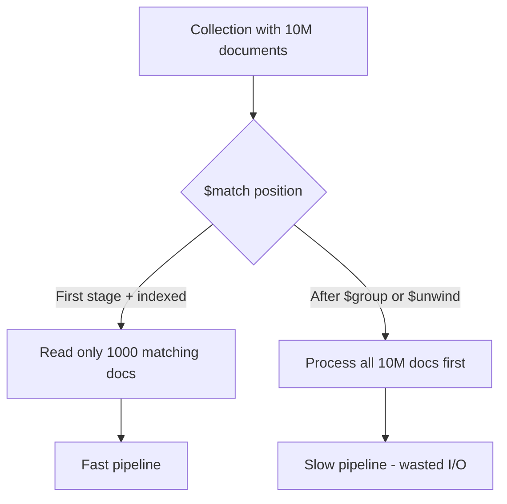
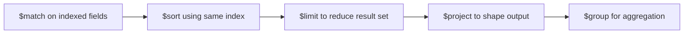

# How to Use $match Stage Effectively with Indexes in MongoDB

Author: [nawazdhandala](https://www.github.com/nawazdhandala)

Tags: MongoDB, Aggregation, Index, Query Optimization, Performance

Description: Learn how to write effective $match stages in MongoDB aggregation pipelines that leverage indexes, where to place $match for maximum performance, and how to verify index usage.

---

## Why $match Placement and Index Design Matter

The `$match` stage is the primary gate for limiting which documents flow through an aggregation pipeline. When `$match` appears as the first stage and the filter fields are indexed, MongoDB reads only the matching documents from disk. If `$match` comes later, MongoDB must load, unpack, and process all documents up to that point before filtering.



## Setting Up the Example

```javascript
db.events.insertMany([
  { userId: "u1", type: "click",    page: "/home",   ts: new Date("2024-03-01"), value: 5 },
  { userId: "u2", type: "view",     page: "/docs",   ts: new Date("2024-03-02"), value: 1 },
  { userId: "u1", type: "purchase", page: "/shop",   ts: new Date("2024-03-03"), value: 200 },
  { userId: "u3", type: "click",    page: "/blog",   ts: new Date("2024-03-04"), value: 3 },
  { userId: "u2", type: "purchase", page: "/shop",   ts: new Date("2024-03-05"), value: 450 }
]);

// Create indexes to support $match stages
db.events.createIndex({ type: 1, ts: -1 });
db.events.createIndex({ userId: 1 });
db.events.createIndex({ ts: -1 });
```

## Rule 1: Put $match First

```javascript
// GOOD: $match is the first stage and uses an index
db.events.aggregate([
  { $match: { type: "purchase", ts: { $gte: new Date("2024-03-01") } } },
  { $group: { _id: "$userId", total: { $sum: "$value" } } },
  { $sort: { total: -1 } }
]);

// BAD: $match after $group loses all index benefit
db.events.aggregate([
  { $group: { _id: "$userId", total: { $sum: "$value" }, type: { $first: "$type" } } },
  { $match: { type: "purchase" } }  // cannot use index here
]);
```

## Rule 2: Match on Indexed Fields

Design your `$match` filters to align with existing indexes:

```javascript
// Compound index: { type: 1, ts: -1 }
// This $match uses the compound index efficiently (equality then range)
db.events.aggregate([
  { $match: { type: "click", ts: { $gte: new Date("2024-03-01") } } },
  { $count: "clickCount" }
]);

// This $match cannot use the compound index efficiently (missing leading field)
db.events.aggregate([
  { $match: { ts: { $gte: new Date("2024-03-01") } } }
  // Would need a separate index on ts to be efficient
]);
```

## Rule 3: Use $expr Carefully

`$expr` allows aggregation expressions inside `$match` but has different index behavior:

```javascript
// Regular $match - can use index on userId
db.events.aggregate([
  { $match: { userId: "u1" } }
]);

// $expr with simple comparison - MongoDB 5.0+ can use an index
db.events.aggregate([
  { $match: { $expr: { $eq: ["$userId", "u1"] } } }
]);

// $expr with computed values - cannot use indexes
db.events.aggregate([
  { $match: {
    $expr: { $gt: [{ $multiply: ["$value", 2] }, 100] }
  }}
  // No index can be used here - computed value
]);
```

## Verifying $match Uses an Index

```javascript
db.events.explain("executionStats").aggregate([
  { $match: { type: "purchase" } },
  { $group: { _id: "$userId", total: { $sum: "$value" } } }
]);
```

The explain output shows the cursor stage before the aggregation stages:

```javascript
{
  "stages": [
    {
      "$cursor": {
        "queryPlanner": {
          "winningPlan": {
            "stage": "FETCH",
            "inputStage": {
              "stage": "IXSCAN",        // index is used
              "keyPattern": { "type": 1, "ts": -1 }
            }
          }
        }
      }
    },
    { "$group": { ... } }
  ]
}
```

If you see `COLLSCAN` in the `$cursor` stage, the `$match` is not using any index.

## Multiple $match Stages

MongoDB merges adjacent `$match` stages and can push them toward the beginning of the pipeline:

```javascript
// MongoDB may automatically combine these two $match stages
db.events.aggregate([
  { $match: { type: "purchase" } },
  { $addFields: { month: { $month: "$ts" } } },
  { $match: { month: 3 } }   // MongoDB cannot push this before $addFields
]);

// Better approach: combine conditions before computed fields
db.events.aggregate([
  { $match: {
    type: "purchase",
    ts: { $gte: new Date("2024-03-01"), $lt: new Date("2024-04-01") }
  }},
  { $addFields: { month: { $month: "$ts" } } }
]);
```

## $match After $unwind

After `$unwind`, document count increases (one doc per array element). A subsequent `$match` after `$unwind` is acceptable when filtering on unwound array values, but the initial `$match` before `$unwind` should use indexes to minimize the set:

```javascript
db.posts.createIndex({ tags: 1, status: 1 });

db.posts.aggregate([
  // First $match uses the multikey index on tags
  { $match: { status: "published", tags: "mongodb" } },
  { $unwind: "$tags" },
  // Second $match narrows further on unwound tags (in-memory)
  { $match: { tags: { $in: ["mongodb", "database"] } } },
  { $group: { _id: "$tags", count: { $sum: 1 } } }
]);
```

## $match with $or and Indexes

MongoDB can use indexes with `$or` if each branch of the `$or` has its own index:

```javascript
// Create indexes for both branches
db.events.createIndex({ type: 1 });
db.events.createIndex({ userId: 1 });

// $or query can use index intersection or multiple index scans
db.events.aggregate([
  { $match: {
    $or: [
      { type: "purchase" },
      { userId: "u1" }
    ]
  }},
  { $count: "total" }
]);
```

## $match with Text Search

Text index queries must use `$text` in `$match`, and `$text` must be in the first `$match` stage:

```javascript
db.articles.createIndex({ content: "text" });

db.articles.aggregate([
  { $match: { $text: { $search: "mongodb index" } } },  // must be first $match
  { $project: { title: 1, score: { $meta: "textScore" } } },
  { $sort: { score: { $meta: "textScore" } } }
]);
```

## Pipeline Template: Indexed $match Pattern



```javascript
// Full optimized pipeline
db.events.aggregate([
  // Stage 1: Indexed filter (uses compound index { type:1, ts:-1 })
  { $match: {
    type: "purchase",
    ts: { $gte: new Date("2024-01-01") }
  }},
  // Stage 2: Covered sort from same index
  { $sort: { ts: -1 } },
  // Stage 3: Limit before expensive stages
  { $limit: 1000 },
  // Stage 4: Join (uses index on customers._id)
  { $lookup: {
    from: "customers",
    localField: "userId",
    foreignField: "_id",
    as: "user"
  }},
  // Stage 5: Shape output
  { $project: {
    userId: 1, value: 1, ts: 1,
    "user.name": 1, _id: 0
  }}
]);
```

## Summary

Effective use of `$match` with indexes in MongoDB aggregation requires placing `$match` as the first stage, aligning filter fields with compound index key patterns (equality fields first, then sort, then range), and verifying with `explain("executionStats")` that the cursor stage shows `IXSCAN` rather than `COLLSCAN`. Avoid using computed expressions in early `$match` stages when a direct field comparison would suffice, and combine multiple filter conditions into a single early `$match` rather than splitting them across the pipeline.
