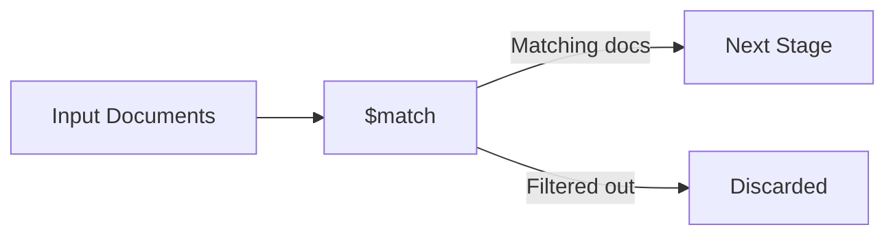

# How to Use $match Stage in MongoDB Aggregation

Author: [nawazdhandala](https://www.github.com/nawazdhandala)

Tags: MongoDB, Aggregation, $match, Pipeline, Stage, Query, Filter

Description: Learn how to use the $match stage in MongoDB aggregation pipelines to filter documents early and efficiently, improving query performance.

---

## How $match Works

The `$match` stage filters documents in an aggregation pipeline, passing only those that meet the specified conditions to the next stage. It works exactly like a `find()` query filter but within a pipeline. Placing `$match` early in a pipeline is critical for performance because it reduces the number of documents that subsequent stages must process.

When `$match` is the first stage, MongoDB can use indexes to accelerate the filter, just as it would for a regular query.



## Syntax

The `$match` stage accepts a query document using standard MongoDB query operators.

```javascript
{ $match: { <query> } }
```

## Examples

### Example 1 - Filtering by a Field Value

Consider an `orders` collection with the following documents.

```javascript
// Input documents
[
  { _id: 1, status: "completed", amount: 150, customerId: "C1" },
  { _id: 2, status: "pending",   amount: 80,  customerId: "C2" },
  { _id: 3, status: "completed", amount: 220, customerId: "C3" },
  { _id: 4, status: "cancelled", amount: 60,  customerId: "C1" }
]
```

To retrieve only completed orders:

```javascript
db.orders.aggregate([
  { $match: { status: "completed" } }
])
```

Output:

```javascript
[
  { _id: 1, status: "completed", amount: 150, customerId: "C1" },
  { _id: 3, status: "completed", amount: 220, customerId: "C3" }
]
```

### Example 2 - Using Comparison Operators

Filter orders where the amount is greater than 100:

```javascript
db.orders.aggregate([
  { $match: { amount: { $gt: 100 } } }
])
```

Output:

```javascript
[
  { _id: 1, status: "completed", amount: 150, customerId: "C1" },
  { _id: 3, status: "completed", amount: 220, customerId: "C3" }
]
```

### Example 3 - Combining Conditions with $and

Filter completed orders with an amount greater than 100:

```javascript
db.orders.aggregate([
  {
    $match: {
      $and: [
        { status: "completed" },
        { amount: { $gt: 100 } }
      ]
    }
  }
])
```

The same result can be written more concisely using an implicit AND:

```javascript
db.orders.aggregate([
  { $match: { status: "completed", amount: { $gt: 100 } } }
])
```

### Example 4 - $match with $or

Retrieve orders that are either pending or cancelled:

```javascript
db.orders.aggregate([
  {
    $match: {
      $or: [
        { status: "pending" },
        { status: "cancelled" }
      ]
    }
  }
])
```

### Example 5 - $match After $group

`$match` is also useful after a `$group` stage to filter aggregated results. Here, documents are grouped by `customerId` and then filtered by the total amount:

```javascript
db.orders.aggregate([
  {
    $group: {
      _id: "$customerId",
      totalAmount: { $sum: "$amount" }
    }
  },
  { $match: { totalAmount: { $gt: 200 } } }
])
```

Output:

```javascript
[
  { _id: "C1", totalAmount: 210 },
  { _id: "C3", totalAmount: 220 }
]
```

### Example 6 - Using $expr Inside $match

`$expr` allows you to use aggregation expressions within `$match`, enabling comparisons between fields in the same document:

```javascript
db.orders.aggregate([
  {
    $match: {
      $expr: { $gt: ["$amount", 100] }
    }
  }
])
```

## Performance Best Practices

**Place $match as early as possible.** When `$match` is the first stage of a pipeline, MongoDB can use collection indexes to minimize the number of documents scanned.

```javascript
// Good - $match is first, allowing index use
db.orders.aggregate([
  { $match: { status: "completed" } },
  { $group: { _id: "$customerId", total: { $sum: "$amount" } } }
])

// Less efficient - $group runs on all documents before $match filters
db.orders.aggregate([
  { $group: { _id: "$customerId", total: { $sum: "$amount" } } },
  { $match: { total: { $gt: 200 } } }
])
```

Note: when `$match` follows `$group`, it cannot use collection indexes on the original fields because the grouped result is a new set of documents.

**Use covered indexes.** Create compound indexes that match the fields used in your `$match` query for maximum performance.

```javascript
// Create a supporting index
db.orders.createIndex({ status: 1, amount: -1 })
```

## Use Cases

- Pre-filtering a large collection before expensive stages like `$lookup` or `$group`
- Implementing date range reports by matching on a timestamp field
- Filtering aggregated results after a `$group` stage (acts like SQL's `HAVING` clause)
- Combining with `$or` and `$in` for multi-value filters

## Summary

The `$match` stage is the primary filtering mechanism in MongoDB aggregation pipelines. It behaves like a `find()` filter and supports all standard query operators including comparison, logical, element, and evaluation operators. For best performance, always place `$match` as the first stage so MongoDB can leverage indexes. When used after `$group`, `$match` acts like a SQL `HAVING` clause, filtering on computed aggregation results rather than raw document fields.
