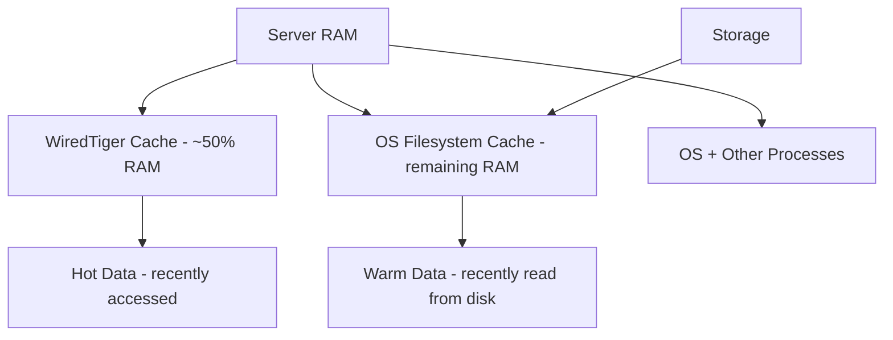

# How to Tune MongoDB Memory and Cache Settings

Author: [nawazdhandala](https://www.github.com/nawazdhandala)

Tags: MongoDB, Performance, Memory, WiredTiger, Tuning, Operations

Description: A practical guide to tuning MongoDB memory usage including WiredTiger cache sizing, OS memory settings, swap configuration, and monitoring memory pressure for optimal performance.

---

## MongoDB Memory Architecture

MongoDB uses memory at two levels: the WiredTiger cache and the OS filesystem cache. Understanding both is essential for effective memory tuning.



**WiredTiger Cache** - in-memory cache of working set data managed by MongoDB. Reads from here are the fastest.

**OS Filesystem Cache** - the Linux page cache holds recently read disk blocks. MongoDB benefits from this even for data not in the WiredTiger cache.

**Memory mapped I/O** - when data is not in the WiredTiger cache, MongoDB reads from disk. The OS filesystem cache intercepts these reads, so data in the filesystem cache is served from RAM rather than actual disk I/O.

## Configuring WiredTiger Cache Size

The most impactful memory setting is `wiredTiger.engineConfig.cacheSizeGB`.

Default calculation: `max(50% of RAM - 1GB, 256MB)`

Set it explicitly in `mongod.conf`:

```yaml
storage:
  wiredTiger:
    engineConfig:
      cacheSizeGB: 8    # 8GB for a 16GB server
```

Sizing guidelines by server RAM:

| Server RAM | Recommended cacheSizeGB |
|------------|------------------------|
| 4GB | 1.5 |
| 8GB | 3 |
| 16GB | 6 to 8 |
| 32GB | 14 to 18 |
| 64GB | 28 to 36 |
| 128GB | 56 to 72 |

Leave at least 2-4GB for the OS, application overhead, and filesystem cache.

## Checking Current Memory Usage

Check WiredTiger cache usage from mongosh:

```javascript
const status = db.serverStatus();
const cache = status.wiredTiger.cache;

const used = cache["bytes currently in the cache"];
const max = cache["maximum bytes configured"];
const dirty = cache["tracked dirty bytes in the cache"];

print("Cache Used:  " + (used / 1073741824).toFixed(2) + " GB");
print("Cache Max:   " + (max / 1073741824).toFixed(2) + " GB");
print("Cache Used%: " + (used / max * 100).toFixed(1) + "%");
print("Dirty:       " + (dirty / 1048576).toFixed(0) + " MB (" + (dirty / max * 100).toFixed(1) + "% of cache)");
```

Check overall process memory:

```javascript
const mem = db.serverStatus().mem;
print("Resident:  " + mem.resident + " MB");
print("Virtual:   " + mem.virtual + " MB");
```

The `resident` value should be close to `cacheSizeGB * 1024` plus some overhead. If `resident` is much less than the cache setting, the working set is smaller than the configured cache.

## Resizing the Cache Without Restart

```javascript
db.adminCommand({
  setParameter: 1,
  wiredTigerEngineRuntimeConfig: "cache_size=6G"
})
```

Verify:

```javascript
db.serverStatus().wiredTiger.cache["maximum bytes configured"]
```

## OS Memory Settings

### Disable Transparent Huge Pages

MongoDB recommends disabling Transparent Huge Pages (THP) on Linux, as they can cause performance issues with MongoDB's memory allocation patterns.

Check current THP status:

```bash
cat /sys/kernel/mm/transparent_hugepage/enabled
```

Disable THP permanently by creating `/etc/systemd/system/disable-thp.service`:

```text
[Unit]
Description=Disable Transparent Huge Pages

[Service]
Type=oneshot
ExecStart=/bin/sh -c "echo never > /sys/kernel/mm/transparent_hugepage/enabled && echo never > /sys/kernel/mm/transparent_hugepage/defrag"

[Install]
WantedBy=multi-user.target
```

```bash
sudo systemctl daemon-reload
sudo systemctl enable --now disable-thp
```

Verify MongoDB is not generating THP warnings by checking the log:

```bash
grep -i "transparent" /var/log/mongodb/mongod.log
```

### vm.swappiness

Set `vm.swappiness` low to discourage the OS from swapping MongoDB pages out to disk:

```bash
sudo sysctl -w vm.swappiness=1
```

Make it permanent in `/etc/sysctl.conf`:

```bash
vm.swappiness=1
```

A value of `1` (not `0`) keeps the swap file as a last resort to prevent OOM kills, while strongly preferring to keep data in RAM.

### NUMA Configuration

On multi-socket NUMA systems, MongoDB processes should be pinned to a NUMA node or NUMA interleaving should be enabled to prevent memory access penalties.

Run MongoDB with NUMA interleaving:

```bash
numactl --interleave=all mongod --config /etc/mongod.conf
```

Or in the systemd unit override:

```text
[Service]
ExecStart=numactl --interleave=all /usr/bin/mongod --config /etc/mongod.conf
```

## Monitoring for Memory Pressure

### Page Faults

Page faults indicate MongoDB is reading data that is not in the cache and must fetch from disk.

```javascript
const status = db.serverStatus();
print("Page faults: " + status.extra_info.page_faults);
```

A continuously rising page fault count is a sign that the working set exceeds the WiredTiger cache size.

### Cache Evictions

High modified (dirty) page evictions indicate that WiredTiger is under memory pressure:

```javascript
const cache = db.serverStatus().wiredTiger.cache;
print("Dirty page evictions: " + cache["modified pages evicted"]);
print("Clean page evictions: " + cache["unmodified pages evicted"]);
```

Clean evictions are normal. A high number of dirty evictions means MongoDB is evicting pages it has to write to disk before evicting, which is expensive.

### Hit Ratio Script

Track cache hit ratio over time:

```javascript
function cacheHitRatio() {
  const cache = db.serverStatus().wiredTiger.cache;
  const requested = cache["pages requested from the cache"];
  const readIn = cache["pages read into cache"];
  if (requested === 0) return 100;
  return ((requested - readIn) / requested * 100).toFixed(2);
}

// Sample every 10 seconds
while (true) {
  print(new Date().toISOString() + " Cache hit ratio: " + cacheHitRatio() + "%");
  sleep(10000);
}
```

Target: above 95%. Below 90% consistently means the working set does not fit in the cache.

## Capacity Planning

Estimate your working set size:

```javascript
// Total data size across all collections
let totalSize = 0;
db.adminCommand({ listDatabases: 1 }).databases.forEach(dbInfo => {
  if (!["admin", "config", "local"].includes(dbInfo.name)) {
    const dbStats = db.getSiblingDB(dbInfo.name).stats();
    totalSize += dbStats.dataSize;
  }
});
print("Total data size: " + (totalSize / 1073741824).toFixed(2) + " GB");
```

If the working set (data accessed within a typical time window) is larger than the cache, increase RAM. If that is not possible, add indexes to reduce the data scanned per query.

## Memory Settings for Containers

In Docker or Kubernetes, MongoDB may detect the host memory instead of the container limit. Set `cacheSizeGB` explicitly:

```yaml
storage:
  wiredTiger:
    engineConfig:
      cacheSizeGB: 1    # for a container limited to 2GB RAM
```

Or pass it as a command-line argument:

```bash
mongod --wiredTigerCacheSizeGB 1
```

## Best Practices

- Always set `cacheSizeGB` explicitly in `mongod.conf`; never rely on the default.
- Disable Transparent Huge Pages on all MongoDB servers.
- Set `vm.swappiness=1` to prevent swapping without completely disabling the swap file.
- Monitor cache hit ratio and page faults continuously; alert if hit ratio drops below 90%.
- Size RAM so that the active working set fits in the WiredTiger cache.
- On NUMA systems, use `numactl --interleave=all` to prevent NUMA memory locality issues.
- On containers, set `cacheSizeGB` to 50% of the container memory limit.

## Summary

Effective MongoDB memory tuning starts with setting `cacheSizeGB` to 50-60% of available RAM. Monitor the WiredTiger cache hit ratio (target: above 95%), dirty page percentage (target: below 5%), and page faults. Disable Transparent Huge Pages and set `vm.swappiness=1` on Linux for stable performance. In containerized environments, always set `cacheSizeGB` explicitly because MongoDB may detect the host's total RAM instead of the container limit.
