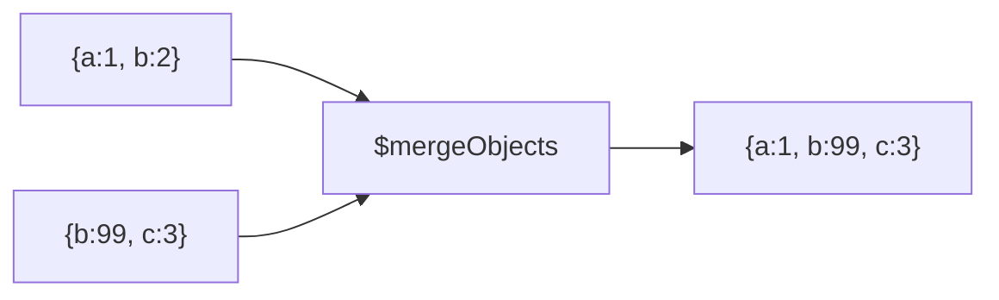

# How to Use $mergeObjects in MongoDB Aggregation

Author: [nawazdhandala](https://www.github.com/nawazdhandala)

Tags: MongoDB, Aggregation, Pipeline, Expression, Document

Description: Learn how to use $mergeObjects in MongoDB aggregation to combine multiple documents or embedded objects into a single document, with later fields overriding earlier ones.

---

## How $mergeObjects Works

`$mergeObjects` accepts one or more documents and returns a single merged document. When two input documents share a field name, the value from the later (rightmost) document wins. Null and missing documents are silently skipped.



## Syntax

### As an expression operator (in $project, $addFields)

```javascript
{
  $mergeObjects: [ <document1>, <document2>, ... ]
}
```

### As an accumulator (in $group)

```javascript
{
  $group: {
    _id: "$groupField",
    merged: { $mergeObjects: "$embeddedDoc" }
  }
}
```

## Examples

### Example 1 - Merge Two Embedded Objects

Merge default settings with user-specific overrides:

```javascript
// Input: { _id: 1, defaults: { theme: "light", lang: "en" }, overrides: { lang: "fr" } }
db.userSettings.aggregate([
  {
    $project: {
      effective: {
        $mergeObjects: ["$defaults", "$overrides"]
      }
    }
  }
])
```

Output:

```javascript
[
  { _id: 1, effective: { theme: "light", lang: "fr" } }
]
```

### Example 2 - Merge Three Documents

Later documents override earlier ones when keys collide:

```javascript
db.config.aggregate([
  {
    $project: {
      final: {
        $mergeObjects: [
          "$globalConfig",
          "$tenantConfig",
          "$userConfig"
        ]
      }
    }
  }
])
```

### Example 3 - Merge as an Accumulator in $group

Collect and merge all config fragments per user into one document:

```javascript
// Input documents: each has { userId, configFragment: { key: value } }
db.configFragments.aggregate([
  {
    $group: {
      _id: "$userId",
      config: { $mergeObjects: "$configFragment" }
    }
  }
])
```

Output:

```javascript
[
  { _id: "user1", config: { theme: "dark", lang: "en", timezone: "UTC" } }
]
```

### Example 4 - Add Computed Fields to an Embedded Document

Enrich an embedded address object with a `fullAddress` computed field:

```javascript
db.customers.aggregate([
  {
    $project: {
      address: {
        $mergeObjects: [
          "$address",
          {
            fullAddress: {
              $concat: ["$address.street", ", ", "$address.city"]
            }
          }
        ]
      }
    }
  }
])
```

### Example 5 - Combine $lookup Result with Parent Document

After a `$lookup`, merge the joined sub-document into the parent:

```javascript
db.orders.aggregate([
  {
    $lookup: {
      from: "products",
      localField: "productId",
      foreignField: "_id",
      as: "productInfo"
    }
  },
  { $unwind: "$productInfo" },
  {
    $replaceWith: {
      $mergeObjects: ["$$ROOT", "$productInfo"]
    }
  },
  {
    $project: { productInfo: 0 }
  }
])
```

### Example 6 - Merge with a Static Default Object

Apply default values for missing keys:

```javascript
db.profiles.aggregate([
  {
    $project: {
      settings: {
        $mergeObjects: [
          { notifications: true, theme: "light", language: "en" },
          "$settings"
        ]
      }
    }
  }
])
```

Documents where `$settings` is missing or null get all three defaults. Documents with partial settings override only the keys they define.

## Behavior Notes

| Input | Behavior |
|---|---|
| `null` or missing document | Silently ignored |
| Duplicate keys | Last document's value wins |
| Empty document `{}` | No contribution to output |
| Non-document value | Error |

## Use Cases

- Applying layered configuration overrides (global, tenant, user)
- Merging lookup results into parent documents with `$replaceWith`
- Accumulating partial configuration fragments across multiple group documents
- Adding computed fields to embedded documents inline

## Summary

`$mergeObjects` is the go-to operator for combining multiple documents into one within an aggregation pipeline. Used as an expression operator it merges two or more document expressions left to right, with later documents overriding keys from earlier ones. Used as a `$group` accumulator it collapses multiple documents per group into a single merged document. Pair it with `$replaceWith`, `$lookup`, and `$cond` for powerful document enrichment patterns.
