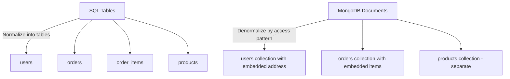

# How to Migrate SQL Schema to MongoDB Document Model

Author: [nawazdhandala](https://www.github.com/nawazdhandala)

Tags: MongoDB, SQL, Migration, Data Modeling, NoSQL

Description: A practical guide to migrating relational SQL schemas to MongoDB's document model, covering embedding vs referencing, denormalization patterns, and data migration strategies.

---

## The Fundamental Difference

In SQL, data is normalized into tables with foreign key relationships. In MongoDB, data is stored as documents that can contain nested objects and arrays. The core question is: when to embed data and when to reference it.



## The Core Rule: Model by Access Pattern

SQL models by data relationships. MongoDB models by how the application reads data. Ask yourself: "Do I always read this data together?" If yes, embed it. If no, reference it.

## SQL to MongoDB Mapping Reference

| SQL Concept | MongoDB Equivalent |
|-------------|-------------------|
| Table | Collection |
| Row | Document |
| Column | Field |
| Primary Key | `_id` field |
| Foreign Key | Reference field (manual or DBRef) |
| `JOIN` | `$lookup` aggregation or embedded document |
| `INDEX` | Index |
| `SELECT` | `find()` with projection |
| `INSERT` | `insertOne()` / `insertMany()` |
| `UPDATE` | `updateOne()` / `updateMany()` |
| `DELETE` | `deleteOne()` / `deleteMany()` |
| `GROUP BY` | `$group` aggregation stage |
| `WHERE` | filter document in `find()` |
| Transaction | Multi-document transaction with session |

## Example: E-Commerce Schema Migration

### SQL Schema

```sql
CREATE TABLE users (
    id UUID PRIMARY KEY,
    email VARCHAR(255) UNIQUE NOT NULL,
    name VARCHAR(100),
    created_at TIMESTAMP
);

CREATE TABLE addresses (
    id UUID PRIMARY KEY,
    user_id UUID REFERENCES users(id),
    street VARCHAR(200),
    city VARCHAR(100),
    country VARCHAR(50)
);

CREATE TABLE orders (
    id UUID PRIMARY KEY,
    user_id UUID REFERENCES users(id),
    status VARCHAR(50),
    total DECIMAL(10,2),
    created_at TIMESTAMP
);

CREATE TABLE order_items (
    id UUID PRIMARY KEY,
    order_id UUID REFERENCES orders(id),
    product_id UUID REFERENCES products(id),
    quantity INT,
    unit_price DECIMAL(10,2)
);

CREATE TABLE products (
    id UUID PRIMARY KEY,
    name VARCHAR(200),
    price DECIMAL(10,2),
    stock_count INT
);
```

### MongoDB Document Model

**users collection** - embed addresses because they are always read with the user:

```javascript
{
  _id: ObjectId("..."),
  email: "alice@example.com",
  name: "Alice Smith",
  addresses: [
    {
      type: "home",
      street: "123 Main St",
      city: "Springfield",
      country: "US"
    },
    {
      type: "work",
      street: "456 Office Blvd",
      city: "Springfield",
      country: "US"
    }
  ],
  createdAt: ISODate("2026-01-15T09:00:00Z")
}
```

**orders collection** - embed order items (always read together), reference product by ID for current price:

```javascript
{
  _id: ObjectId("..."),
  userId: ObjectId("..."),        // reference to users._id
  status: "shipped",
  items: [
    {
      productId: ObjectId("..."), // reference to products._id
      productName: "Widget Pro",  // denormalized snapshot at purchase time
      quantity: 2,
      unitPrice: 49.99
    }
  ],
  total: 99.98,
  shippingAddress: {              // embedded snapshot - address at time of order
    street: "123 Main St",
    city: "Springfield",
    country: "US"
  },
  createdAt: ISODate("2026-03-15T14:30:00Z")
}
```

**products collection** - separate because products change independently:

```javascript
{
  _id: ObjectId("..."),
  name: "Widget Pro",
  price: 49.99,
  stockCount: 150,
  category: "electronics"
}
```

## Embedding vs Referencing Decision Guide

**Embed when:**
- Data is always accessed together (user + address)
- The embedded data belongs to one parent (order items)
- The embedded array will not grow unboundedly
- You need the child data to be a snapshot at creation time (order address)

**Reference when:**
- Data has its own lifecycle independent of the parent (products)
- The relationship is many-to-many (users and groups)
- The array would grow very large (comments on a popular post)
- Multiple parents reference the same child (product referenced by many orders)

## Handling Many-to-Many Relationships

SQL uses a junction table. In MongoDB, store an array of references in one or both sides.

SQL:

```sql
CREATE TABLE user_roles (
    user_id UUID REFERENCES users(id),
    role_id UUID REFERENCES roles(id)
);
```

MongoDB (roles array in user document):

```javascript
{
  _id: ObjectId("..."),
  email: "admin@example.com",
  roleIds: [ObjectId("role-admin"), ObjectId("role-reporting")]
}
```

Query users with a specific role:

```javascript
db.users.find({ roleIds: ObjectId("role-admin") })
```

## Using $lookup for SQL-style Joins

When you must query across collections, use `$lookup` in the aggregation pipeline:

```javascript
db.orders.aggregate([
  { $match: { status: "pending" } },
  {
    $lookup: {
      from: "users",
      localField: "userId",
      foreignField: "_id",
      as: "user"
    }
  },
  { $unwind: "$user" },
  {
    $project: {
      orderId: "$_id",
      userEmail: "$user.email",
      userName: "$user.name",
      total: 1,
      status: 1
    }
  }
])
```

## Data Migration Script

Export SQL data and import into MongoDB. The following shows a conceptual Node.js migration:

```javascript
const { MongoClient } = require("mongodb");
const { Pool } = require("pg");  // PostgreSQL client

const pgPool = new Pool({ connectionString: process.env.PG_URI });
const mongoClient = new MongoClient(process.env.MONGODB_URI);

async function migrateUsers() {
  const pg = await pgPool.connect();
  const mongo = mongoClient.db("myapp");

  const users = await pg.query("SELECT * FROM users");
  const addresses = await pg.query("SELECT * FROM addresses");

  // Group addresses by user_id
  const addressMap = {};
  for (const addr of addresses.rows) {
    if (!addressMap[addr.user_id]) addressMap[addr.user_id] = [];
    addressMap[addr.user_id].push({
      street: addr.street,
      city: addr.city,
      country: addr.country
    });
  }

  const docs = users.rows.map(u => ({
    _id: u.id,              // preserve original UUID as _id
    email: u.email,
    name: u.name,
    addresses: addressMap[u.id] || [],
    createdAt: u.created_at
  }));

  await mongo.collection("users").insertMany(docs, { ordered: false });
  console.log(`Migrated ${docs.length} users`);
  pg.release();
}

async function migrateOrders() {
  const pg = await pgPool.connect();
  const mongo = mongoClient.db("myapp");

  const orders = await pg.query("SELECT o.*, u.email FROM orders o JOIN users u ON u.id = o.user_id");
  const items = await pg.query(`
    SELECT oi.*, p.name, p.price
    FROM order_items oi
    JOIN products p ON p.id = oi.product_id
  `);

  // Group items by order_id
  const itemMap = {};
  for (const item of items.rows) {
    if (!itemMap[item.order_id]) itemMap[item.order_id] = [];
    itemMap[item.order_id].push({
      productId: item.product_id,
      productName: item.name,
      quantity: item.quantity,
      unitPrice: parseFloat(item.unit_price)
    });
  }

  const docs = orders.rows.map(o => ({
    _id: o.id,
    userId: o.user_id,
    status: o.status,
    items: itemMap[o.id] || [],
    total: parseFloat(o.total),
    createdAt: o.created_at
  }));

  await mongo.collection("orders").insertMany(docs, { ordered: false });
  console.log(`Migrated ${docs.length} orders`);
  pg.release();
}

async function main() {
  await mongoClient.connect();
  await migrateUsers();
  await migrateOrders();
  await mongoClient.close();
  await pgPool.end();
}

main().catch(console.error);
```

## Creating Indexes After Migration

After loading data, create indexes that match your query patterns:

```javascript
// Users: fast lookup by email
db.users.createIndex({ email: 1 }, { unique: true })

// Orders: fast lookup by userId and date range
db.orders.createIndex({ userId: 1, createdAt: -1 })

// Orders: fast lookup by status
db.orders.createIndex({ status: 1 })

// Products: text search
db.products.createIndex({ name: "text" })
```

## Validating the Migration

Compare row/document counts:

```javascript
// PostgreSQL
// SELECT COUNT(*) FROM users;  -- returns 5000

// MongoDB
db.users.countDocuments()  // should be 5000
```

Spot-check specific records:

```javascript
db.users.findOne({ email: "alice@example.com" })
```

## Best Practices

- Model data by access patterns, not by relationships.
- Embed arrays that are bounded in size and always read with the parent.
- Denormalize snapshot data (like order line items with product names at purchase time) to preserve historical accuracy.
- Migrate in phases: migrate reference tables first (products, categories), then transactional tables (orders).
- Run the migration with `ordered: false` in `insertMany` to allow partial failures without stopping the batch.
- Add indexes after the migration is complete for faster initial load.

## Summary

Migrating from SQL to MongoDB requires rethinking data structure around access patterns rather than normalization rules. Embed related data that is always read together (addresses, order items) and use references for entities with independent lifecycles (products, users). Denormalize snapshot data for historical accuracy. Use `$lookup` for occasional cross-collection queries. Migrate in phases and validate counts and spot-check records after each phase.
