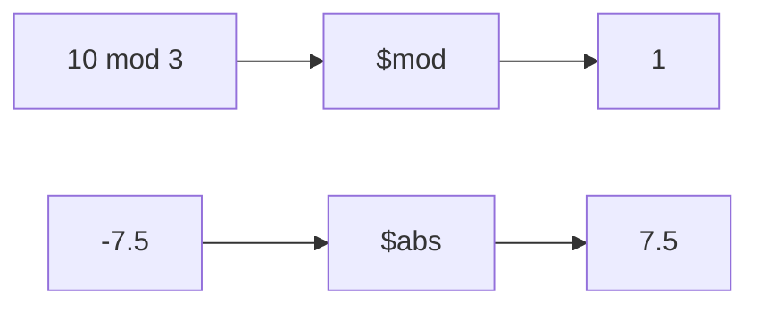

# How to Use $mod and $abs in MongoDB Aggregation

Author: [nawazdhandala](https://www.github.com/nawazdhandala)

Tags: MongoDB, Aggregation, $mod, $abs, Pipeline, Math

Description: Learn how to use $mod for modulo operations and $abs for absolute value in MongoDB aggregation pipelines.

---

## $mod and $abs

`$mod` returns the remainder after dividing one number by another (the modulo operation). `$abs` returns the absolute value of a number (its magnitude without regard to sign).



## Syntax

```javascript
// $mod: returns <dividend> modulo <divisor>
{ $mod: [ <dividend>, <divisor> ] }

// $abs: returns absolute value
{ $abs: <numeric expression> }
```

## Examples

### Input Documents

```javascript
[
  { _id: 1, value: 17,  x: -3.5, score: -85 },
  { _id: 2, value: 20,  x:  4.0, score:  92 },
  { _id: 3, value: 15,  x: -0.7, score: -60 },
  { _id: 4, value: 100, x:  7.2, score:  78 }
]
```

### Example 1 - $mod: Even/Odd Classification

Determine whether each `value` is even or odd:

```javascript
db.data.aggregate([
  {
    $project: {
      value: 1,
      remainder: { $mod: ["$value", 2] },
      parity: {
        $cond: {
          if: { $eq: [{ $mod: ["$value", 2] }, 0] },
          then: "even",
          else: "odd"
        }
      }
    }
  }
])
```

Output:

```javascript
[
  { _id: 1, value: 17,  remainder: 1, parity: "odd"  },
  { _id: 2, value: 20,  remainder: 0, parity: "even" },
  { _id: 3, value: 15,  remainder: 1, parity: "odd"  },
  { _id: 4, value: 100, remainder: 0, parity: "even" }
]
```

### Example 2 - $mod: Bucket by Modulo

Assign items to 3 processing buckets by `_id % 3`:

```javascript
db.data.aggregate([
  {
    $project: {
      bucket: { $mod: ["$_id", 3] }
    }
  }
])
```

Output:

```javascript
[
  { _id: 1, bucket: 1 },
  { _id: 2, bucket: 2 },
  { _id: 3, bucket: 0 },
  { _id: 4, bucket: 1 }
]
```

This pattern is useful for hash-based partitioning.

### Example 3 - $mod: Filter Every Nth Document

Use `$match` with `$expr` and `$mod` to keep only every 2nd document:

```javascript
db.data.aggregate([
  {
    $match: {
      $expr: { $eq: [{ $mod: ["$_id", 2] }, 0] }
    }
  }
])
```

Output:

```javascript
[
  { _id: 2, value: 20,  x: 4.0,  score: 92 },
  { _id: 4, value: 100, x: 7.2,  score: 78 }
]
```

### Example 4 - $abs: Remove Sign from Values

Get the absolute value of each `score`:

```javascript
db.data.aggregate([
  {
    $project: {
      score: 1,
      absScore: { $abs: "$score" }
    }
  }
])
```

Output:

```javascript
[
  { _id: 1, score: -85, absScore: 85 },
  { _id: 2, score:  92, absScore: 92 },
  { _id: 3, score: -60, absScore: 60 },
  { _id: 4, score:  78, absScore: 78 }
]
```

### Example 5 - $abs: Calculate Distance

Compute the distance from a reference value (deviation from zero):

```javascript
db.data.aggregate([
  {
    $project: {
      x: 1,
      distanceFromZero: { $abs: "$x" }
    }
  },
  { $sort: { distanceFromZero: 1 } }
])
```

Output (sorted by proximity to zero):

```javascript
[
  { _id: 3, x: -0.7, distanceFromZero: 0.7 },
  { _id: 1, x: -3.5, distanceFromZero: 3.5 },
  { _id: 2, x:  4.0, distanceFromZero: 4.0 },
  { _id: 4, x:  7.2, distanceFromZero: 7.2 }
]
```

### Example 6 - $abs on Computed Difference

Compute the absolute difference between two fields:

```javascript
// Input: { _id: 1, forecast: 100, actual: 87 }
db.metrics.aggregate([
  {
    $project: {
      forecast: 1,
      actual: 1,
      absoluteError: { $abs: { $subtract: ["$forecast", "$actual"] } }
    }
  }
])
```

Output:

```javascript
[
  { _id: 1, forecast: 100, actual: 87, absoluteError: 13 }
]
```

### Example 7 - Combining $mod and $abs

Combine both operators: bucket by absolute value modulo:

```javascript
db.data.aggregate([
  {
    $project: {
      value: "$x",
      bucket: { $mod: [{ $abs: "$x" }, 2] }
    }
  }
])
```

## Behavior Notes

- `$mod` with a divisor of `0` throws a divide-by-zero error.
- `$abs` of `null` or a missing field returns `null`.
- `$mod` of `null` or a missing field returns `null`.
- Both operators work on integers and floating-point numbers.

## Use Cases

- Even/odd classification for striped data processing
- Hash-based partitioning of documents into N buckets
- Sampling every Nth document using `$mod` in `$match`
- Computing absolute differences and errors for analytics
- Sorting by proximity to a reference value

## Summary

`$mod` computes the remainder of a division (useful for cycling, partitioning, and even/odd checks) and `$abs` returns the non-negative magnitude of a number (useful for error calculation and distance sorting). Both operators handle floating-point numbers and return `null` for null or missing inputs. Never use `0` as the divisor in `$mod`.
