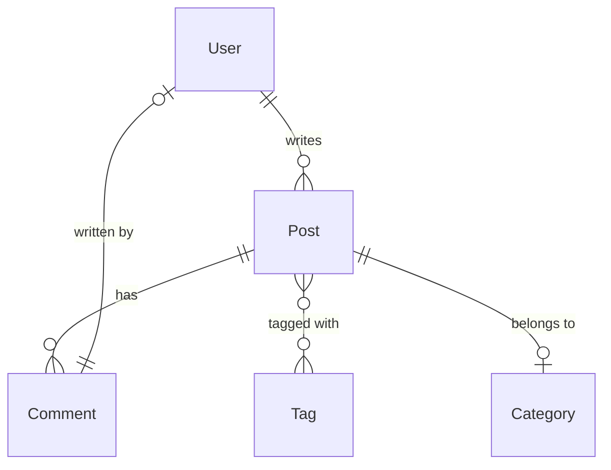

# How to Model a Blog with Posts and Comments in MongoDB

Author: [nawazdhandala](https://www.github.com/nawazdhandala)

Tags: MongoDB, Data Modeling, Schema Design, Embedding, Reference

Description: Learn how to design a MongoDB schema for a blog application with posts, comments, authors, and tags, choosing between embedding and referencing for each relationship.

---

Modeling a blog in MongoDB requires decisions about what to embed and what to reference. Posts, comments, authors, and tags all have different access patterns and size characteristics that drive the best schema choice.

## Core Entities and Relationships



## Option 1: Comments Fully Embedded

Embed comments directly inside the post document. Good for blogs with few comments per post and read-heavy workloads.

```javascript
// posts collection
{
  _id: ObjectId("6601aaa000000000000000a1"),
  slug: "getting-started-with-mongodb",
  title: "Getting Started with MongoDB",
  body: "MongoDB is a document database...",
  publishedAt: ISODate("2026-03-01T10:00:00Z"),
  author: {
    _id: ObjectId("6601aaa000000000000000b1"),
    username: "alice",
    avatarUrl: "https://cdn.example.com/alice.jpg"
  },
  tags: ["mongodb", "databases", "tutorial"],
  category: "Databases",
  status: "published",
  viewCount: 1420,
  comments: [
    {
      _id: ObjectId("6601aaa000000000000000c1"),
      author: {
        _id: ObjectId("6601aaa000000000000000b2"),
        username: "bob"
      },
      body: "Great introduction!",
      createdAt: ISODate("2026-03-02T08:30:00Z"),
      approved: true,
      likeCount: 5
    },
    {
      _id: ObjectId("6601aaa000000000000000c2"),
      author: {
        _id: ObjectId("6601aaa000000000000000b3"),
        username: "carol"
      },
      body: "Could you cover aggregation next?",
      createdAt: ISODate("2026-03-02T09:15:00Z"),
      approved: true,
      likeCount: 2
    }
  ],
  commentCount: 2
}
```

Pros: single read to get a post with all comments, comments automatically deleted when the post is deleted.
Cons: document grows unboundedly as comments are added; MongoDB document limit is 16 MB.

## Option 2: Comments in a Separate Collection

For active posts with many comments, store comments separately and reference the post:

```javascript
// posts collection (no comments array)
{
  _id: ObjectId("6601aaa000000000000000a1"),
  slug: "getting-started-with-mongodb",
  title: "Getting Started with MongoDB",
  body: "MongoDB is a document database...",
  publishedAt: ISODate("2026-03-01T10:00:00Z"),
  authorId: ObjectId("6601aaa000000000000000b1"),
  tags: ["mongodb", "databases", "tutorial"],
  category: "Databases",
  status: "published",
  viewCount: 1420,
  commentCount: 87           // cached count for display
}

// comments collection
{
  _id: ObjectId("6601aaa000000000000000c1"),
  postId: ObjectId("6601aaa000000000000000a1"),
  authorId: ObjectId("6601aaa000000000000000b2"),
  body: "Great introduction!",
  createdAt: ISODate("2026-03-02T08:30:00Z"),
  approved: true,
  likeCount: 5,
  parentCommentId: null       // null = top-level, ObjectId = reply
}

// users collection
{
  _id: ObjectId("6601aaa000000000000000b1"),
  username: "alice",
  email: "alice@example.com",
  avatarUrl: "https://cdn.example.com/alice.jpg",
  bio: "Software developer and writer",
  postCount: 12,
  joinedAt: ISODate("2025-01-10T00:00:00Z")
}
```

## Hybrid: Embed the First N Comments

A common production pattern stores the most recent or most-liked comments directly in the post for the first page load, and fetches the rest via a separate query:

```javascript
{
  _id: ObjectId("6601aaa000000000000000a1"),
  slug: "getting-started-with-mongodb",
  title: "Getting Started with MongoDB",
  // ...
  commentCount: 87,
  // Top 5 comments embedded for quick rendering
  featuredComments: [
    { _id: ObjectId, author: { username: "bob" }, body: "...", likeCount: 22 },
    { _id: ObjectId, author: { username: "carol" }, body: "...", likeCount: 15 }
  ]
}
```

## Indexes

```javascript
// posts
db.posts.createIndex({ slug: 1 }, { unique: true });
db.posts.createIndex({ authorId: 1, publishedAt: -1 });
db.posts.createIndex({ tags: 1, publishedAt: -1 });
db.posts.createIndex({ category: 1, publishedAt: -1 });
db.posts.createIndex({ status: 1, publishedAt: -1 });

// comments
db.comments.createIndex({ postId: 1, createdAt: -1 });
db.comments.createIndex({ postId: 1, approved: 1, createdAt: -1 });
db.comments.createIndex({ authorId: 1 });
db.comments.createIndex({ parentCommentId: 1 });   // for replies

// users
db.users.createIndex({ username: 1 }, { unique: true });
db.users.createIndex({ email: 1 }, { unique: true });
```

## Common Queries

### Fetch a Post with Author Details

```javascript
db.posts.aggregate([
  { $match: { slug: "getting-started-with-mongodb" } },
  {
    $lookup: {
      from: "users",
      localField: "authorId",
      foreignField: "_id",
      as: "author"
    }
  },
  { $unwind: "$author" },
  {
    $project: {
      title: 1, body: 1, publishedAt: 1, tags: 1,
      commentCount: 1,
      "author.username": 1,
      "author.avatarUrl": 1,
      "author.bio": 1
    }
  }
]);
```

### Paginate Comments for a Post

```javascript
async function getComments(postId, page = 1, pageSize = 20) {
  return db.collection("comments").find(
    { postId: ObjectId(postId), approved: true, parentCommentId: null },
    { projection: { body: 1, authorId: 1, createdAt: 1, likeCount: 1 } }
  )
  .sort({ createdAt: -1 })
  .skip((page - 1) * pageSize)
  .limit(pageSize)
  .toArray();
}
```

### Add a Comment and Increment Count Atomically

```javascript
async function addComment(postId, authorId, body) {
  const comment = await db.collection("comments").insertOne({
    postId: ObjectId(postId),
    authorId: ObjectId(authorId),
    body,
    createdAt: new Date(),
    approved: true,
    likeCount: 0,
    parentCommentId: null
  });

  // Increment the cached comment count on the post
  await db.collection("posts").updateOne(
    { _id: ObjectId(postId) },
    { $inc: { commentCount: 1 } }
  );

  return comment;
}
```

### Threaded Comments (Replies)

```javascript
// Get top-level comments and their direct replies
db.comments.aggregate([
  {
    $match: {
      postId: ObjectId("6601aaa000000000000000a1"),
      approved: true,
      parentCommentId: null
    }
  },
  { $sort: { likeCount: -1 } },
  { $limit: 20 },
  {
    $lookup: {
      from: "comments",
      let: { commentId: "$_id" },
      pipeline: [
        {
          $match: {
            $expr: { $eq: ["$parentCommentId", "$$commentId"] },
            approved: true
          }
        },
        { $sort: { createdAt: 1 } },
        { $limit: 5 }
      ],
      as: "replies"
    }
  }
]);
```

### Post Listing with Author

```javascript
db.posts.aggregate([
  { $match: { status: "published" } },
  { $sort: { publishedAt: -1 } },
  { $skip: 0 },
  { $limit: 10 },
  {
    $lookup: {
      from: "users",
      localField: "authorId",
      foreignField: "_id",
      as: "author"
    }
  },
  { $unwind: "$author" },
  {
    $project: {
      title: 1, slug: 1, publishedAt: 1, tags: 1,
      commentCount: 1, viewCount: 1,
      "author.username": 1, "author.avatarUrl": 1
    }
  }
]);
```

## Schema for Tags

Tags stored as an array of strings on the post are simple and index well with a multikey index. For tag metadata (description, post count), use a separate `tags` collection:

```javascript
// tags collection
{
  _id: "mongodb",
  displayName: "MongoDB",
  description: "The MongoDB document database",
  postCount: 47,
  createdAt: ISODate("2025-01-01")
}
```

## Decision Summary

| Relationship | Recommendation |
|---|---|
| Post - Author | Reference; authors are shared across posts |
| Post - Tags | Embed tag slugs; reference for tag metadata |
| Post - Comments (< 50 comments) | Embed |
| Post - Comments (unbounded) | Reference separate `comments` collection |
| Comment - Author | Store minimal author info (username, avatar) embedded |
| Comment - Replies | Self-reference via `parentCommentId` |

## Summary

A blog schema in MongoDB typically uses a separate `posts`, `comments`, and `users` collection. Embed a small number of featured or recent comments for fast initial page loads and store the full comment set as references. Cache the comment count on the post document for fast display without counting. Use multikey indexes on the `tags` array and compound indexes on `(postId, approved, createdAt)` for the comments collection. The hybrid embed-for-first-page, reference-for-rest pattern gives the best balance of read performance and schema flexibility.
