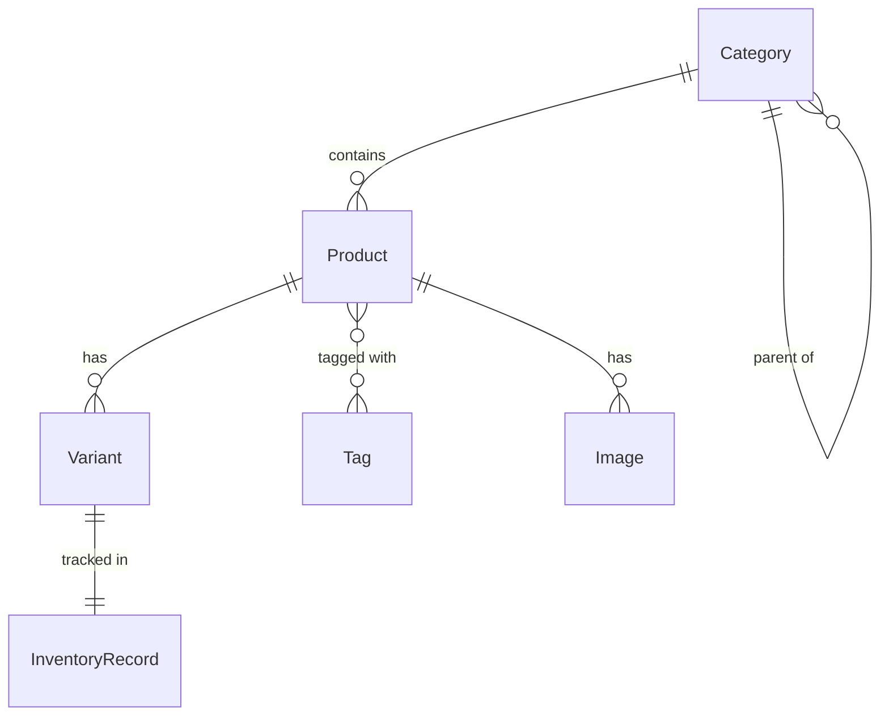

# How to Model an E-Commerce Product Catalog in MongoDB

Author: [nawazdhandala](https://www.github.com/nawazdhandala)

Tags: MongoDB, Data Modeling, E-Commerce, Schema Design, Catalog

Description: Learn how to design a MongoDB schema for an e-commerce product catalog supporting variants, categories, attributes, pricing, and inventory with practical examples.

---

An e-commerce product catalog must handle products with variable attributes (size, color), multiple variants with independent pricing and inventory, hierarchical categories, and rich media -- all while supporting fast search and filtering.

## Catalog Structure Overview



## Category Schema

Represent the category tree with a parent reference and the full ancestor path for efficient breadcrumb and subtree queries:

```javascript
// categories collection
{
  _id: ObjectId("6601bbb000000000000000a1"),
  slug: "mens-footwear",
  name: "Men's Footwear",
  parentId: ObjectId("6601bbb000000000000000a0"),   // "footwear"
  ancestors: [
    { _id: ObjectId("6601bbb000000000000000a0"), slug: "footwear", name: "Footwear" }
  ],
  depth: 2,
  sortOrder: 3,
  isActive: true,
  imageUrl: "https://cdn.example.com/mens-footwear.jpg"
}
```

## Product Schema

```javascript
// products collection
{
  _id: ObjectId("6601ccc000000000000000a1"),
  sku: "NK-AIR-MAX-270",
  slug: "nike-air-max-270",
  name: "Nike Air Max 270",
  brand: "Nike",
  categoryId: ObjectId("6601bbb000000000000000a1"),
  categoryPath: ["footwear", "mens-footwear"],          // for range queries

  description: "Inspired by the Air Max 180 and Air Max 93...",
  shortDescription: "Lifestyle shoe with large Air unit.",

  basePrice: 150.00,
  currency: "USD",

  // Product-level attributes that apply to all variants
  attributes: {
    material: "Mesh upper, rubber sole",
    closure: "Lace-up",
    style: "Lifestyle"
  },

  // Attribute schema defines which variant dimensions this product uses
  variantSchema: ["color", "size"],

  images: [
    { url: "https://cdn.example.com/am270-black-1.jpg", color: "black", isPrimary: true },
    { url: "https://cdn.example.com/am270-black-2.jpg", color: "black", isPrimary: false },
    { url: "https://cdn.example.com/am270-white-1.jpg", color: "white", isPrimary: false }
  ],

  tags: ["running", "lifestyle", "bestseller"],
  status: "active",
  publishedAt: ISODate("2026-01-10T00:00:00Z"),
  rating: 4.7,
  reviewCount: 2840,
  totalSold: 12500
}
```

## Variant Schema

Each variant is a unique combination of attributes with its own SKU, price, and inventory:

```javascript
// variants collection
{
  _id: ObjectId("6601ddd000000000000000a1"),
  productId: ObjectId("6601ccc000000000000000a1"),
  sku: "NK-AIR-MAX-270-BLK-10",
  attributes: {
    color: "black",
    size: "10"
  },
  price: 150.00,
  compareAtPrice: 180.00,         // original price for sale display
  inventory: {
    qty: 45,
    reserved: 3,
    available: 42,
    warehouseLocation: "BIN-A12"
  },
  weight: 340,                    // grams, for shipping
  isActive: true,
  images: [
    "https://cdn.example.com/am270-black-1.jpg"
  ]
}
```

## Denormalized Product+Variants Document (for read performance)

For product detail pages, embed variants directly in the product to avoid a join:

```javascript
{
  _id: ObjectId("6601ccc000000000000000a1"),
  sku: "NK-AIR-MAX-270",
  slug: "nike-air-max-270",
  name: "Nike Air Max 270",
  brand: "Nike",
  basePrice: 150.00,
  // ... other product fields ...

  // Variants embedded for single-document reads
  variants: [
    {
      sku: "NK-AIR-MAX-270-BLK-9",
      attributes: { color: "black", size: "9" },
      price: 150.00,
      inventory: { qty: 12, available: 10 },
      isActive: true
    },
    {
      sku: "NK-AIR-MAX-270-BLK-10",
      attributes: { color: "black", size: "10" },
      price: 150.00,
      inventory: { qty: 45, available: 42 },
      isActive: true
    },
    {
      sku: "NK-AIR-MAX-270-WHT-10",
      attributes: { color: "white", size: "10" },
      price: 155.00,
      inventory: { qty: 0, available: 0 },
      isActive: false
    }
  ]
}
```

## Indexes

```javascript
// products
db.products.createIndex({ slug: 1 }, { unique: true });
db.products.createIndex({ sku: 1 }, { unique: true });
db.products.createIndex({ categoryId: 1, status: 1, publishedAt: -1 });
db.products.createIndex({ brand: 1, status: 1 });
db.products.createIndex({ tags: 1 });
db.products.createIndex({ "categoryPath": 1, status: 1 });
db.products.createIndex({ basePrice: 1 });
db.products.createIndex({ rating: -1 });
db.products.createIndex({ totalSold: -1 });

// variants
db.variants.createIndex({ productId: 1 });
db.variants.createIndex({ sku: 1 }, { unique: true });
db.variants.createIndex({ productId: 1, "attributes.color": 1, "attributes.size": 1 });
db.variants.createIndex({ "inventory.available": 1 });

// categories
db.categories.createIndex({ slug: 1 }, { unique: true });
db.categories.createIndex({ parentId: 1 });
```

## Common Queries

### Product Listing by Category with Facet Filters

```javascript
async function listProducts({ categorySlug, brand, minPrice, maxPrice, page = 1 }) {
  const category = await db.collection("categories").findOne({ slug: categorySlug });

  const filter = {
    categoryPath: categorySlug,
    status: "active"
  };

  if (brand) filter.brand = brand;
  if (minPrice || maxPrice) {
    filter.basePrice = {};
    if (minPrice) filter.basePrice.$gte = minPrice;
    if (maxPrice) filter.basePrice.$lte = maxPrice;
  }

  return db.collection("products")
    .find(filter)
    .sort({ totalSold: -1 })
    .skip((page - 1) * 24)
    .limit(24)
    .project({ name: 1, slug: 1, basePrice: 1, rating: 1, reviewCount: 1, images: { $slice: 1 } })
    .toArray();
}
```

### Product Detail with Variant Availability

```javascript
async function getProductDetail(slug) {
  return db.collection("products").aggregate([
    { $match: { slug, status: "active" } },
    {
      $lookup: {
        from: "variants",
        let: { pid: "$_id" },
        pipeline: [
          { $match: { $expr: { $eq: ["$productId", "$$pid"] }, isActive: true } },
          { $project: { sku: 1, attributes: 1, price: 1, compareAtPrice: 1, "inventory.available": 1 } }
        ],
        as: "variants"
      }
    },
    {
      $lookup: {
        from: "categories",
        localField: "categoryId",
        foreignField: "_id",
        as: "category"
      }
    },
    { $unwind: "$category" }
  ]).next();
}
```

### Update Inventory After a Sale

```javascript
async function reserveInventory(variantSku, qty) {
  const result = await db.collection("variants").updateOne(
    {
      sku: variantSku,
      "inventory.available": { $gte: qty }     // ensure sufficient stock
    },
    {
      $inc: {
        "inventory.reserved": qty,
        "inventory.available": -qty
      }
    }
  );
  return result.modifiedCount === 1;
}
```

### Build Facets for Filter Sidebar

```javascript
db.products.aggregate([
  { $match: { categoryPath: "mens-footwear", status: "active" } },
  {
    $facet: {
      brands: [
        { $group: { _id: "$brand", count: { $sum: 1 } } },
        { $sort: { count: -1 } },
        { $limit: 20 }
      ],
      priceRanges: [
        {
          $bucket: {
            groupBy: "$basePrice",
            boundaries: [0, 50, 100, 150, 200, 500],
            default: "500+",
            output: { count: { $sum: 1 } }
          }
        }
      ],
      ratings: [
        {
          $bucket: {
            groupBy: "$rating",
            boundaries: [1, 2, 3, 4, 4.5, 5],
            default: "unrated",
            output: { count: { $sum: 1 } }
          }
        }
      ]
    }
  }
]);
```

### Find Products in Stock for a Given Color

```javascript
db.products.aggregate([
  { $match: { status: "active", brand: "Nike" } },
  {
    $lookup: {
      from: "variants",
      let: { pid: "$_id" },
      pipeline: [
        {
          $match: {
            $expr: { $eq: ["$productId", "$$pid"] },
            "attributes.color": "black",
            "inventory.available": { $gt: 0 },
            isActive: true
          }
        },
        { $project: { sku: 1, attributes: 1, price: 1 } }
      ],
      as: "blackVariants"
    }
  },
  { $match: { "blackVariants.0": { $exists: true } } }
]);
```

## Attribute Pattern for Variable Product Attributes

Different product categories have different attributes (electronics have voltage, clothing has material). Use the Attribute Pattern to make them filterable:

```javascript
// Instead of arbitrary keys, store as an array of name-value pairs
{
  _id: ObjectId("..."),
  name: "Samsung 4K TV",
  attributes: [
    { name: "screenSize",   value: 55,      unit: "inches" },
    { name: "resolution",   value: "4K UHD", unit: null   },
    { name: "refreshRate",  value: 120,      unit: "Hz"   },
    { name: "hdrSupport",   value: true,     unit: null   }
  ]
}

// Index for fast attribute filtering
db.products.createIndex({ "attributes.name": 1, "attributes.value": 1 });
```

## Summary

Model an e-commerce catalog with a `products` collection, a `variants` collection for SKU-level pricing and inventory, and a `categories` collection with parent references and ancestor paths. Embed a small number of variants directly in the product document for fast single-document reads on the product detail page. Store full variant inventory in a dedicated collection for transactional inventory updates. Use the Attribute Pattern for variable product specifications and the `$facet` stage for building filter sidebar counts. Index on `categoryPath`, `brand`, `basePrice`, and `attributes.name`/`attributes.value` to support common listing and filtering queries.
