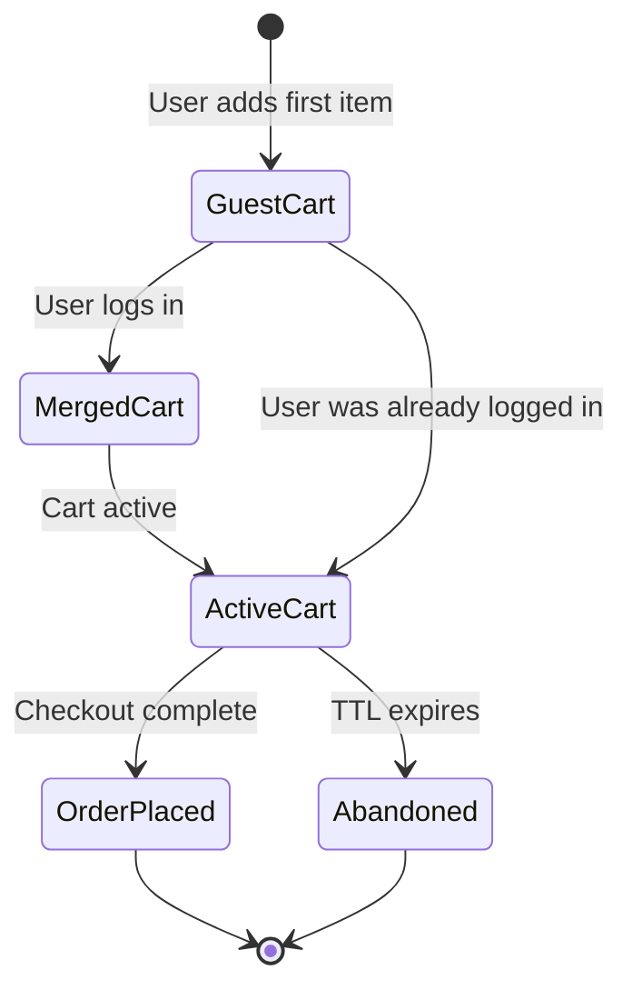

# How to Model a Shopping Cart in MongoDB

Author: [nawazdhandala](https://www.github.com/nawazdhandala)

Tags: MongoDB, Data Modeling, Shopping Cart, Schema Design, E-Commerce

Description: Learn how to design a MongoDB schema for a shopping cart that handles guest and authenticated users, inventory reservations, price snapshots, and cart expiration.

---

A shopping cart is a short-lived, user-specific document that holds items before checkout. In MongoDB, the cart is naturally modeled as a single document with embedded line items, making cart reads and updates fast and atomic.

## Cart Lifecycle



## Cart Schema

```javascript
// carts collection
{
  _id: ObjectId("6601aaa000000000000000a1"),

  // Either userId (logged in) or sessionId (guest)
  userId: ObjectId("6601bbb000000000000000a1"),  // null for guests
  sessionId: "sess_abc123xyz",                   // always set

  status: "active",   // active | checkout | abandoned | converted

  items: [
    {
      _id: ObjectId("6601ccc000000000000000a1"),  // line item id
      productId: ObjectId("6601ddd000000000000000a1"),
      variantId: ObjectId("6601eee000000000000000a1"),

      // Snapshot prices at add-to-cart time
      sku: "NK-AIR-MAX-270-BLK-10",
      name: "Nike Air Max 270",
      variantLabel: "Black / Size 10",
      imageUrl: "https://cdn.example.com/am270-blk.jpg",

      qty: 2,
      unitPrice: 150.00,    // price when added
      currency: "USD",

      // Track price changes since item was added
      currentPrice: 135.00,   // current price (for displaying a discount)

      addedAt: ISODate("2026-03-31T08:00:00Z"),
      updatedAt: ISODate("2026-03-31T08:00:00Z")
    }
  ],

  couponCode: "SAVE10",
  couponDiscount: 28.50,

  summary: {
    subtotal: 300.00,
    discount: 28.50,
    shipping: 0.00,
    tax: 24.68,
    total: 296.18
  },

  shippingAddressId: ObjectId("6601fff000000000000000a1"),
  savedForLater: [],

  createdAt: ISODate("2026-03-31T08:00:00Z"),
  updatedAt: ISODate("2026-03-31T08:30:00Z"),
  expiresAt: ISODate("2026-04-14T08:00:00Z")    // TTL field
}
```

## Indexes

```javascript
db.carts.createIndex({ userId: 1 }, { sparse: true });
db.carts.createIndex({ sessionId: 1 });
db.carts.createIndex({ userId: 1, status: 1 });
db.carts.createIndex({ expiresAt: 1 }, { expireAfterSeconds: 0 });  // TTL
db.carts.createIndex({ updatedAt: 1 });
```

## Creating or Retrieving a Cart

```javascript
async function getOrCreateCart(userId, sessionId) {
  const filter = userId
    ? { userId: ObjectId(userId), status: "active" }
    : { sessionId, userId: null, status: "active" };

  return db.collection("carts").findOneAndUpdate(
    filter,
    {
      $setOnInsert: {
        userId: userId ? ObjectId(userId) : null,
        sessionId,
        status: "active",
        items: [],
        summary: { subtotal: 0, discount: 0, shipping: 0, tax: 0, total: 0 },
        createdAt: new Date(),
        expiresAt: new Date(Date.now() + 14 * 24 * 60 * 60 * 1000)  // 14 days
      },
      $set: { updatedAt: new Date() }
    },
    { upsert: true, returnDocument: "after" }
  );
}
```

## Adding an Item to the Cart

```javascript
async function addItem(cartId, item) {
  const { productId, variantId, sku, name, variantLabel, imageUrl, unitPrice, qty } = item;

  // Check if the variant is already in the cart
  const cart = await db.collection("carts").findOne(
    { _id: ObjectId(cartId), "items.variantId": ObjectId(variantId) }
  );

  if (cart) {
    // Increment quantity if already in cart
    return db.collection("carts").findOneAndUpdate(
      { _id: ObjectId(cartId), "items.variantId": ObjectId(variantId) },
      {
        $inc: { "items.$.qty": qty },
        $set: { "items.$.updatedAt": new Date(), updatedAt: new Date() }
      },
      { returnDocument: "after" }
    );
  }

  // Add new line item
  return db.collection("carts").findOneAndUpdate(
    { _id: ObjectId(cartId) },
    {
      $push: {
        items: {
          _id: new ObjectId(),
          productId: ObjectId(productId),
          variantId: ObjectId(variantId),
          sku, name, variantLabel, imageUrl,
          qty,
          unitPrice,
          currentPrice: unitPrice,
          currency: "USD",
          addedAt: new Date(),
          updatedAt: new Date()
        }
      },
      $set: { updatedAt: new Date() }
    },
    { returnDocument: "after" }
  );
}
```

## Updating Item Quantity

```javascript
async function updateItemQty(cartId, variantId, newQty) {
  if (newQty <= 0) {
    return removeItem(cartId, variantId);
  }

  return db.collection("carts").findOneAndUpdate(
    { _id: ObjectId(cartId), "items.variantId": ObjectId(variantId) },
    {
      $set: {
        "items.$.qty": newQty,
        "items.$.updatedAt": new Date(),
        updatedAt: new Date()
      }
    },
    { returnDocument: "after" }
  );
}
```

## Removing an Item

```javascript
async function removeItem(cartId, variantId) {
  return db.collection("carts").findOneAndUpdate(
    { _id: ObjectId(cartId) },
    {
      $pull: { items: { variantId: ObjectId(variantId) } },
      $set: { updatedAt: new Date() }
    },
    { returnDocument: "after" }
  );
}
```

## Merging a Guest Cart on Login

```javascript
async function mergeCarts(sessionId, userId) {
  const guestCart = await db.collection("carts").findOne({
    sessionId,
    userId: null,
    status: "active"
  });

  if (!guestCart || guestCart.items.length === 0) {
    // Just assign the session cart to the user
    await db.collection("carts").updateOne(
      { sessionId, userId: null, status: "active" },
      { $set: { userId: ObjectId(userId), updatedAt: new Date() } }
    );
    return;
  }

  // Find or create the user's cart
  const userCart = await getOrCreateCart(userId, sessionId);

  // Merge items: add guest items not already in user cart
  for (const guestItem of guestCart.items) {
    const exists = userCart.items.some(
      i => i.variantId.toString() === guestItem.variantId.toString()
    );
    if (!exists) {
      await addItem(userCart._id.toString(), guestItem);
    }
  }

  // Delete the guest cart
  await db.collection("carts").deleteOne({ _id: guestCart._id });
}
```

## Recalculating Cart Summary

```javascript
function calculateSummary(items, couponDiscount = 0) {
  const subtotal = items.reduce((sum, item) => sum + item.unitPrice * item.qty, 0);
  const discount = couponDiscount;
  const shipping = subtotal >= 100 ? 0 : 9.99;
  const taxRate = 0.08;
  const tax = Math.round((subtotal - discount) * taxRate * 100) / 100;
  const total = Math.round((subtotal - discount + shipping + tax) * 100) / 100;
  return { subtotal, discount, shipping, tax, total };
}

async function recalculateCart(cartId) {
  const cart = await db.collection("carts").findOne({ _id: ObjectId(cartId) });
  const summary = calculateSummary(cart.items, cart.couponDiscount || 0);

  await db.collection("carts").updateOne(
    { _id: ObjectId(cartId) },
    { $set: { summary, updatedAt: new Date() } }
  );

  return summary;
}
```

## Inventory Check Before Checkout

```javascript
async function validateCartInventory(cartId) {
  const cart = await db.collection("carts").findOne({ _id: ObjectId(cartId) });
  const errors = [];

  for (const item of cart.items) {
    const variant = await db.collection("variants").findOne({
      _id: item.variantId,
      isActive: true
    });

    if (!variant) {
      errors.push({ sku: item.sku, reason: "Product no longer available" });
    } else if (variant.inventory.available < item.qty) {
      errors.push({
        sku: item.sku,
        reason: "Insufficient stock",
        available: variant.inventory.available,
        requested: item.qty
      });
    }
  }

  return errors;
}
```

## Converting Cart to Order

```javascript
async function checkoutCart(cartId, session) {
  const cart = await db.collection("carts").findOne({ _id: ObjectId(cartId) });

  // Create order from cart
  const order = await db.collection("orders").insertOne({
    cartId: cart._id,
    userId: cart.userId,
    items: cart.items,
    summary: cart.summary,
    status: "pending",
    createdAt: new Date()
  });

  // Mark cart as converted
  await db.collection("carts").updateOne(
    { _id: cart._id },
    { $set: { status: "converted", orderId: order.insertedId, updatedAt: new Date() } }
  );

  return order;
}
```

## Cart Abandonment Tracking

```javascript
// Find carts active for more than 1 hour but not updated in 24 hours
db.carts.aggregate([
  {
    $match: {
      status: "active",
      "items.0": { $exists: true },
      updatedAt: {
        $lt: new Date(Date.now() - 24 * 60 * 60 * 1000),
        $gt: new Date(Date.now() - 7 * 24 * 60 * 60 * 1000)
      }
    }
  },
  {
    $project: {
      userId: 1,
      itemCount: { $size: "$items" },
      total: "$summary.total",
      lastUpdated: "$updatedAt"
    }
  }
]);
```

## Summary

Model a shopping cart as a single MongoDB document with embedded line items for fast atomic reads and updates. Store price snapshots at add-to-cart time to handle price changes during the session. Use a TTL index on `expiresAt` for automatic expiry of abandoned carts. Merge guest carts on login by transferring items from the session cart to the user cart. Always validate inventory availability before checkout and use `findOneAndUpdate` with positional operators to update individual line items atomically.
