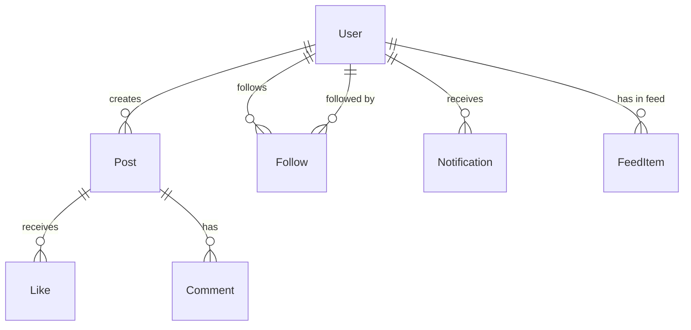

# How to Model a Social Network with Followers in MongoDB

Author: OneUptime Team

Tags: MongoDB, Data modeling, Social network, Schema design, Graph

Description: Learn how to design a MongoDB schema for a social network with followers, feeds, posts, and notifications, choosing the right patterns for scale and query performance.

---

A social network has several interconnected entities -- users, follow relationships, posts, likes, and feeds -- each with distinct access patterns. MongoDB's flexible document model can handle these patterns well when the schema is designed around the most frequent queries.

## Core Entities and Relationships



## User Schema

```javascript
// users collection
{
  _id: ObjectId("6601aaa000000000000000a1"),
  username: "alice",
  handle: "@alice",
  displayName: "Alice Smith",
  email: "alice@example.com",
  avatarUrl: "https://cdn.example.com/alice.jpg",
  bio: "Engineer. Coffee enthusiast.",
  website: "https://alice.dev",
  location: "San Francisco, CA",
  isVerified: true,
  isPrivate: false,
  stats: {
    followers: 12400,
    following: 820,
    posts: 347
  },
  createdAt: ISODate("2024-06-01T00:00:00Z"),
  lastActiveAt: ISODate("2026-03-31T10:00:00Z")
}
```

## Follow Relationship Schema

Store each follow as a document in a `follows` collection. This is more scalable than embedding the full follower list in the user document:

```javascript
// follows collection
{
  _id: ObjectId("6601bbb000000000000000a1"),
  followerId: ObjectId("6601aaa000000000000000a2"),    // who is following
  followeeId: ObjectId("6601aaa000000000000000a1"),    // who is being followed
  createdAt: ISODate("2026-01-15T12:00:00Z"),
  status: "active"    // active | pending (for private accounts)
}
```

## Post Schema

```javascript
// posts collection
{
  _id: ObjectId("6601ccc000000000000000a1"),
  authorId: ObjectId("6601aaa000000000000000a1"),

  // Denormalize minimal author info for feed rendering without a join
  author: {
    username: "alice",
    displayName: "Alice Smith",
    avatarUrl: "https://cdn.example.com/alice.jpg",
    isVerified: true
  },

  body: "Just launched my new project! Check it out.",
  mediaUrls: ["https://cdn.example.com/post-img-1.jpg"],
  linkPreview: {
    url: "https://alice.dev/project",
    title: "My New Project",
    imageUrl: "https://cdn.example.com/preview.jpg"
  },
  hashtags: ["launch", "buildinpublic"],
  mentions: [
    { userId: ObjectId("..."), username: "bob" }
  ],
  replyToPostId: null,     // null = original post, ObjectId = reply
  stats: {
    likes: 342,
    comments: 28,
    reposts: 15,
    views: 8400
  },
  createdAt: ISODate("2026-03-31T08:00:00Z"),
  isDeleted: false
}
```

## Likes Schema

```javascript
// likes collection
{
  _id: ObjectId("6601ddd000000000000000a1"),
  userId: ObjectId("6601aaa000000000000000a2"),
  postId: ObjectId("6601ccc000000000000000a1"),
  createdAt: ISODate("2026-03-31T09:00:00Z")
}
```

## Indexes

```javascript
// users
db.users.createIndex({ username: 1 }, { unique: true });
db.users.createIndex({ "stats.followers": -1 });

// follows
db.follows.createIndex({ followerId: 1, followeeId: 1 }, { unique: true });
db.follows.createIndex({ followeeId: 1, createdAt: -1 });  // who follows me
db.follows.createIndex({ followerId: 1, createdAt: -1 });  // who I follow

// posts
db.posts.createIndex({ authorId: 1, createdAt: -1 });
db.posts.createIndex({ hashtags: 1, createdAt: -1 });
db.posts.createIndex({ "mentions.userId": 1 });
db.posts.createIndex({ replyToPostId: 1 });

// likes
db.likes.createIndex({ userId: 1, postId: 1 }, { unique: true });
db.likes.createIndex({ postId: 1 });
```

## Common Queries

### Follow a User

```javascript
async function followUser(followerId, followeeId) {
  // Insert the follow relationship
  await db.collection("follows").updateOne(
    { followerId, followeeId },
    { $setOnInsert: { followerId, followeeId, createdAt: new Date(), status: "active" } },
    { upsert: true }
  );

  // Update stats
  await db.collection("users").bulkWrite([
    { updateOne: { filter: { _id: followerId }, update: { $inc: { "stats.following": 1 } } } },
    { updateOne: { filter: { _id: followeeId }, update: { $inc: { "stats.followers": 1 } } } }
  ]);
}
```

### Check If User A Follows User B

```javascript
async function isFollowing(followerId, followeeId) {
  const follow = await db.collection("follows").findOne({
    followerId: ObjectId(followerId),
    followeeId: ObjectId(followeeId),
    status: "active"
  });
  return follow !== null;
}
```

### Get Followers of a User (Paginated)

```javascript
async function getFollowers(userId, cursor = null, limit = 20) {
  const filter = { followeeId: ObjectId(userId), status: "active" };
  if (cursor) filter.createdAt = { $lt: new Date(cursor) };

  const follows = await db.collection("follows")
    .find(filter)
    .sort({ createdAt: -1 })
    .limit(limit)
    .toArray();

  const followerIds = follows.map(f => f.followerId);
  const users = await db.collection("users")
    .find({ _id: { $in: followerIds } })
    .project({ username: 1, displayName: 1, avatarUrl: 1, bio: 1, "stats.followers": 1, isVerified: 1 })
    .toArray();

  return { users, nextCursor: follows.at(-1)?.createdAt?.toISOString() };
}
```

### User Timeline (Posts from People You Follow)

Fan-out-on-read: query posts from followed users at read time. Good for users with a small following list.

```javascript
async function getTimeline(userId, cursor = null, limit = 20) {
  // Get list of users this person follows
  const follows = await db.collection("follows")
    .find({ followerId: ObjectId(userId), status: "active" })
    .project({ followeeId: 1 })
    .toArray();

  const followeeIds = follows.map(f => f.followeeId);
  followeeIds.push(ObjectId(userId));   // include own posts

  const filter = {
    authorId: { $in: followeeIds },
    isDeleted: false
  };
  if (cursor) filter.createdAt = { $lt: new Date(cursor) };

  return db.collection("posts")
    .find(filter)
    .sort({ createdAt: -1 })
    .limit(limit)
    .project({ body: 1, author: 1, stats: 1, createdAt: 1, mediaUrls: 1 })
    .toArray();
}
```

### Fan-out-on-write Feed (for Scale)

For large followings, pre-compute the feed by writing to each follower's feed collection on post creation:

```javascript
// feed collection
{
  _id: ObjectId("..."),
  userId: ObjectId("6601aaa000000000000000a3"),   // feed owner
  postId: ObjectId("6601ccc000000000000000a1"),
  authorId: ObjectId("6601aaa000000000000000a1"),
  createdAt: ISODate("2026-03-31T08:00:00Z")
}

db.feed.createIndex({ userId: 1, createdAt: -1 });

// On new post, fan out to all followers
async function fanOutPost(post) {
  const followers = await db.collection("follows")
    .find({ followeeId: post.authorId, status: "active" })
    .project({ followerId: 1 })
    .toArray();

  const feedItems = followers.map(f => ({
    userId: f.followerId,
    postId: post._id,
    authorId: post.authorId,
    createdAt: post.createdAt
  }));

  if (feedItems.length > 0) {
    await db.collection("feed").insertMany(feedItems);
  }
}

// Reading the feed is then a simple lookup
async function getFeed(userId, cursor = null, limit = 20) {
  const filter = { userId: ObjectId(userId) };
  if (cursor) filter.createdAt = { $lt: new Date(cursor) };

  const feedItems = await db.collection("feed")
    .find(filter)
    .sort({ createdAt: -1 })
    .limit(limit)
    .toArray();

  const postIds = feedItems.map(f => f.postId);
  return db.collection("posts")
    .find({ _id: { $in: postIds }, isDeleted: false })
    .sort({ createdAt: -1 })
    .toArray();
}
```

### Like a Post

```javascript
async function likePost(userId, postId) {
  try {
    await db.collection("likes").insertOne({
      userId: ObjectId(userId),
      postId: ObjectId(postId),
      createdAt: new Date()
    });
    await db.collection("posts").updateOne(
      { _id: ObjectId(postId) },
      { $inc: { "stats.likes": 1 } }
    );
    return true;
  } catch (err) {
    if (err.code === 11000) return false;  // already liked
    throw err;
  }
}
```

### Mutual Followers (Friends)

```javascript
async function getMutualFollowers(userA, userB) {
  const [aFollows, bFollows] = await Promise.all([
    db.collection("follows")
      .find({ followerId: ObjectId(userA), status: "active" })
      .project({ followeeId: 1 })
      .toArray(),
    db.collection("follows")
      .find({ followerId: ObjectId(userB), status: "active" })
      .project({ followeeId: 1 })
      .toArray()
  ]);

  const aSet = new Set(aFollows.map(f => f.followeeId.toString()));
  const mutual = bFollows.filter(f => aSet.has(f.followeeId.toString()));
  return mutual.map(f => f.followeeId);
}
```

## Fan-out Strategy Decision

| Account type | Strategy |
|---|---|
| Regular user (< 10K followers) | Fan-out on read (compute timeline at read time) |
| Celebrity (> 10K followers) | Fan-out on write (pre-computed feed) or hybrid |
| Hybrid | Fan-out on write for non-celebrities; inject celebrity posts at read time |

## Summary

Model a social network in MongoDB with separate `users`, `follows`, `posts`, `likes`, and `feed` collections. Embed minimal author data in posts to avoid joins on the feed. Store follow relationships as individual documents indexed on both `followerId` and `followeeId` for fast lookup in either direction. For timelines, choose between fan-out-on-read for simplicity with small followings, or fan-out-on-write for pre-computed feeds at scale. Cache social stats (follower count, like count) directly on the relevant document using `$inc` and rebuild from counts periodically if needed.
