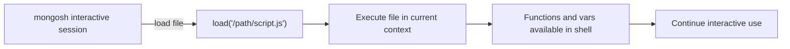

# How to Use mongosh load() for Script Execution

Author: [nawazdhandala](https://www.github.com/nawazdhandala)

Tags: MongoDB, Mongosh, Scripting, Tool, Administration

Description: Learn how to use the mongosh load() function to execute external JavaScript files, build reusable script libraries, and compose complex operations from the interactive shell.

---

## What is load()

The `load()` function in mongosh executes a JavaScript file in the current shell context. Unlike `--file` which runs a script non-interactively at startup, `load()` is called from within an active mongosh session and the loaded code shares the same context, meaning variables and functions defined in the loaded file are available afterward in the shell.



## Basic load() Usage

Start a mongosh session and load a file:

```bash
mongosh "mongodb://localhost:27017/myapp"
```

Inside the session:

```javascript
load("/opt/scripts/helpers.js")
```

If the file executes successfully, `load()` returns `true`. Any functions or variables defined in the file are now available in the shell.

## Creating a Reusable Helper Library

A common pattern is to maintain a library of helper functions and load it at the start of each session:

```javascript
// /opt/scripts/helpers.js

// Helper: count documents matching a filter
function countDocs(collName, filter) {
  return db.getCollection(collName).countDocuments(filter || {});
}

// Helper: find recent documents
function recent(collName, limit) {
  return db.getCollection(collName)
    .find()
    .sort({ _id: -1 })
    .limit(limit || 10)
    .toArray();
}

// Helper: explain a query
function explainQuery(collName, filter) {
  return db.getCollection(collName)
    .find(filter)
    .explain("executionStats");
}

// Helper: list indexes with usage stats
function indexStats(collName) {
  return db.getCollection(collName).aggregate([
    { $indexStats: {} }
  ]).toArray();
}

print("Helper functions loaded: countDocs, recent, explainQuery, indexStats");
```

After `load("/opt/scripts/helpers.js")`, use the functions directly:

```javascript
countDocs("orders", { status: "pending" })
recent("users", 5)
explainQuery("orders", { customerId: "c123" })
indexStats("orders")
```

## Auto-Loading with .mongoshrc.js

To automatically load a file every time you start mongosh, add a `load()` call to your mongoshrc file:

```javascript
// ~/.mongoshrc.js
load("/opt/scripts/helpers.js");
load("/opt/scripts/admin-utils.js");

// Set a custom prompt showing db name
prompt = function() {
  return `[${db.getName()}]> `;
};

print("Custom helpers loaded. Type 'help' or run 'countDocs(\"collection\")'");
```

Now every mongosh session starts with the helpers available.

## Composing Scripts with load()

Use `load()` to build a composition of scripts where one script calls another:

```javascript
// /opt/scripts/run-migration.js

// Load shared utilities
load("/opt/scripts/helpers.js");
load("/opt/scripts/migration-utils.js");

const db = db.getSiblingDB("myapp");

print("Starting migration v1.2.0");

// Use functions from loaded files
const pendingCount = countDocs("orders", { status: "legacy_pending" });
print(`Found ${pendingCount} legacy orders to migrate`);

if (pendingCount === 0) {
  print("Nothing to migrate");
  quit(0);
}

migrateOrders(db); // function from migration-utils.js
print("Migration complete");
```

## Loading Configuration Files

Load a configuration file to set variables used by subsequent scripts:

```javascript
// /opt/scripts/config.js
const CONFIG = {
  batchSize: 500,
  dryRun: true,
  logLevel: "verbose",
  collections: ["orders", "users", "products"]
};

print(`Config loaded. Dry run: ${CONFIG.dryRun}`);
```

In your migration script:

```javascript
load("/opt/scripts/config.js");

if (CONFIG.dryRun) {
  print("DRY RUN mode - no changes will be made");
}

CONFIG.collections.forEach(collName => {
  const count = db.getCollection(collName).countDocuments();
  print(`${collName}: ${count} documents`);
});
```

## load() vs --file

| Feature | load() | --file |
|---|---|---|
| Where called | Inside interactive shell | Command-line flag at startup |
| Context sharing | Shares current shell context | Runs in isolated context |
| Auto-loading | Via .mongoshrc.js | Must specify on every launch |
| Chaining scripts | Can call load() inside loaded file | Use multiple --file flags |
| Interactivity | Can continue shell use after | Shell exits when file finishes |

## Relative vs Absolute Paths

`load()` accepts both relative and absolute paths. Relative paths are resolved from the working directory where mongosh was launched:

```javascript
// Absolute path (recommended for reliability)
load("/opt/scripts/helpers.js");

// Relative path (resolved from cwd when mongosh started)
load("./scripts/helpers.js");
```

For scripts loaded via `.mongoshrc.js`, always use absolute paths because the working directory when mongosh starts is unpredictable.

## Error Handling in Loaded Files

Errors inside a loaded file propagate back to the shell:

```javascript
// error-demo.js
print("Starting");
throw new Error("Something went wrong");
print("This never runs");
```

In the shell:

```javascript
load("/opt/scripts/error-demo.js")
// Output:
// Starting
// MongoshRuntimeError: Something went wrong
// load() returns false if an error occurs
```

Check the return value:

```javascript
const loaded = load("/opt/scripts/setup.js");
if (!loaded) {
  print("Setup script failed, aborting");
  quit(1);
}
```

## Practical Example: Admin Toolkit

A complete admin toolkit organized as loadable modules:

```javascript
// /opt/scripts/admin-toolkit.js

// Module: Connection info
function connectionInfo() {
  const status = db.adminCommand({ serverStatus: 1 });
  return {
    version: status.version,
    uptime: Math.floor(status.uptime / 3600) + "h",
    connections: status.connections.current,
    opCounters: status.opcounters
  };
}

// Module: Find top slow queries
function slowQueries(limit) {
  return db.getSiblingDB("myapp").system.profile
    .find({ millis: { $gt: 100 } })
    .sort({ millis: -1 })
    .limit(limit || 5)
    .toArray()
    .map(q => ({ millis: q.millis, op: q.op, ns: q.ns, command: q.command }));
}

// Module: Collection size summary
function collectionSizes(dbName) {
  const targetDb = db.getSiblingDB(dbName);
  return targetDb.getCollectionNames().map(name => {
    const stats = targetDb[name].stats();
    return {
      collection: name,
      count: stats.count,
      sizeMB: (stats.size / 1024 / 1024).toFixed(2),
      indexSizeMB: (stats.totalIndexSize / 1024 / 1024).toFixed(2)
    };
  }).sort((a, b) => b.sizeMB - a.sizeMB);
}

print("Admin toolkit loaded: connectionInfo(), slowQueries(limit), collectionSizes(dbName)");
```

Load and use:

```javascript
load("/opt/scripts/admin-toolkit.js");
printjson(connectionInfo());
printjson(slowQueries(10));
printjson(collectionSizes("myapp"));
```

## Summary

`load()` executes a JavaScript file in the current mongosh session context, making all defined functions and variables available in the shell afterward. Use it to build reusable helper libraries, compose migrations from modular scripts, and share configuration objects between script files. Add `load()` calls to `~/.mongoshrc.js` to auto-load toolkits on every session start. Prefer absolute paths in automation to avoid working-directory ambiguity.
