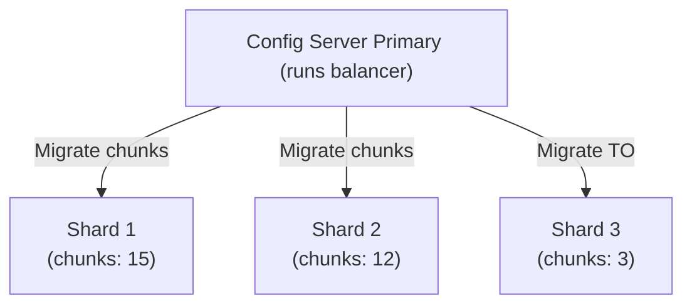

# How to Monitor Shard Balancing in MongoDB

Author: [OneUptime](https://www.github.com/oneuptime)

Tags: MongoDB, Sharding, Balancer, Monitoring, Operations

Description: Learn how to monitor MongoDB shard balancer activity, check chunk migration history, configure balancer windows, and diagnose balancing issues.

---

## Introduction

The MongoDB balancer runs on the config server primary and automatically migrates chunks between shards to maintain even data distribution. Monitoring the balancer helps you understand cluster health, prevent performance degradation during peak hours, and diagnose uneven distribution problems.

## Balancer Architecture



The balancer moves chunks from the most loaded shard to the least loaded until the difference falls within the threshold (default: 2 for < 20 chunks, 4 for 20-79 chunks, 8 for 80+ chunks).

## Step 1: Check Balancer State

```javascript
// Connect to mongos
sh.getBalancerState()
// Returns: true (enabled) or false (disabled)

sh.isBalancerRunning()
// Returns: true if actively migrating chunks right now
```

More detailed balancer status:

```javascript
db.adminCommand({ balancerStatus: 1 })
```

Expected output:

```javascript
{
  mode: "full",         // full = enabled, off = disabled
  inBalancerRound: false,
  numBalancerRounds: 1234,
  ok: 1
}
```

## Step 2: View Chunk Distribution

```javascript
use config

// Chunk count per shard per namespace
db.chunks.aggregate([
  {
    $group: {
      _id: { ns: "$ns", shard: "$shard" },
      count: { $sum: 1 }
    }
  },
  { $sort: { "_id.ns": 1, count: -1 } }
])
```

Quick summary with sh.status():

```javascript
sh.status()
// Shows chunk counts per shard per collection
```

## Step 3: Monitor Active Migrations

Check if a migration is currently in progress:

```javascript
use config
db.migrations.find().pretty()
// Non-empty = migration in progress
```

From mongos:

```javascript
db.adminCommand({ currentOp: 1, "desc": { $regex: /moveChunk/ } })
```

## Step 4: Review Balancer History

The `config.changelog` collection records all balancer events:

```javascript
use config

// Recent successful migrations
db.changelog.find({
  what: "moveChunk.from"
}).sort({ time: -1 }).limit(10).forEach(doc => {
  printjson({
    time: doc.time,
    ns: doc.ns,
    from: doc.server,
    to: doc.details.to,
    chunk: doc.details.min
  })
})

// Failed migrations
db.changelog.find({
  what: "moveChunk.from",
  "details.errmsg": { $exists: true }
}).sort({ time: -1 }).limit(5).forEach(doc => {
  printjson({ time: doc.time, ns: doc.ns, error: doc.details.errmsg })
})
```

## Step 5: Configure a Balancer Window

Restrict balancing to off-peak hours to avoid impacting production writes:

```javascript
use config
db.settings.updateOne(
  { _id: "balancer" },
  {
    $set: {
      activeWindow: {
        start: "02:00",  // UTC time
        stop: "06:00"
      }
    }
  },
  { upsert: true }
)
```

Verify the window is set:

```javascript
db.settings.findOne({ _id: "balancer" })
```

Remove the window to allow 24/7 balancing:

```javascript
db.settings.updateOne(
  { _id: "balancer" },
  { $unset: { activeWindow: 1 } }
)
```

## Step 6: Stop and Start the Balancer

Stop the balancer before performing maintenance that could conflict with migrations:

```javascript
sh.stopBalancer(60000)  // Wait up to 60 seconds for current round to finish
```

Verify it has stopped:

```javascript
sh.getBalancerState()   // false
sh.isBalancerRunning()  // false
```

Resume:

```javascript
sh.startBalancer()
```

## Step 7: Disable Balancing for a Specific Collection

```javascript
sh.disableBalancing("ecommerce.orders")
```

Re-enable:

```javascript
sh.enableBalancing("ecommerce.orders")
```

Check per-collection balancing state:

```javascript
use config
db.collections.find({ _id: "ecommerce.orders" }, { noBalance: 1 })
// noBalance: true = disabled
```

## Step 8: Check Balancer Efficiency

Compare the number of migrations vs the time they took:

```javascript
use config
db.changelog.aggregate([
  {
    $match: {
      what: "moveChunk.from",
      time: { $gte: new Date(Date.now() - 24 * 60 * 60 * 1000) }  // last 24h
    }
  },
  {
    $group: {
      _id: null,
      totalMigrations: { $sum: 1 },
      avgDurationMs: { $avg: "$details.cloneLogsVerbose.duration" }
    }
  }
])
```

## Balancer Thresholds Reference

```javascript
// Change the migration threshold (chunks difference before balancing kicks in)
use config
db.settings.updateOne(
  { _id: "chunksize" },
  { $set: { value: 64 } },  // chunk size in MB (default: 128)
  { upsert: true }
)
```

## Summary

Monitoring the MongoDB shard balancer involves checking `sh.getBalancerState()` and `sh.isBalancerRunning()` for real-time status, querying `config.chunks` for distribution, and reviewing `config.changelog` for migration history and errors. Configure a balancer window to restrict migrations to off-peak hours, stop the balancer before cluster maintenance, and disable per-collection balancing when needed. Consistent monitoring of chunk distribution prevents hot shards and ensures your cluster scales as expected.
