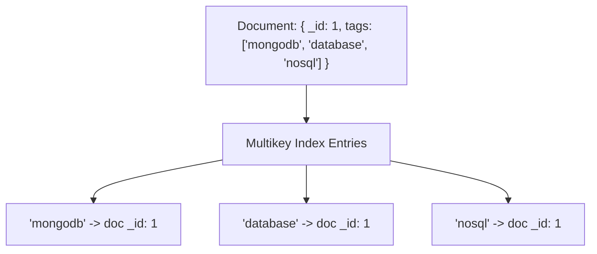

# How to Create a Multikey Index in MongoDB for Array Fields

Author: [nawazdhandala](https://www.github.com/nawazdhandala)

Tags: MongoDB, Index, Multikey Index, Array, Query Optimization

Description: Learn how to create multikey indexes in MongoDB to index array fields efficiently, enabling fast queries on individual array elements and sub-document arrays.

---

## How Multikey Indexes Work

A multikey index indexes each element of an array field separately. When you create an index on a field that contains an array, MongoDB automatically creates a multikey index. There is no special syntax needed - MongoDB detects the array and creates the appropriate index type.

For a document with `tags: ["mongodb", "database", "nosql"]`, MongoDB creates three separate index entries pointing to the same document - one for each array element.



## Automatic Multikey Creation

There is no explicit `"multikey"` type to specify. Any index on a field that contains arrays becomes a multikey index automatically:

```javascript
// Creating a regular index on a field that has arrays
db.products.createIndex({ tags: 1 })
// Becomes a multikey index automatically when tags contains arrays
```

You can verify an index is multikey by running:

```javascript
db.products.getIndexes()
// The "multikey" property will be true
```

## Examples

### Index Array of Scalar Values

A product catalog with tag arrays:

```javascript
db.products.createIndex({ tags: 1 })

db.products.insertMany([
  { name: "Laptop", tags: ["electronics", "computers", "portable"] },
  { name: "T-Shirt", tags: ["clothing", "casual", "cotton"] },
  { name: "USB Cable", tags: ["electronics", "accessories"] }
])

// Query for any element in the array
db.products.find({ tags: "electronics" })
// Returns: Laptop, USB Cable

db.products.find({ tags: { $all: ["electronics", "portable"] } })
// Returns: Laptop
```

### Index Array of Sub-Documents

For arrays containing embedded documents, index specific fields within the sub-documents:

```javascript
db.orders.createIndex({ "items.productId": 1 })

db.orders.insertMany([
  {
    orderId: "ORD-001",
    items: [
      { productId: "P001", qty: 2, price: 29.99 },
      { productId: "P002", qty: 1, price: 49.99 }
    ]
  },
  {
    orderId: "ORD-002",
    items: [
      { productId: "P001", qty: 5, price: 29.99 },
      { productId: "P003", qty: 3, price: 9.99 }
    ]
  }
])

// Find all orders that include product P001
db.orders.find({ "items.productId": "P001" })
// Returns: ORD-001, ORD-002
```

### Querying Array Elements with $elemMatch

Use `$elemMatch` to match documents where a sub-document array element satisfies multiple conditions simultaneously:

```javascript
// Find orders with an item where productId is P001 AND qty > 3
db.orders.find({
  items: {
    $elemMatch: { productId: "P001", qty: { $gt: 3 } }
  }
})
// Returns only ORD-002 (qty: 5 for P001)
```

Without `$elemMatch`, the conditions apply independently across array elements:

```javascript
// This matches if ANY item has productId P001 AND ANY item has qty > 3
// (they can be different items)
db.orders.find({
  "items.productId": "P001",
  "items.qty": { $gt: 3 }
})
```

### Compound Index with Array Field

You can create a compound index where one field is an array (multikey) and others are not:

```javascript
db.products.createIndex({ category: 1, tags: 1 })

db.products.find({ category: "electronics", tags: "portable" })
```

Limitation: At most one field in a compound index can be an array. You cannot create a compound index on two array fields.

### Node.js Example

```javascript
const { MongoClient } = require("mongodb");

async function main() {
  const client = new MongoClient("mongodb://localhost:27017");
  await client.connect();

  const products = client.db("catalog").collection("products");

  // Create multikey index on tags array
  await products.createIndex({ tags: 1 }, { name: "idx_tags_multikey" });

  // Create compound index on category (scalar) + tags (array)
  await products.createIndex(
    { category: 1, tags: 1 },
    { name: "idx_category_tags" }
  );

  await products.insertMany([
    { name: "Gaming Laptop", category: "electronics", tags: ["gaming", "laptop", "portable"], price: 1299 },
    { name: "Office Laptop", category: "electronics", tags: ["office", "laptop", "productivity"], price: 899 },
    { name: "Gaming Mouse", category: "peripherals", tags: ["gaming", "mouse"], price: 59 }
  ]);

  // Find all laptops (any category)
  const laptops = await products.find({ tags: "laptop" }).toArray();
  console.log("All laptops:", laptops.map(p => p.name));

  // Find gaming electronics
  const gamingElectronics = await products.find({
    category: "electronics",
    tags: "gaming"
  }).toArray();
  console.log("Gaming electronics:", gamingElectronics.map(p => p.name));

  // Verify multikey index
  const indexes = await products.indexes();
  const tagIndex = indexes.find(i => i.name === "idx_tags_multikey");
  console.log("Is multikey:", tagIndex.multiKey);

  await client.close();
}

main().catch(console.error);
```

### Range Query on Array Elements

```javascript
db.products.createIndex({ ratings: 1 })

db.products.insertMany([
  { name: "Product A", ratings: [4, 5, 3, 4] },
  { name: "Product B", ratings: [1, 2, 1] },
  { name: "Product C", ratings: [5, 5, 4, 5] }
])

// Find products that have at least one rating >= 5
db.products.find({ ratings: { $gte: 5 } })
// Returns: Product A, Product C
```

## Limitations

- **Compound multikey index restriction**: At most one array field is allowed in a compound index.
- **No shard key**: A multikey index cannot be used as a shard key.
- **Index size**: A document with a large array creates many index entries, increasing index size significantly.
- **No covered queries**: Multikey indexes cannot produce covered queries (always need to fetch the document).

## Best Practices

- **Index the specific sub-field you query.** For `{ items: [{ productId: "P001" }] }`, create `{ "items.productId": 1 }` not `{ items: 1 }`.
- **Use `$elemMatch` for multi-condition matching** on the same array element.
- **Be mindful of index size** for arrays with many elements or documents - monitor with `db.collection.stats()`.
- **Avoid compound indexes on two array fields** - MongoDB does not support this.
- **Test performance with `explain()`** to confirm the multikey index is used.

## Summary

A multikey index in MongoDB indexes every element of an array field, creating individual index entries for each element. It is created automatically when you run `createIndex()` on a field that contains arrays. Use it to efficiently query documents by array element values, including arrays of scalars and arrays of embedded documents. Remember that at most one array field can appear in a compound index.
