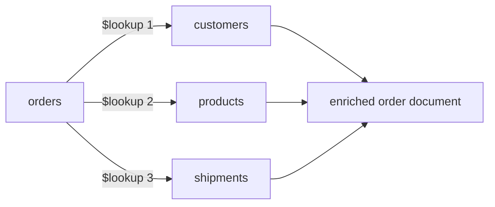

# How to Use Multiple $lookup Stages in MongoDB Aggregation

Author: [nawazdhandala](https://www.github.com/nawazdhandala)

Tags: MongoDB, Aggregation, Lookup, Join, Pipeline

Description: Learn how to chain multiple $lookup stages in a MongoDB aggregation pipeline to join data from several collections in a single query with practical examples.

---

A single MongoDB aggregation pipeline can contain multiple `$lookup` stages, letting you pull related data from several collections in one pass. This is the MongoDB equivalent of writing multiple SQL JOINs.

## Why Multiple $lookup Stages?

In relational databases, a single query often joins three or more tables. In MongoDB you model one-to-many or many-to-many relationships across collections, and you may need to resolve all of them at query time.



## Sample Schema

```javascript
// orders collection
{ _id: ObjectId, customerId: ObjectId, productIds: [ObjectId], shipmentId: ObjectId, total: Number }

// customers collection
{ _id: ObjectId, name: String, email: String, country: String }

// products collection
{ _id: ObjectId, name: String, sku: String, price: Number, category: String }

// shipments collection
{ _id: ObjectId, trackingNumber: String, carrier: String, status: String, deliveredAt: Date }
```

## Basic Sequential $lookup

```javascript
db.orders.aggregate([
  // Join 1: resolve customer
  {
    $lookup: {
      from: "customers",
      localField: "customerId",
      foreignField: "_id",
      as: "customer"
    }
  },
  { $unwind: "$customer" },

  // Join 2: resolve products
  {
    $lookup: {
      from: "products",
      localField: "productIds",
      foreignField: "_id",
      as: "products"
    }
  },

  // Join 3: resolve shipment
  {
    $lookup: {
      from: "shipments",
      localField: "shipmentId",
      foreignField: "_id",
      as: "shipment"
    }
  },
  { $unwind: { path: "$shipment", preserveNullAndEmptyArrays: true } }
]);
```

## Using Pipeline-Form for Each Join

The pipeline form lets you filter and project in each join, keeping intermediate documents lean:

```javascript
db.orders.aggregate([
  { $match: { status: "completed" } },

  {
    $lookup: {
      from: "customers",
      let: { cid: "$customerId" },
      pipeline: [
        { $match: { $expr: { $eq: ["$_id", "$$cid"] } } },
        { $project: { name: 1, email: 1, country: 1, _id: 0 } }
      ],
      as: "customer"
    }
  },
  { $unwind: "$customer" },

  {
    $lookup: {
      from: "products",
      let: { pids: "$productIds" },
      pipeline: [
        { $match: { $expr: { $in: ["$_id", "$$pids"] } } },
        { $project: { name: 1, sku: 1, price: 1, category: 1, _id: 0 } }
      ],
      as: "products"
    }
  },

  {
    $lookup: {
      from: "shipments",
      let: { sid: "$shipmentId" },
      pipeline: [
        { $match: { $expr: { $eq: ["$_id", "$$sid"] } } },
        { $project: { trackingNumber: 1, carrier: 1, status: 1 } }
      ],
      as: "shipment"
    }
  },
  { $unwind: { path: "$shipment", preserveNullAndEmptyArrays: true } }
]);
```

## Joining on Fields from a Previous $lookup

After the first `$lookup`, the enriched document has new fields you can join on in the next stage:

```javascript
// employees -> departments -> locations -> managers
db.employees.aggregate([
  // Join 1: resolve department
  {
    $lookup: {
      from: "departments",
      localField: "departmentId",
      foreignField: "_id",
      as: "department"
    }
  },
  { $unwind: "$department" },

  // Join 2: resolve location using field from department
  {
    $lookup: {
      from: "locations",
      localField: "department.locationId",  // field from previous $lookup
      foreignField: "_id",
      as: "location"
    }
  },
  { $unwind: "$location" },

  // Join 3: resolve manager using field from department
  {
    $lookup: {
      from: "employees",
      localField: "department.managerId",
      foreignField: "_id",
      as: "manager"
    }
  },
  { $unwind: { path: "$manager", preserveNullAndEmptyArrays: true } },

  {
    $project: {
      name: 1,
      "department.name": 1,
      "location.city": 1,
      "location.country": 1,
      "manager.name": 1
    }
  }
]);
```

## Real-World Example: Blog Post Feed

```javascript
// posts -> authors -> tags -> commentCounts
db.posts.aggregate([
  { $match: { published: true } },
  { $sort: { publishedAt: -1 } },
  { $limit: 20 },

  // Join 1: author profile
  {
    $lookup: {
      from: "users",
      let: { uid: "$authorId" },
      pipeline: [
        { $match: { $expr: { $eq: ["$_id", "$$uid"] } } },
        { $project: { username: 1, avatarUrl: 1, bio: 1 } }
      ],
      as: "author"
    }
  },
  { $unwind: "$author" },

  // Join 2: tags for each post
  {
    $lookup: {
      from: "tags",
      let: { tagIds: "$tagIds" },
      pipeline: [
        { $match: { $expr: { $in: ["$_id", "$$tagIds"] } } },
        { $project: { name: 1, slug: 1 } }
      ],
      as: "tags"
    }
  },

  // Join 3: comment summary
  {
    $lookup: {
      from: "comments",
      let: { pid: "$_id" },
      pipeline: [
        { $match: { $expr: { $eq: ["$postId", "$$pid"] }, approved: true } },
        { $count: "total" }
      ],
      as: "commentSummary"
    }
  },
  {
    $addFields: {
      commentCount: {
        $ifNull: [{ $arrayElemAt: ["$commentSummary.total", 0] }, 0]
      }
    }
  },

  {
    $project: {
      title: 1,
      slug: 1,
      excerpt: 1,
      publishedAt: 1,
      "author.username": 1,
      "author.avatarUrl": 1,
      tags: 1,
      commentCount: 1
    }
  }
]);
```

## E-Commerce Order Report with Four Joins

```javascript
db.orders.aggregate([
  { $match: { createdAt: { $gte: ISODate("2026-01-01"), $lt: ISODate("2026-04-01") } } },

  // Join 1: customer
  {
    $lookup: {
      from: "customers",
      localField: "customerId",
      foreignField: "_id",
      as: "customer"
    }
  },
  { $unwind: "$customer" },

  // Join 2: billing address
  {
    $lookup: {
      from: "addresses",
      localField: "billingAddressId",
      foreignField: "_id",
      as: "billingAddress"
    }
  },
  { $unwind: { path: "$billingAddress", preserveNullAndEmptyArrays: true } },

  // Join 3: payment method
  {
    $lookup: {
      from: "paymentMethods",
      localField: "paymentMethodId",
      foreignField: "_id",
      as: "payment"
    }
  },
  { $unwind: { path: "$payment", preserveNullAndEmptyArrays: true } },

  // Join 4: coupon used
  {
    $lookup: {
      from: "coupons",
      localField: "couponId",
      foreignField: "_id",
      as: "coupon"
    }
  },
  { $unwind: { path: "$coupon", preserveNullAndEmptyArrays: true } },

  {
    $project: {
      orderId: "$_id",
      total: 1,
      status: 1,
      "customer.name": 1,
      "customer.email": 1,
      "billingAddress.city": 1,
      "billingAddress.country": 1,
      "payment.type": 1,
      "coupon.code": 1,
      "coupon.discount": 1
    }
  }
]);
```

## Indexes to Support Multiple $lookup Stages

Create indexes on every `foreignField` used across all joins:

```javascript
db.customers.createIndex({ _id: 1 });       // default, already exists
db.products.createIndex({ _id: 1 });        // default, already exists
db.shipments.createIndex({ _id: 1 });       // default, already exists
db.addresses.createIndex({ _id: 1 });       // default, already exists
db.comments.createIndex({ postId: 1, approved: 1 });
db.tags.createIndex({ _id: 1 });
```

## Performance Tips

Reduce document size before downstream joins to save memory:

```javascript
db.orders.aggregate([
  { $match: { status: "active" } },
  // Trim the document early so subsequent lookups work on smaller docs
  { $project: { customerId: 1, productIds: 1, total: 1 } },
  { $lookup: { from: "customers", localField: "customerId", foreignField: "_id", as: "customer" } },
  { $lookup: { from: "products", localField: "productIds", foreignField: "_id", as: "products" } }
]);
```

Use `allowDiskUse` for large pipelines that exceed the 100 MB memory limit:

```javascript
db.orders.aggregate([...pipeline...], { allowDiskUse: true });
```

## Summary

Chaining multiple `$lookup` stages in a single MongoDB aggregation pipeline is the standard way to resolve relationships across several collections in one query. Use the pipeline form of `$lookup` to filter and project during each join, keeping intermediate results small. Join on fields produced by earlier `$lookup` stages when you need multi-hop resolution. Always index the `foreignField` of each joined collection and project away unneeded fields early in the pipeline to keep memory usage under control.
