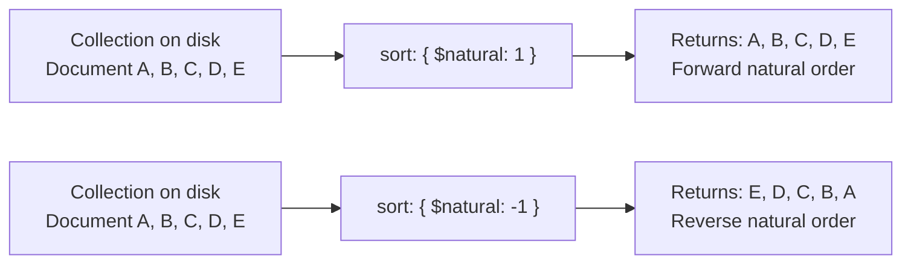
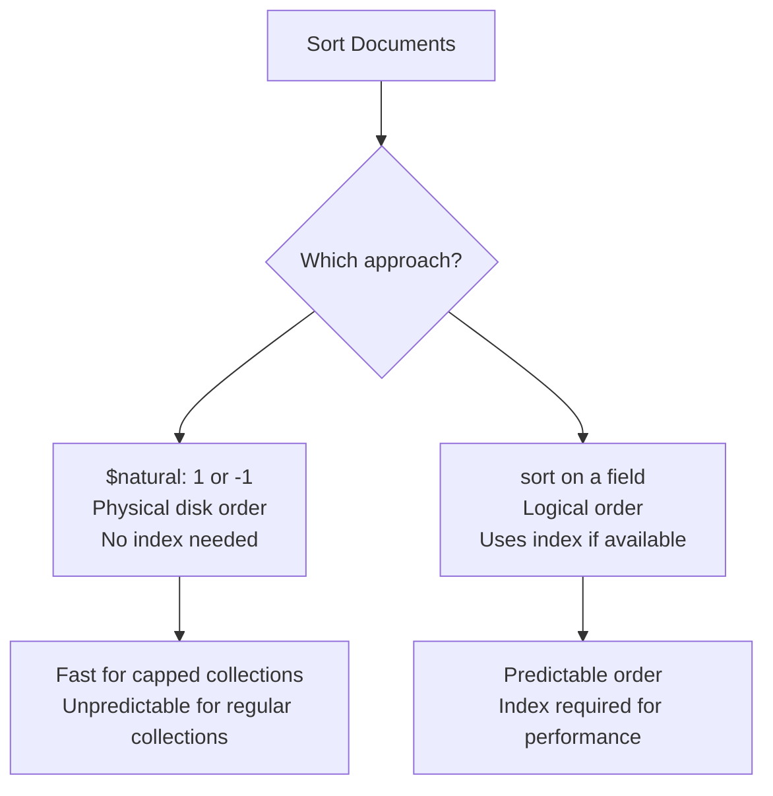

# How to Use the $natural Sort Order in MongoDB

Author: [nawazdhandala](https://www.github.com/nawazdhandala)

Tags: MongoDB, $natural, Sort, Cursor, Capped Collection

Description: Learn how to use the $natural hint in MongoDB to sort query results in natural (insertion) order or reverse natural order, and when to apply it.

---

## Overview

In MongoDB, `$natural` is a special sort hint that controls the order in which documents are returned from a collection based on their physical storage order on disk. This is sometimes called "natural order" and corresponds approximately to insertion order, though it is not guaranteed to be perfectly stable for regular (non-capped) collections after updates and deletions.



## Syntax

```javascript
// Forward natural order (first inserted first)
db.collection.find({}).sort({ $natural: 1 })

// Reverse natural order (last inserted first)
db.collection.find({}).sort({ $natural: -1 })
```

`1` means forward (oldest first), `-1` means reverse (newest first).

## Basic Examples

### Return Documents in Insertion Order

```javascript
db.logs.find({}).sort({ $natural: 1 })
```

Returns documents in the order they were stored on disk.

### Return Documents in Reverse Insertion Order

```javascript
db.logs.find({}).sort({ $natural: -1 })
```

Returns documents from the most recently inserted first. Useful for retrieving the latest records quickly from capped collections.

### Combine with a Filter

```javascript
db.logs.find({ level: "error" }).sort({ $natural: -1 }).limit(10)
```

Returns the 10 most recent error log entries in reverse storage order.

## $natural and Capped Collections

The `$natural` sort is most reliable and meaningful with capped collections. Capped collections maintain strict insertion order and never allow document moves, so `$natural` always reflects true insertion order.

```javascript
// Create a capped collection
db.createCollection("eventLog", {
  capped: true,
  size: 10485760,  // 10 MB
  max: 100000
})

// Get the most recent 20 events
db.eventLog.find({}).sort({ $natural: -1 }).limit(20)
```

For regular (non-capped) collections, storage order can shift after document updates that increase document size (pre-4.0 behavior with MMAPv1). With WiredTiger (the default storage engine), documents are stored with padding and `$natural` order is generally stable but not guaranteed.

## $natural as a Hint (Bypassing Indexes)

You can also use `$natural` as a query hint to force a collection scan and bypass any index:

```javascript
db.orders.find({ status: "pending" }).hint({ $natural: 1 })
```

This tells MongoDB to scan the collection sequentially rather than using an index. This is useful for:

- Debugging index behavior by comparing index vs collection scan
- Situations where a full scan is faster than an index scan (very high selectivity, small collections)

## Comparison: $natural vs Index Sort



| Feature | $natural | Field Sort |
|---|---|---|
| Uses index | No (bypasses indexes) | Yes (if available) |
| Order guarantee | Physical storage order | Logical field value order |
| Best for | Capped collections, debug | Regular queries |
| Predictable | Only for capped collections | Always |

## Tailable Cursors and $natural

Tailable cursors on capped collections use `$natural` order implicitly. A tailable cursor waits for new documents after reaching the end, making it suitable for log streaming:

```javascript
const cursor = db.eventLog.find({}).addOption(DBQuery.Option.tailable)

while (true) {
  if (cursor.hasNext()) {
    printjson(cursor.next())
  }
}
```

Tailable cursors require a capped collection and always iterate in forward `$natural` order.

## Summary

The `$natural` sort hint returns documents in their physical storage order on disk. Use `{ $natural: 1 }` for forward order and `{ $natural: -1 }` for reverse order. It is most predictable and useful with capped collections, where insertion order is guaranteed. For regular collections, use `$natural` primarily when you want to bypass indexes for debugging or when building tailable cursors for real-time data streaming.
