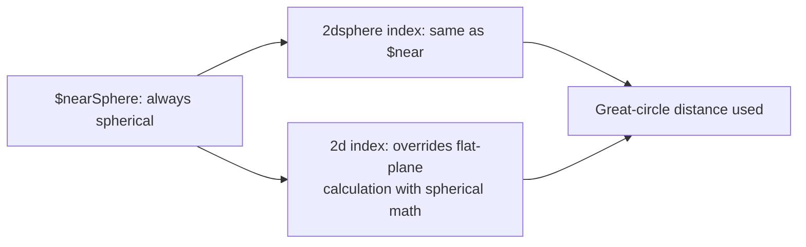

# How to Use $nearSphere in MongoDB for Spherical Queries

Author: [nawazdhandala](https://www.github.com/nawazdhandala)

Tags: MongoDB, Geospatial, $nearSphere, Spherical Query, Location

Description: Learn how to use MongoDB's $nearSphere operator for proximity queries that account for the spherical shape of the Earth, including differences from $near.

---

## How $nearSphere Works

The `$nearSphere` operator returns documents sorted by distance from a specified point using spherical geometry (great-circle distance), closest first. It works on both `2dsphere` and `2d` indexes.

The key distinction from `$near`:
- `$near` uses spherical calculations only when used with a `2dsphere` index.
- `$nearSphere` always uses spherical calculations, even when used with a `2d` index.

For modern applications using `2dsphere` indexes, `$near` and `$nearSphere` produce the same results. `$nearSphere` is primarily useful for legacy `2d` indexes where spherical accuracy is needed.



## Syntax

Using `$nearSphere` with GeoJSON (`2dsphere` index):

```javascript
db.collection.find({
  field: {
    $nearSphere: {
      $geometry: {
        type: "Point",
        coordinates: [longitude, latitude]
      },
      $maxDistance: <meters>,
      $minDistance: <meters>
    }
  }
})
```

Using `$nearSphere` with legacy coordinate pairs (`2d` index):

```javascript
db.collection.find({
  field: {
    $nearSphere: [longitude, latitude],
    $maxDistance: <radians>   // distance in radians, not meters
  }
})
```

## Examples

### Setup

```javascript
db.landmarks.createIndex({ location: "2dsphere" })

db.landmarks.insertMany([
  {
    name: "Eiffel Tower",
    city: "Paris",
    location: { type: "Point", coordinates: [2.2945, 48.8584] }
  },
  {
    name: "Big Ben",
    city: "London",
    location: { type: "Point", coordinates: [-0.1246, 51.5007] }
  },
  {
    name: "Colosseum",
    city: "Rome",
    location: { type: "Point", coordinates: [12.4922, 41.8902] }
  },
  {
    name: "Sagrada Familia",
    city: "Barcelona",
    location: { type: "Point", coordinates: [2.1744, 41.4036] }
  }
])
```

### Find Nearest Landmarks Using $nearSphere

Find landmarks nearest to a point in central Europe, sorted by spherical distance:

```javascript
db.landmarks.find({
  location: {
    $nearSphere: {
      $geometry: {
        type: "Point",
        coordinates: [5.0, 47.0]  // central Europe
      },
      $maxDistance: 1500000  // 1500 km in meters
    }
  }
})
```

### $nearSphere with $minDistance and $maxDistance

Find landmarks between 500 km and 1500 km from a point:

```javascript
db.landmarks.find({
  location: {
    $nearSphere: {
      $geometry: {
        type: "Point",
        coordinates: [2.3522, 48.8566]  // Paris
      },
      $minDistance: 500000,    // 500 km
      $maxDistance: 1500000    // 1500 km
    }
  }
})
```

### Using $nearSphere with a 2d Index (Legacy)

If your collection uses a `2d` index with legacy coordinate arrays, `$nearSphere` forces spherical calculation:

```javascript
// With a 2d index
db.legacyPlaces.createIndex({ coords: "2d" })

// Distance in radians (1 radian = ~6371 km)
const distanceKm = 100;
const distanceRadians = distanceKm / 6371;

db.legacyPlaces.find({
  coords: {
    $nearSphere: [2.3522, 48.8566],  // Paris [lng, lat]
    $maxDistance: distanceRadians
  }
})
```

### Get Distance with $geoNear Aggregation

To include the calculated distance in the output, use the `$geoNear` aggregation stage with `spherical: true`:

```javascript
db.landmarks.aggregate([
  {
    $geoNear: {
      near: {
        type: "Point",
        coordinates: [2.3522, 48.8566]  // Paris
      },
      distanceField: "distanceKm",
      distanceMultiplier: 0.001,  // convert meters to km
      maxDistance: 2000000,       // 2000 km in meters
      spherical: true
    }
  },
  {
    $project: {
      name: 1,
      city: 1,
      distanceKm: { $round: ["$distanceKm", 0] }
    }
  }
])
```

Sample output:

```javascript
[
  { name: "Eiffel Tower", city: "Paris", distanceKm: 0 },
  { name: "Big Ben", city: "London", distanceKm: 342 },
  { name: "Sagrada Familia", city: "Barcelona", distanceKm: 1039 },
  { name: "Colosseum", city: "Rome", distanceKm: 1105 }
]
```

### Node.js Example

```javascript
const { MongoClient } = require("mongodb");

async function findNearestLandmarks(referenceLng, referenceLat, maxKm) {
  const client = new MongoClient("mongodb://localhost:27017");
  await client.connect();

  const landmarks = client.db("world").collection("landmarks");
  await landmarks.createIndex({ location: "2dsphere" });

  // Use $geoNear for distance output
  const results = await landmarks.aggregate([
    {
      $geoNear: {
        near: { type: "Point", coordinates: [referenceLng, referenceLat] },
        distanceField: "distMeters",
        maxDistance: maxKm * 1000,
        spherical: true
      }
    },
    {
      $project: {
        name: 1,
        city: 1,
        distanceKm: { $round: [{ $divide: ["$distMeters", 1000] }, 1] }
      }
    }
  ]).toArray();

  console.log(`Landmarks within ${maxKm}km of [${referenceLng}, ${referenceLat}]:`);
  results.forEach(l => {
    console.log(`  ${l.name}, ${l.city} - ${l.distanceKm} km`);
  });

  await client.close();
}

// Find landmarks within 2000km of Paris
findNearestLandmarks(2.3522, 48.8566, 2000).catch(console.error);
```

## $near vs $nearSphere

```text
Scenario                              $near                $nearSphere
-------------------------------------------------------------------
With 2dsphere index                   Spherical (same)     Spherical (same)
With 2d index                         Flat plane           Spherical
Required index                        2d or 2dsphere       2d or 2dsphere
Distance units (GeoJSON mode)         Meters               Meters
Distance units (legacy mode)          Coordinate units     Radians
Recommended for Earth data            Yes (2dsphere)       Yes (either index)
```

For new applications with `2dsphere` indexes, `$near` and `$nearSphere` produce identical results. Use `$nearSphere` specifically when:
1. You have a legacy `2d` index and need spherical accuracy.
2. You are porting code that explicitly uses `$nearSphere`.

## Best Practices

- **Use `2dsphere` indexes for Earth-based data.** With a `2dsphere` index, `$near` and `$nearSphere` behave identically - prefer `$near` for clarity.
- **Use `$nearSphere` with `2d` indexes** only for legacy systems where you need spherical accuracy without migrating to `2dsphere`.
- **Convert distances carefully** when using legacy mode: specify in radians (`km / 6371`), not meters.
- **Use `$geoNear` aggregation** when you need the actual distance value in the result documents.
- **Always set `$maxDistance`** to bound queries and prevent slow full-collection proximity scans.

## Summary

`$nearSphere` returns documents sorted by spherical (great-circle) distance from a query point, always using spherical geometry regardless of index type. With a `2dsphere` index, it behaves identically to `$near`. Its primary use is with legacy `2d` indexes where you need Earth-accurate distances. For new applications, prefer `$near` with a `2dsphere` index, and use `$geoNear` in aggregation pipelines when you need the calculated distance in results.
